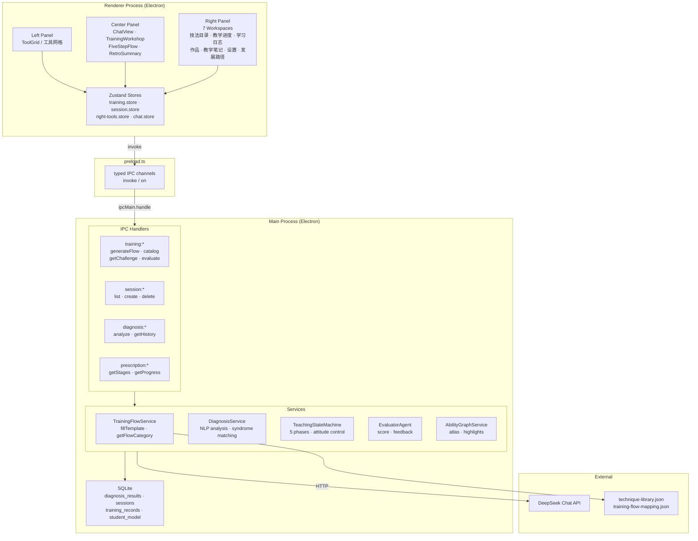
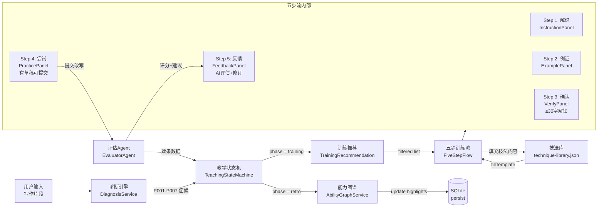
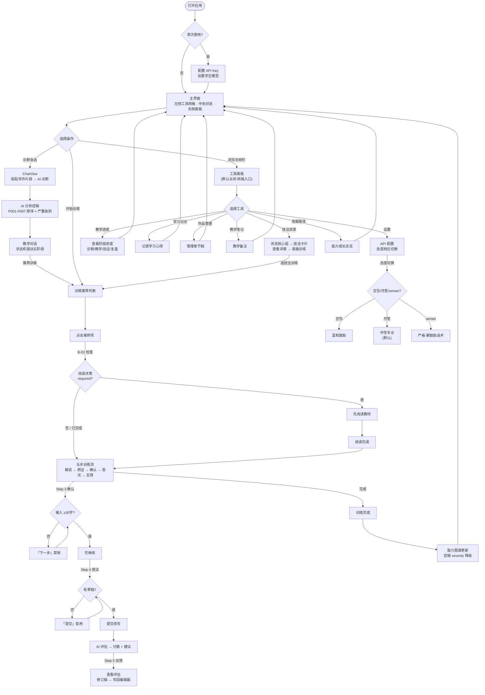

# 月笙写作教练 — 架构图 / 数据流 / 用户流程

> 三个 Mermaid 图，GitHub 原生渲染。
> 嵌入位置：README.md `## 架构概览` 和 `## 用户流程` 章节。

---

## 1. 系统架构图



---

## 2. 数据传输依赖图



---

## 3. 用户流程图



---

## Mermaid 嵌入 README 用法

复制以下代码块到 `README.md` 对应章节即可：

### 架构图 — 放 `## 架构概览`

```markdown
\`\`\`mermaid
graph TB
    ...（上面图 1 的内容）...
\`\`\`
```

### 数据流 — 放 `## 数据流`

```markdown
\`\`\`mermaid
flowchart LR
    ...（上面图 2 的内容）...
\`\`\`
```

### 用户流程 — 放 `## 用户流程`

```markdown
\`\`\`mermaid
flowchart TB
    ...（上面图 3 的内容）...
\`\`\`
```
