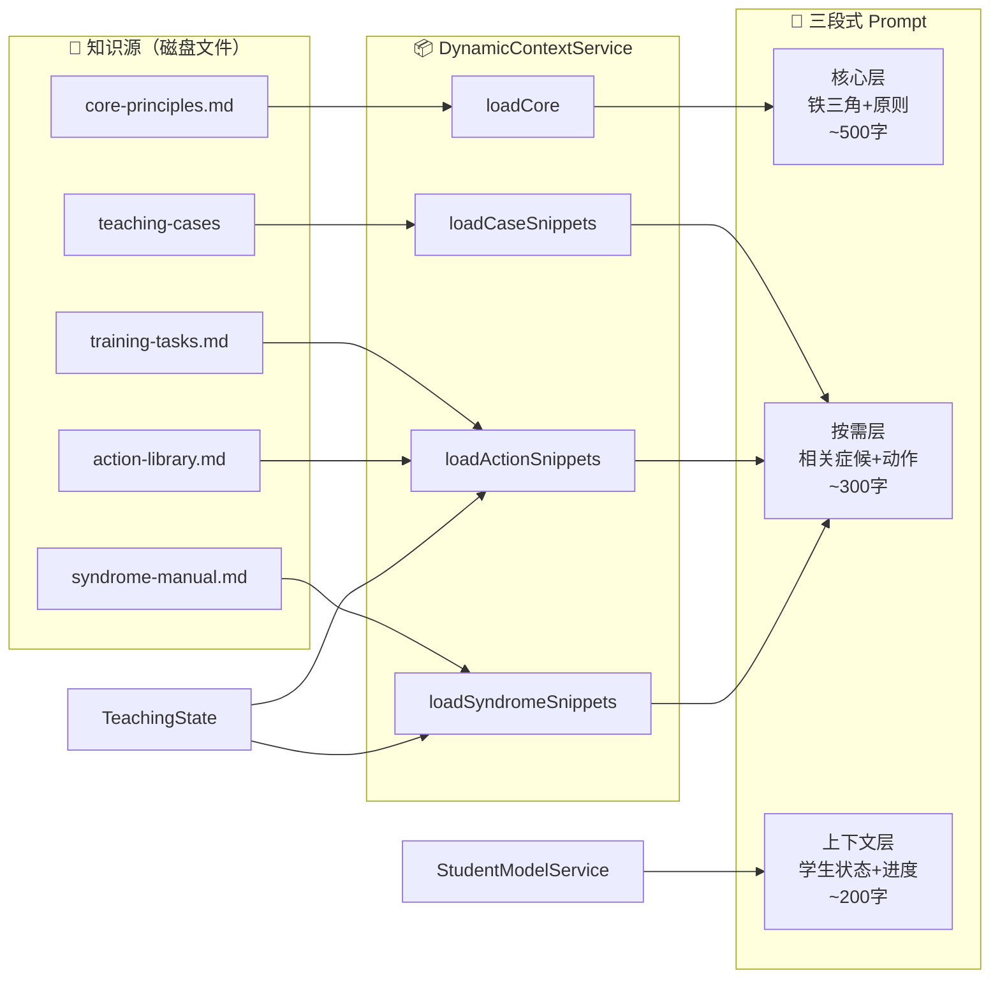

# T-014 动态上下文装载设计

> **对应发现**：发现10 — 参考抽屉实现走偏  
> **优先级**：P0  
> **工作量**：2-3天  
> **依赖**：T-010（PromptBuilder 改造）✅、T-009（Strategy Service）✅  
> **前端改动**：无  

---

## 一、问题

当前 System Prompt 生成方式为全量拼接：

```
System Prompt = V3 Prompt（~3000字）+ 诊断增强 + 历史诊断 + 教学进度 + 语气修饰 + 策略指令
```

所有知识文件（`syndrome-manual.md`、`action-library.md`、`core-principles.md` 等）从未被读取。AI 只能访问 Prompt 内的"一句话精髓"摘要，无法获取完整参考内容。

## 二、目标

实现"参考抽屉"的按需装载机制：

1. 根据当前教学阶段和活跃症候，只装载相关的知识片段
2. 将 System Prompt 从全量拼接改为 `核心 + 按需 + 上下文` 三段式组装
3. 减少 Prompt 长度，降低 LLM 认知负担和 API 成本

## 三、设计

### 3.1 架构



### 3.2 核心类

```typescript
interface ContextBundle {
  corePrompt: string;
  referenceDrawer: {
    syndromeSnippets: string[];
    actionSnippets: string[];
    caseSnippets: string[];
  };
  studentContext: string;
  teachingProgress: string;
}

class DynamicContextService {
  constructor(
    private configService: ConfigService,
  ) {}

  /** 入口：根据当前状态装载上下文 */
  loadContext(state: TeachingState, studentModel: StudentModel): ContextBundle {
    const corePrompt = this.loadCorePrompt();
    const activeSyndromeIds = state.activeProblems.map(p => p.syndromeId);
    const syndromeSnippets = this.loadSyndromeSnippets(activeSyndromeIds);
    const actionSnippets = this.loadActionSnippets(activeSyndromeIds);
    const caseSnippets = this.loadCaseSnippets(activeSyndromeIds);
    const studentContext = this.buildStudentContext(studentModel);
    const teachingProgress = this.buildTeachingProgress(state);

    return { corePrompt, referenceDrawer: { syndromeSnippets, actionSnippets, caseSnippets }, studentContext, teachingProgress };
  }

  /** 装载核心 Prompt（铁三角，始终装载） */
  private loadCorePrompt(): string { /* ... */ }

  /** 按症候 ID 装载症候手册片段 */
  private loadSyndromeSnippets(syndromeIds: string[]): string[] { /* ... */ }

  /** 按症候 ID 装载动作库片段 */
  private loadActionSnippets(syndromeIds: string[]): string[] { /* ... */ }

  /** 装载参考案例 */
  private loadCaseSnippets(syndromeIds: string[]): string[] { /* ... */ }
}
```

### 3.3 知识文件结构

每个知识文件需要支持"按 ID 检索"：

**syndrome-manual.md** 改为片段式结构：
```markdown
<!-- SYNDROME:P001 -->
## P001 世界观膨胀
**识别标准**：开篇大量世界观设定...
**典型表现**：...
<!-- END:SYNDROME:P001 -->
```

**action-library.md** 同理：
```markdown
<!-- ACTION:A001 -->
## A001 缩小范围
**一句话精髓**：从宏大设定回到具体场景...
**话术模板**：...
<!-- END:ACTION:A001 -->
```

### 3.4 装载规则

| 阶段 | 装载内容 |
|------|---------|
| P0_INIT | 核心 Prompt + 新手引导说明 |
| P1_WORLD | 核心 Prompt + P001/P004/P005 症候 + 对应动作 |
| P2_PRACTICE | 核心 Prompt + 全部活跃症候 + 对应动作 |
| P4_REVIEW | 核心 Prompt + 历史症候摘要 + 进步说明 |

### 3.5 与 PromptLoader 的关系

```typescript
// 改造前：prompt-loader.ts 全量拼接
// 改造后：prompt-loader.ts 调用 DynamicContextService

class PromptLoader {
  constructor(private contextService: DynamicContextService) {}
  
  async loadSystemPrompt(
    state: TeachingState,
    studentModel: StudentModel,
  ): Promise<string> {
    const bundle = this.contextService.loadContext(state, studentModel);
    
    return [
      bundle.corePrompt,
      '--- 参考抽屉 ---',
      ...bundle.referenceDrawer.syndromeSnippets,
      ...bundle.referenceDrawer.actionSnippets,
      '--- 学生状态 ---',
      bundle.studentContext,
      bundle.teachingProgress,
    ].join('\n\n');
  }
}
```

## 四、涉及文件

| 文件 | 改动类型 |
|------|---------|
| `src/main/services/dynamic-context.service.ts` | **新建** |
| `src/main/services/prompt-loader.ts` | 改造 `loadSystemPrompt()` 调用新服务 |
| `resources/prompts/syndrome-manual.md` | 增加片段标记（可选） |
| `resources/prompts/action-library.md` | 增加片段标记（可选） |
| `src/main/index.ts` | 注册 DynamicContextService |

## 五、DoD

1. `DynamicContextService` 正确按教学阶段装载知识片段
2. `prompt-loader.ts` 改用三段式组装替代全量拼接
3. TypeScript 编译无错误
4. 至少 3 个单元测试覆盖不同阶段的装载逻辑

## 六、变更记录

| 版本 | 日期 | 变更内容 |
|------|------|---------|
| V1.0 | 2026-06-05 | 初始设计 |
