# 月笙写作教练 — 全量任务依赖图

> **最后更新**: 2026-06-17
> **说明**: 覆盖项目所有阶段（V2 → RWR）已完成和待执行的全部任务。
> **格式**: Mermaid flowceart，按阶段分组，箭头表示依赖关系。

```mermaid
flowchart TB
    %% ============ 样式定义 ============
    classDef completed fill:#27ae60,stroke:#1e8449,color:#fff
    classDef inprogress fill:#e74c3c,stroke:#c0392b,color:#fff
    classDef pending fill:#f39c12,stroke:#d35400,color:#fff
    classDef pendingP2 fill:#f1c40f,stroke:#f39c12,color:#222
    classDef pendingP3 fill:#95a5a6,stroke:#7f8c8d,color:#fff
    classDef eval fill:#8e44ad,stroke:#7d3c98,color:#fff
    classDef shadow fill:#2ecc71,stroke:#27ae60,color:#fff,stroke-dasharray: 5 5
    classDef headline fill:none,stroke:none,color:#fff

    %% ============ 一、已完成（所有历史阶段） ============

    subgraph COMPLETED["✅ 已完成（历史）"]
        V2_HEAD(("V2 SOLO 模式改造（29项）"))
        V2_000["V2-000~008 基础改造"]
        V2_009["V2-009~015 SOLO 三栏布局"]
        V2_016["V2-016 推荐引擎修复"]
        V2_017["V2-017 训练工坊面板"]
        V2_018["V2-018 诊断面板"]
        V2_019["V2-019 对话视图"]
        V2_020["V2-020 任务面板"]
        V2_021["V2-021 成长记录"]
        V2_022["V2-022 设置面板"]
        V2_023["V2-023 清理与收尾"]
        V2_AUDIT["V2-024~027 四道关卡审查"]

        DB_HEAD(("DB+MEM 数据基建（7项）"))
        DB_P0["DB-P0 FK/UNIQUE 约束"]
        DB_P1["DB-P1a/b/c 时间格式/主键统一/CHECK"]
        DB_M1["DB-M1 分页查询"]
        DB_M2["DB-M2 滑动窗口"]
        DB_P2c["DB-P2c+M4 FTS5 全文搜索"]
        DB_P2d["DB-P2d+M3 PRAGMA 配置"]

        P25_HEAD(("Phase 2.5 蒸馏落地（5项）"))
        T_028["T-028 技法核心化"]
        T_029["T-029 症候分类"]
        T_030["T-030 AI 工具提取"]
        T_031["T-031 教育学接入"]
        T_032["T-032 剩余蒸馏入库"]

        CPHASE_HEAD(("C-Phase（4项）"))
        P_04["P-04 Phase 1~2"]
        P_06["P-06"]
        X_01["X-01"]
        X_02["X-02 训练编辑器联动"]

        FB_HEAD(("Bug 修复审计（3轮）"))
        FB_609["FB240609-001 8项修复"]
        FB_611["FB240611-003 数据流审计6项"]
        FB_616["FB260616-001 对齐设计文档"]

        SHADOW_HEAD(("影子功能审查（5项，D-023~D-026）"))
        PE_004["PE-004 五步引导链→已消化"]
        PE_005["PE-005 约束三明治→已记录"]
        SF_001["SF-001 场景元数据面板→已确认"]
        SF_003["SF-003 节拍诊断→已确认"]
        SF_004["SF-004 节拍图表→已确认"]

        SPEC_HEAD(("规格设计"))
        SPEC_REWRITE["2026-06-17-system-rewrite-spec.md 定稿"]

        V2_000 --> V2_009 --> V2_016 --> V2_017 --> V2_018 --> V2_019
        V2_019 --> V2_020 --> V2_021 --> V2_022 --> V2_023
        V2_017 --> V2_AUDIT

        DB_P0 --> DB_P1 --> DB_M1 --> DB_M2
        DB_P1 --> DB_P2c --> DB_P2d

        T_028 --> T_029 --> T_030 --> T_031 --> T_032

        P_04 --> P_06 --> X_01 --> X_02

        FB_609 --> FB_611 --> FB_616

        PE_004 -.- PE_005 -.- SF_001 -.- SF_003 -.- SF_004

        SPEC_REWRITE -.- V2_HEAD
        SPEC_REWRITE -.- DB_HEAD
        SPEC_REWRITE -.- P25_HEAD
        SPEC_REWRITE -.- CPHASE_HEAD
        SPEC_REWRITE -.- FB_HEAD
    end

    %% ============ 二、当前：RWR P0（数据地基） ============

    subgraph RWR_P0["🔴 RWR P0 — 数据地基（当前指针）"]
        P0_1["RWR-P0-1 DB 数据模型扩展"]
        P0_2["RWR-P0-2 progress.store 新增"]
        P0_3["RWR-P0-3 Store 导出统一 + 删除 rightPanelService"]
        P0_4["RWR-P0-4 项目 IPC 通道 + 项目表 migration"]
        P0_5["RWR-P0-5 数据迁移脚本"]
        P0_6["RWR-P0-6 useRightPanel hook + 设置面板"]
    end

    P0_1 --> P0_2
    P0_3 --> P0_6
    P0_1 --> P0_5
    P0_4 --> P0_5

    %% 已完成阶段 → P0 的输入
    V2_HEAD --> P0_1
    DB_HEAD --> P0_1
    V2_023 --> P0_3

    %% ============ 三、RWR P1（核心体验） ============

    subgraph RWR_P1["🟡 RWR P1 — 核心体验"]
        P1_1["RWR-P1-1 AppShell 三栏独立布局"]
        P1_2["RWR-P1-2 SoloSidebar 三标签"]
        P1_3["RWR-P1-3 ProjectSelector + InputToolbar + AttitudeIndicator"]
        P1_4["RWR-P1-4 输入区 1/6 屏高重构"]
        P1_5["RWR-P1-5 TeachingProgressBar + ProgressTimeline"]
        P1_6["RWR-P1-6 诊断表与进度联动 + 教学决策记录"]
        P1_7["RWR-P1-7 画像增强"]
        P1_8["RWR-P1-8 进步摘要卡片 + 时序点击展开"]
    end

    P0_2 --> P1_5
    P0_1 --> P1_6
    P0_2 --> P1_6
    P0_1 --> P1_7
    P1_5 --> P1_8
    P1_6 --> P1_8
    P0_3 --> P1_1
    P0_6 --> P1_1
    P1_1 --> P1_2
    P1_1 --> P1_4
    P0_4 --> P1_3
    P1_1 --> P1_3

    %% ============ 四、RWR P2（增强功能） ============

    subgraph RWR_P2["🟢 RWR P2 — 增强功能"]
        P2_1["RWR-P2-1 LearningLogPanel"]
        P2_2["RWR-P2-2 训练反馈回路"]
        P2_3["RWR-P2-3 IPC 错误处理统一 + 骨架屏"]
        P2_4["RWR-P2-4 空状态全覆盖 + placeholder 轮换"]
    end

    P0_1 --> P2_1
    P1_6 --> P2_2
    P1_1 --> P2_4

    %% P2-3 无依赖，全程可并行
    P0_3 -.-> P2_3

    %% ============ 五、RWR P3（收尾打磨） ============

    subgraph RWR_P3["⚪ RWR P3 — 收尾打磨"]
        P3_1["RWR-P3-1 文件上传 + 分章"]
        P3_2["RWR-P3-2 TypeScript 全局清理"]
        P3_3["RWR-P3-3 旧待定任务收尾（B3/A3/B2/B4/UI-P2）"]
        P3_4["RWR-P3-4 V4 遗留评估"]
        P3_5["RWR-P3-5 外部项目代码研究（6项目）"]
        P3_6["RWR-P3-6 全链路验收测试"]
    end

    P0_4 --> P3_1
    P1_8 --> P3_6
    P2_2 --> P3_6

    %% ============ 六、评估中 ============

    subgraph EVAL["⏸️ 评估中（待 RWR-P3-4 决策）"]
        V4_SKILL["V4-SKILL-1~5 Prompt→Skill 工程"]
        V4_DIST["V4-DIST-1~7 蒸馏研究"]
        V4_INFRA["V4-INFRA-1~3 数据基建"]
        TECHNIQUE["技法消费层（全量注入修复）"]
        SAMPLES["反例样本收集（15条脚本）"]
        DP_A["DP-A 减法练习训练类型"]
        DP_D["DP-D 进步可视化"]
    end

    P3_4 -.-> V4_SKILL
    P3_4 -.-> V4_DIST
    P3_4 -.-> V4_INFRA

    %% ============ 七、外迁（本重构不做） ============

    subgraph DEFER["⏭️ 外迁（本重构不涉及）"]
        DARK["暗黑模式"]
        SNAPSHOT["节点快照对比"]
        BATCH_REF["批量引用"]
        CUSTOM_TMPL["用户自定义模板"]
        HOTKEYS["快捷键系统 Ctrl+N / Ctrl+["]
        HOLOGRAM["HoloGram MCP 配置"]
        ESLINT["ESLint 规范规则"]
        DESIGN_TOKENS["CSS Design Tokens 清理"]
    end

    %% ============ 注意：样式声明必须在最后 ============

    style V2_HEAD fill:#27ae60,stroke:#1e8449,color:#fff,stroke-width:3px
    style DB_HEAD fill:#27ae60,stroke:#1e8449,color:#fff,stroke-width:3px
    style P25_HEAD fill:#27ae60,stroke:#1e8449,color:#fff,stroke-width:3px
    style CPHASE_HEAD fill:#27ae60,stroke:#1e8449,color:#fff,stroke-width:3px
    style FB_HEAD fill:#27ae60,stroke:#1e8449,color:#fff,stroke-width:3px
    style SHADOW_HEAD fill:#2ecc71,stroke:#27ae60,color:#fff,stroke-width:2px
    style SPEC_HEAD fill:#27ae60,stroke:#1e8449,color:#fff,stroke-width:3px

    style P0_1 fill:#e74c3c,stroke:#c0392b,color:#fff,stroke-width:3px
    style P0_2 fill:#e74c3c,stroke:#c0392b,color:#fff
    style P0_3 fill:#e74c3c,stroke:#c0392b,color:#fff
    style P0_4 fill:#e74c3c,stroke:#c0392b,color:#fff
    style P0_5 fill:#e74c3c,stroke:#c0392b,color:#fff
    style P0_6 fill:#e74c3c,stroke:#c0392b,color:#fff

    style P1_1 fill:#f39c12,stroke:#d35400,color:#fff
    style P1_6 fill:#f39c12,stroke:#d35400,color:#fff

    style P3_5 fill:#3498db,stroke:#2980b9,color:#fff,stroke-dasharray: 5 5
    style P3_6 fill:#e67e22,stroke:#d35400,color:#fff,stroke-width:2px

    style EVAL fill:none,stroke:none
    style DEFER fill:none,stroke:none
```



---

## 图例

| 颜色 | 含义 | 示例 |
|:----:|:-----|:----:|
| 🟢 绿色 | ✅ 已完成 | V2 全部 29 项、DB+MEM 7 项、Phase 2.5 等 |
| 🟢 绿色虚线 | ✅ 影子功能已审查关闭 | PE-004/PE-005/SF-001/SF-003/SF-004 |
| 🔴 红色（加粗） | ▶️ 当前指针（P0 阻塞链首任务） | **RWR-P0-1** |
| 🔴 红色 | P0 — 阻塞链，不做则教学闭环走不通 | RWR-P0-2~P0-6 |
| 🟠 橙色（加粗） | 关键里程碑任务 | P1-1（布局）、P1-6（进度联动）、P3-6（验收） |
| 🟡 黄色 | P1 — 核心体验 | AppShell、进度条、诊断联动等 |
| 🟢 浅绿 | P2 — 增强功能 | LearningLog、训练反馈等 |
| ⚪ 灰色 | P3 — 收尾打磨 | TS 清理、文件上传等 |
| 🔵 蓝色虚线 | 研究类任务（不涉及代码修改） | P3-5 外部项目研究 |
| 🟣 紫色 | ⏸️ 评估中 | V4-SKILL、V4-DIST、V4-INFRA |
| 无色 | ⏭️ 外迁 | 暗黑模式、快捷键等 |

## 关键统计

```
已完成（7 大阶段）:
  ├── V2 SOLO 改造             29 项 ✅
  ├── DB+MEM 数据基建           7 项 ✅
  ├── Phase 2.5 蒸馏落地        5 项 ✅
  ├── C-Phase                  4 项 ✅
  ├── Bug 修复审计 3 轮         3 轮 ✅
  └── 影子功能审查              5 项 ✅

当前阶段（RWR 重写，共计 24 项）:
  ├── P0 数据地基               6 项 ─── ▶️ 当前指针
  ├── P1 核心体验               8 项 ─── 下一阶段
  ├── P2 增强功能               4 项
  └── P3 收尾打磨               6 项

评估中: 7 项  │  外迁: 8 项
```
