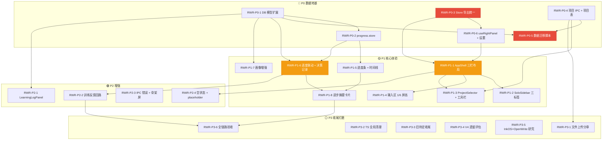

# 重写任务详情表

> **最后更新**: 2026-06-17 | **来源**: [2026-06-17-system-rewrite-spec.md](../dev-docs/designs/2026-06-17-system-rewrite-spec.md)
> **格式遵循**: R-010 原子化原则 + TASK-CHAIN 任务链规范
> **ID 前缀**: RWR-（System Rewrite）

---

## P0 — 数据地基（阻塞链）

### RWR-P0-1：DB 数据模型扩展

| 属性 | 值 |
|------|-----|
| **优先级** | **P0** |
| **目标** | 诊断表扩展 teachingProgress 字段，画像表扩展 teachingHistory 字段 |
| **前置依赖** | 无（起始任务）|
| **涉及文件** | `src/main/db/020_teaching_progress.sql`（新迁移）<br>`src/shared/types/diagnosis.ts`（扩展）<br>`src/shared/types/student-model.ts`（扩展）<br>`src/main/services/diagnosis.service.ts`（改）|
| **预估** | 2d |

**DoD**：
- [ ] diagnosis_results 表包含 teachingProgress 字段（`currentStage`/`resolvedIssues`/`totalIssues`）
- [ ] student_model 表包含 teachingHistory 字段（`history[]` 含 `action`/`syndromeId`/`outcome`/`timestamp`）
- [ ] 迁移不破坏现有数据
- [ ] tsc 0 errors

---

### RWR-P0-2：progress.store 新增

| 属性 | 值 |
|------|-----|
| **优先级** | **P0** |
| **目标** | 新增 progress.store + SessionProgress 类型定义 |
| **前置依赖** | RWR-P0-1（类型定义对齐）|
| **涉及文件** | `src/renderer/stores/progress.store.ts`（新）<br>`src/shared/types/teaching.ts`（SessionProgress 类型）|
| **预估** | 1d |

**DoD**：
- [ ] SessionProgress 类型：`{ sessionId, currentIssue, totalIssues, resolvedIssues, displayStatus, stage, phaseGroup? }`
- [ ] progress.store action：`setProgress` / `updateResolved` / `markCompleted` / `resetProgress`
- [ ] 与 persist middleware 集成（SQLite 持久化）
- [ ] 分母按阶段分组展示
- [ ] tsc 0 errors

---

### RWR-P0-3：Store 导出统一 + 删除 rightPanelService

| 属性 | 值 |
|------|-----|
| **优先级** | **P0** |
| **目标** | 三个独立 store 统一从 layout/ 目录导出，删除旧的 rightPanelService；**同时解决 V4-UI-1（Store 协作协议）** |
| **前置依赖** | 无 |
| **涉及文件** | `src/renderer/stores/layout/index.ts`（新 barrel）<br>`src/renderer/stores/layout/drawer.store.ts`（移入）<br>`src/renderer/stores/layout/panel-session.store.ts`（移入）<br>`src/renderer/stores/layout/chapter.store.ts`（移入）<br>删除 `src/main/services/right-panel.service.ts`<br>更新所有 import 路径（预计 15 处）|
| **预估** | 1.5d |

**DoD**：
- [ ] 所有 import 路径改为 `@/stores/layout/xxx`
- [ ] rightPanelService 全部调用已替换为 useRightPanel hook
- [ ] 旧服务文件确认删除（git rm）
- [ ] tsc 0 errors
- [ ] 测试全绿

---

### RWR-P0-4：项目 IPC + 项目表 migration

| 属性 | 值 |
|------|-----|
| **优先级** | **P0** |
| **目标** | 新增 project:* IPC 通道 + 项目表迁移文件 |
| **前置依赖** | 无 |
| **涉及文件** | `src/main/db/021_projects.sql`（新迁移）<br>`src/main/ipc/project.handler.ts`（新）<br>`src/shared/api-contracts/project.contracts.ts`（新）<br>`src/shared/constants.ts`（IPC_CHANNELS 新增 contract:*）|
| **预估** | 2d |

**DoD**：
- [ ] projects 表结构：`{ id, name, description, settingTree (JSON), settingTreeType ('main'), createdAt, updatedAt }`
- [ ] project:* 通道完整（`list`/`create`/`update`/`delete`/`get`）
- [ ] 合约类型在 `api-contracts/project.contracts.ts`
- [ ] IPC 通道命名遵循 `contract:` 前缀
- [ ] tsc 0 errors

---

### RWR-P0-5：数据迁移脚本

| 属性 | 值 |
|------|-----|
| **优先级** | **P0** |
| **目标** | 将旧数据自动迁移至新模型：作品集→默认项目，会话归入项目，诊断数据保留 |
| **前置依赖** | RWR-P0-1（新字段就绪）+ RWR-P0-4（项目表就绪）|
| **涉及文件** | `src/main/db/022_data_migration.sql`（新迁移）<br>`src/main/core/app-initializer.ts`（注册迁移）|
| **预估** | 1.5d |

**DoD**：
- [ ] "我的作品集"→自动转为默认项目
- [ ] 现有会话归入该项目
- [ ] 诊断数据保留，新字段给默认值
- [ ] 迁移可回滚（事务包裹）
- [ ] 迁移后系统可正常运行
- [ ] 单元测试覆盖迁移逻辑

---

### RWR-P0-6：useRightPanel hook + 设置面板

| 属性 | 值 |
|------|-----|
| **优先级** | **P0** |
| **目标** | 创建 useRightPanel hook 统一管理右侧栏状态；右侧栏工具页承载设置面板 |
| **前置依赖** | RWR-P0-3（rightPanelService 清理后）|
| **涉及文件** | `src/renderer/hooks/useRightPanel.ts`（新）<br>`src/renderer/components/settings/SettingsPanel.tsx`（新）<br>`src/renderer/styles/SettingsPanel.module.css`（新）|
| **预估** | 1d |

**DoD**：
- [ ] useRightPanel 提供 `open()`/`close()`/`toggle()`/`setTool()`/`setView()` 方法
- [ ] `toggle()` 暂不实现，统一由 panel-session 管理（注释标注）
- [ ] 设置面板包含：API Key 配置 + 态度档位默认偏好
- [ ] API Key 仅在 main process 处理（R-029）
- [ ] tsc 0 errors

---

## P1 — 核心体验（教学闭环主力）

### RWR-P1-1：AppShell 三栏独立布局

| 属性 | 值 |
|------|-----|
| **优先级** | **P1** |
| **目标** | 重写 AppShell 为可独立调整宽度的三栏布局 |
| **前置依赖** | RWR-P0-3（Store 就位）+ RWR-P0-6（hook 就位）|
| **涉及文件** | `src/renderer/components/layout/AppShell.tsx`（重写）<br>`src/renderer/styles/AppShell.module.css`（新/改）|
| **预估** | 2d |

**DoD**：
- [ ] 三栏独立 flex 布局，每栏可独立设置宽度
- [ ] min-width：左侧栏 200px / 中间栏 400px / 右侧栏 0px（折叠态不占空间）
- [ ] 拖拽调整宽度延迟 ≤ 100ms
- [ ] `< 1280px` 时右侧栏 overlay 模式
- [ ] 过渡动画：`cubic-bezier(0.25, 0.1, 0.25, 1)`，300ms
- [ ] 右侧栏折叠态：0px 宽度，收起时右侧空白不残留
- [ ] tsc 0 errors

---

### RWR-P1-2：SoloSidebar 三标签

| 属性 | 值 |
|------|-----|
| **优先级** | **P1** |
| **目标** | SoloSidebar 改为 [对话][项目][训练] 三标签结构 |
| **前置依赖** | RWR-P1-1（布局就位）|
| **涉及文件** | `src/renderer/components/layout/SoloSidebar.tsx`（大改）<br>`src/renderer/components/layout/SoloSidebar.module.css`（改）|
| **预估** | 2d |

**DoD**：
- [ ] 顶部独立行：**[训练]** 按钮（居左对齐）
- [ ] 其下标签行：**[对话] [项目]**（双标签）
- [ ] 底部固定行：**[⚙]** 设置按钮
- [ ] 标签切换后列表区内容正确切换
- [ ] 训练标签：已有训练会话列表 + "新建训练"按钮
- [ ] 项目标签：当前项目 + 会话树
- [ ] 垂直分割线：区分按键区域和列表区域（2px `var(--color-border)`）
- [ ] tsc 0 errors

---

### RWR-P1-3：ProjectSelector + InputToolbar + AttitudeIndicator

| 属性 | 值 |
|------|-----|
| **优先级** | **P1** |
| **目标** | 中间栏 header 项目选择 + 输入框上方工具栏 + 态度档位灯 |
| **前置依赖** | RWR-P0-4（项目 IPC）+ RWR-P1-1（布局就位）|
| **涉及文件** | `src/renderer/components/layout/ProjectSelector.tsx`（新）<br>`src/renderer/components/chat/InputToolbar.tsx`（新/改）<br>`src/renderer/components/chat/AttitudeIndicator.tsx`（新）|
| **预估** | 2d |

**DoD**：
- [ ] ProjectSelector：下拉显示当前项目名，点击切换项目
- [ ] InputToolbar 按钮从左到右：`[模板] [工具] [+] [][⤢] [─]`
- [ ] AttitudeIndicator 在 InputToolbar 最右侧：🟢🟡🔴 三灯互斥 + 🔒 锁图标
- [ ] 🔒 锁定：实心 + `var(--color-attitude-{level})`，解锁：空心 + 浅色
- [ ] 无 toast / 弹窗提示
- [ ] tsc 0 errors

---

### RWR-P1-4：输入区 1/6 屏高重构

| 属性 | 值 |
|------|-----|
| **优先级** | **P1** |
| **目标** | ChatInput 重构为默认 1/6 屏幕高度 |
| **前置依赖** | RWR-P1-1（布局就位）|
| **涉及文件** | `src/renderer/components/chat/ChatInput.tsx`（重构）<br>`src/renderer/styles/ChatInput.module.css`（重写）|
| **预估** | 1d |

**DoD**：
- [ ] 输入区默认高度 = `calc(100vh / 6)`
- [ ] 输入保持纯文本（编辑器仅 textarea，预览区渲染对话中的作品引用）
- [ ] placeholder 3 条随机轮换，从 `TeachingTip` 组件读取
- [ ] tsc 0 errors

---

### RWR-P1-5：TeachingProgressBar + ProgressTimeline

| 属性 | 值 |
|------|-----|
| **优先级** | **P1** |
| **目标** | 右侧栏展示教学进度纵向时序 + 0/N 进度 |
| **前置依赖** | RWR-P0-2（progress.store 就位）|
| **涉及文件** | `src/renderer/components/training/TeachingProgressBar.tsx`（新）<br>`src/renderer/components/training/ProgressTimeline.tsx`（新）|
| **预估** | 2d |

**DoD**：
- [ ] ProgressTimeline：纵向流程线（提交→诊断中→教学中→已收尾）
- [ ] TeachingProgressBar：`0/N` 格式，分母只增不减，按阶段分组（如 `认知框架 0/3 → 工具迁移 0/2 → 技能练习 0/4`）
- [ ] 点击数字→展开教学概览
- [ ] 精通确认后分子 +1
- [ ] tsc 0 errors

---

### RWR-P1-6：诊断表与进度联动 + 教学决策记录

| 属性 | 值 |
|------|-----|
| **优先级** | **P1** |
| **目标** | AI 完成教学后进度自动跳动；教学决策日志写入 DB |
| **前置依赖** | RWR-P0-1（DB 扩展就位）+ RWR-P0-2（progress store 就位）|
| **涉及文件** | `src/renderer/stores/progress.store.ts`（改）<br>`src/main/services/progress.service.ts`（新）<br>`src/shared/types/teaching-decision.ts`（新）|
| **预估** | 2d |

**DoD**：
- [ ] AI 教学完成→progressMap.resolvedIssues +1
- [ ] progress.store 订阅 `teaching:completed` IPC 事件
- [ ] TeachingDecisionLog 结构：`{ action, syndromeId, decision, outcome, timestamp, currentStage? }`
- [ ] TeachingOutcomeLog 结构：`{ syndromeId, method, masteryLevel, timestamp }`
- [ ] `currentStage` 限定为教学状态机枚举值（非自由字符串）
- [ ] tsc 0 errors

---

### RWR-P1-7：画像增强

| 属性 | 值 |
|------|-----|
| **优先级** | **P1** |
| **目标** | 学生模型扩展 teachingHistory + attitudePreference 字段 |
| **前置依赖** | RWR-P0-1（DB 扩展就位）|
| **涉及文件** | `src/main/services/student-model.service.ts`（改）<br>`src/main/services/teaching-history.service.ts`（新）|
| **预估** | 1.5d |

**DoD**：
- [ ] teachingHistory：`[{ action, syndromeId, outcome, timestamp }]` 数组
- [ ] attitudePreference：记录用户最近使用的档位
- [ ] teachingHistory 是系统内部字段，不出现在前端 UI
- [ ] tsc 0 errors

---

### RWR-P1-8：进步摘要卡片 + 时序点击展开

| 属性 | 值 |
|------|-----|
| **优先级** | **P1** |
| **目标** | 精通确认时展示进步摘要卡片；点击进度数字展开教学概览 |
| **前置依赖** | RWR-P1-5（进度条就位）+ RWR-P1-6（进度联动就位）|
| **涉及文件** | `src/renderer/components/training/ProgressSummaryCard.tsx`（新）<br>`src/renderer/components/training/TeachingOverviewPanel.tsx`（新）|
| **预估** | 1.5d |

**DoD**：
- [ ] 精通时右侧栏显示进步摘要卡片（总结了什么、学了什么、当前进度）
- [ ] 点击 ProgressTimeline 上的数字→右侧栏切换为教学概览工具
- [ ] 教学概览展示该会话的教学历史摘要
- [ ] tsc 0 errors

---

## P2 — 增强功能

### RWR-P2-1：LearningLogPanel

| 属性 | 值 |
|------|-----|
| **优先级** | **P2** |
| **目标** | 右侧栏学习日志工具面板 |
| **前置依赖** | RWR-P0-1（DB 扩展就位）+ RWR-P1-1（布局就位）|
| **涉及文件** | `src/renderer/components/growth/LearningLogPanel.tsx`（新）|
| **预估** | 1d |

**DoD**：
- [ ] 展示历史教学记录（按时间倒序）
- [ ] 每项显示：日期/内容要点/状态
- [ ] tsc 0 errors

---

### RWR-P2-2：训练反馈回路

| 属性 | 值 |
|------|-----|
| **优先级** | **P2** |
| **目标** | 训练完成后更新进度并检查精通门控 |
| **前置依赖** | RWR-P1-6（进度联动就位）|
| **涉及文件** | `src/renderer/components/training/TrainingFeedbackLoop.tsx`（新）<br>`src/main/services/training.service.ts`（改）|
| **预估** | 1.5d |

**DoD**：
- [ ] 训练完成后 progressMap 自动更新
- [ ] 精通门控触发后不再推荐该症候的训练
- [ ] tsc 0 errors

---

### RWR-P2-3：IPC 错误处理统一 + 加载态骨架屏

| 属性 | 值 |
|------|-----|
| **优先级** | **P2** |
| **目标** | 统一 IPC 调用错误展示 + 加载态骨架屏；**同时解决 V4-UI-3（函数传递链路审计）+ IPC 非空断言** |
| **前置依赖** | 无（可并行于任何阶段）|
| **涉及文件** | `src/renderer/hooks/useIpcWithFallback.ts`（新）<br>`src/renderer/components/common/SkeletonLoader.tsx`（新）<br>`src/renderer/styles/skeleton.module.css`（新）|
| **预估** | 1.5d |

**DoD**：
- [ ] IPC 失败时展示错误占位（非弹窗），不崩溃
- [ ] 左侧栏列表 → 骨架屏
- [ ] 右侧栏工具内容 → 骨架屏
- [ ] 中间栏消息发送失败 → 红色状态标记
- [ ] IPC 请求 `< 300ms` 不展示 loading
- [ ] 主进程 handler 消除 `deps!` 非空断言
- [ ] tsc 0 errors

---

### RWR-P2-4：空状态全覆盖 + placeholder 轮换

| 属性 | 值 |
|------|-----|
| **优先级** | **P2** |
| **目标** | 所有面板添加引导空状态 + 输入框 placeholder 随机轮换 |
| **前置依赖** | RWR-P1-1（布局就位）|
| **涉及文件** | `src/renderer/components/common/EmptyState.tsx`（新）<br>`src/renderer/components/chat/TeachingTip.tsx`（新）|
| **预估** | 1d |

**DoD**：
- [ ] 左侧栏空项目/空会话：显示"还没有XX"引导文字
- [ ] 右侧栏空工具：显示工具网格（6 格 icon grid）
- [ ] 输入框 placeholder 3 条随机轮换："试试在右侧栏看你的进步日志"/另 2 条
- [ ] tsc 0 errors

---

## P3 — 收尾打磨

### RWR-P3-1：文件上传 + 分章

| 属性 | 值 |
|------|-----|
| **优先级** | **P3** |
| **目标** | 用户上传文件→自动分章 |
| **前置依赖** | RWR-P0-4（项目表就位）|
| **涉及文件** | `src/main/ipc/file.handler.ts`（新）<br>`src/renderer/components/manuscript/FileUploadPanel.tsx`（新）|
| **预估** | 2d |

**DoD**：
- [ ] 支持 `.txt`/`.docx` 上传
- [ ] 自动分章（按章节标记分离）
- [ ] 上传失败有降级提示
- [ ] tsc 0 errors

---

### RWR-P3-2：TypeScript 全局清理

| 属性 | 值 |
|------|-----|
| **优先级** | **P3** |
| **目标** | 消除 as 断言（除 as const/DOM API）+ @ts-ignore |
| **前置依赖** | 无（贯穿全程）|
| **涉及文件** | 全局 |
| **预估** | 1.5d |

**DoD**：
- [ ] 0 `@ts-ignore`
- [ ] 0 `as` 断言（例外：`as const` / DOM API 如 `as HTMLElement`）
- [ ] tsc 0 errors

---

### RWR-P3-3：旧待定任务收尾

| 属性 | 值 |
|------|-----|
| **优先级** | **P3** |
| **目标** | 完成 TASK-TABLE 遗留的 B3/A3/B2/B4/UI-P2a/b/c |
| **前置依赖** | 各子项依赖已在 DoD 中标注 |
| **涉及文件** | 多个 |
| **预估** | 2d |

**DoD**：
- [ ] B3：训练完成后指引清晰（评分+下步建议+查看详情）
- [ ] A3：用户写得好时展示"相关阅读"引导
- [ ] B2：推荐列表训练项去重/避免重叠
- [ ] B4：训练记录显示可读名称而非原始 ID
- [ ] UI-P2a：状态栏对比度 ≥ WCAG AA 4.5:1
- [ ] UI-P2b：键盘快捷键（Ctrl+S / Ctrl+= / Ctrl+-）
- [ ] UI-P2c：自动排版操作前弹出确认对话框
- [ ] tsc 0 errors

---

### RWR-P3-4：V4 遗留评估

| 属性 | 值 |
|------|-----|
| **优先级** | **P3** |
| **目标** | 评估 V4-SKILL/V4-DIST/V4-INFRA 三项方向是否继续、暂缓或终止 |
| **前置依赖** | 不依赖代码变更 |
| **涉及文件** | 评估报告（写入决策日志）|
| **预估** | 0.5d |

**DoD**：
- [ ] V4-SKILL（Prompt→Skill 工程）：明确继续/暂缓/终止决策
- [ ] V4-DIST（蒸馏研究）：明确继续/暂缓/终止决策
- [ ] V4-INFRA（数据基建）：明确继续/暂缓/终止决策
- [ ] 决策记录写入 spec 附录关键决策日志

---

### RWR-P3-5：外部项目代码研究

| 属性 | 值 |
|------|-----|
| **优先级** | **P3** |
| **目标** | 对规格附录 B 列举的 6 个外部项目进行全面研究，输出可落地模式分析 |
| **前置依赖** | 不依赖代码变更 |
| **方式** | 研究任务，不涉及项目代码修改 |
| **预估** | 2d |

**研究内容**（三个深度层级）：

| 深度 | 项目 | 研究重点 |
|:----:|:-----|:---------|
| **代码级** | InkOS（MIT）| TruthFile 实现、Auditor 逻辑、Agent 管线调度 |
| | OpenWrite（AGPL-3.0）| Codex 组件树、项目管理状态设计、AI 上下文注入 |
| **产品级** | 91Writing | 提示词库分类管理、进度可视化、目标追踪 UI |
| | SoloEnt | "故事宪法"SoloEnt.md 文件设计哲学（闭源，仅概念层）|
| **参考级** | CoachGPT（SIGIR '25）| Scaffolding 教学结构、A/B 测试实验方法 |
| | Khan Academy Writing Coach | 多稿追踪展示方式、高亮反馈交互 |

**DoD**：
- [ ] 研究笔记写入 spec 附录 B
- [ ] 每项给出"直接采用/借鉴思路/参考即可/不采用"的明确结论
- [ ] 代码级研究输出关键模块调用图或组件树

---

### RWR-P3-6：全链路验收测试

| 属性 | 值 |
|------|-----|
| **优先级** | **P3** |
| **目标** | 完整走一遍教学闭环验证 |
| **前置依赖** | RWR-P1-8（P1 全部完成）|
| **涉及文件** | 测试脚本（手动）|
| **预估** | 1d |

**DoD**：
- [ ] 教学闭环：提交作品→诊断→教学→训练→验证，完整可走通
- [ ] 进度跳动：解决一个问题后 0/N 分子 +1
- [ ] 态度锁定：锁定后 AI 不自动切换
- [ ] 项目切换：切换项目后会话和进度随之切换
- [ ] 右侧栏不主动弹
- [ ] 项目切换 ≤ 500ms
- [ ] 1000+ 消息会话滚动帧率 ≥ 30fps
- [ ] 拖拽调整宽度延迟 ≤ 100ms
- [ ] IPC 失败降级：invoke 失败时对应面板展示错误占位，不崩溃
- [ ] 加载态覆盖：左侧栏/右侧栏有骨架屏

---

## 依赖图



---

## 推荐执行顺序

```
Phase 0（并行启动）：
  RWR-P0-1（2d）─→ RWR-P0-2（1d）
  RWR-P0-3（1.5d）─→ RWR-P0-6（1d）
  RWR-P0-4（2d）───→ RWR-P0-5（1.5d）
  RWR-P2-3（1.5d，无依赖，可全程并行）

Phase 1（依次 + 并行）：
  RWR-P0-3+P0-6 ─→ RWR-P1-1（2d）──→ RWR-P1-2（2d）
                                       └──→ RWR-P1-4（1d）
                             RWR-P0-4 ─→ RWR-P1-3（2d）
                             RWR-P0-1+P0-2 ─→ RWR-P1-5（2d）→ RWR-P1-8（1.5d）
                                              RWR-P1-6（2d）─┘
                                              RWR-P1-7（1.5d，可并行）

Phase 2：
  RWR-P2-1（1d，无依赖）
  RWR-P2-2（1.5d，依赖 P1-6）
  RWR-P2-4（1d，依赖 P1-1）

Phase 3：
  RWR-P3-3（2d）+ RWR-P3-2（1.5d，可并行）
  RWR-P3-1（2d，依赖 P0-4）
  RWR-P3-4（0.5d，无依赖）
  RWR-P3-5（1d，无依赖）
  RWR-P3-6（1d，依赖 P1-8+P2-2）
```
