# 任务链状态（统一正本）

> **最后更新**: 2026-06-05  
> **系统版本**: V3.1  
> **规范依据**: [TASK-SYSTEM-DESIGN.md](TASK-SYSTEM-DESIGN.md)

---

## 一、当前指针

| 位置 | 任务 |
|------|------|
| ✅ 已完成 | [T-000 ~ T-014](#-已完成任务-14项) |
| ▶️ **进行中** | [T-021: 训练入口与工坊](#todo-) |
| ⏩ 下一个 | [T-020: 状态锁定机制](#todo-) |

---

## 二、依赖图

```mermaid
flowchart LR
    subgraph done["✅ 已完成"]
        T0[T-000 基线建设]
        T1[T-001 System Prompt 注入]
        T2[T-002 数据持久化]
        T3[T-003 世界观扩展]
        T4[T-004 诊断持久化]
        T5[T-005 能力画像]
        T6[T-006 聚焦方向]
        T7[T-007 Config 提取]
        T8[T-008 学生模型桥接]
        T9[T-009 Strategy Service]
        T10[T-010 PromptBuilder 改造]
        T11[T-011 能力画像文字化]
        T12[T-012 右侧栏数据同步]
        T14[T-014 动态上下文装载 <br/><small>P0</small>]
    end
    
    subgraph current["▶️ 进行中"]
        T21[T-021 训练入口与工坊 🔵]
    end

    subgraph next["📋 待执行"]
        T20[T-020 状态锁定机制 <br/><small>P2</small>]
        T13[T-013 能力成长可视化 <br/><small>P1</small>]
        T16[T-016 辩驳追踪+强度升级 <br/><small>P1</small>]
        T17[T-017 态度系统统一 <br/><small>P1</small>]
        T18[T-018 Challenge-Unlock <br/><small>P1</small>]
        T15[T-015 翻译层 <br/><small>P1</small>]
        T19[T-019 从零构建引导 <br/><small>P2</small>]
    end
    
    T0 --> T1 --> T2 --> T3 --> T4 --> T5 --> T6
    T6 --> T7 --> T8 --> T9 --> T10
    T10 --> T11 --> T12
    T12 --> T14
    
    T14 --> T20 --> T13 --> T21 --> T16 --> T17 --> T18 --> T15 --> T19
    
    style T0 fill:#4a4
    style T1 fill:#4a4
    style T2 fill:#4a4
    style T3 fill:#4a4
    style T4 fill:#4a4
    style T5 fill:#4a4
    style T6 fill:#4a4
    style T7 fill:#4a4
    style T8 fill:#4a4
    style T9 fill:#4a4
    style T10 fill:#4a4
    style T11 fill:#4a4
    style T12 fill:#4a4
    style T14 fill:#4a4
    
    style T21 fill:#48f,color:#fff
    style T20 fill:#888,color:#fff
    style T13 fill:#888,color:#fff
    style T16 fill:#888,color:#fff
    style T17 fill:#888,color:#fff
    style T18 fill:#888,color:#fff
    style T15 fill:#888,color:#fff
    style T19 fill:#888,color:#fff
```



---

## 三、待执行任务序列

```
T-014 动态上下文装载 [P0]     ← 架构基础，改造 PromptLoader
  → T-020 状态锁定机制 [P2]   ← P3 阶段 + 锁定语义（需 Prompt 架构稳定）
  → T-013 能力成长可视化 [P1] ← 右侧栏使用 T-014 后的 Prompt 数据
  → T-021 训练入口与卡片 [P1] ← 成长可视化后自然承接训练
  → T-016 辩驳追踪+强度升级 [P1] ← chat.handler 集成辩驳检测
  → T-017 态度系统统一 [P1]   ← 整合 T-016 的升级逻辑为三态
  → T-018 反思门控 [P1]       ← 复用 T-017 的态度系统做语气决策
  → T-015 翻译层 [P1]         ← 诊断展示使用 T-018 后的数据流
  → T-019 从零构建引导 [P2]   ← 全部核心功能稳定后做
```

### 序列化依据

| 步骤 | 关系类型 | 依据 |
|------|---------|------|
| T-014 → T-020 | 延续 | T-014 改造 PromptLoader 后，状态机（T-020）的锁定逻辑需要稳定的 Prompt 架构 |
| T-020 → T-013 | 基础 | T-020 产出状态锁定机制，T-013 的成长趋势需要稳定阶段状态 |
| T-013 → T-021 | 延续 | T-013 成长可视化后用户看到症候趋势，T-021 提供训练入口承接改进需求 |
| T-021 → T-016 | 延续 | T-021 接线训练资源后，T-016 的辩驳检测集成到 chat.handler |
| T-016 → T-017 | 总结 | T-016 产出升级逻辑（doubao→sensei），T-017 整合为统一的三态系统 |
| T-017 → T-018 | 延续 | T-018 的反思门控需要 T-017 的统一语气系统做语气决策 |
| T-018 → T-015 | 延续 | T-018 稳定后，T-015 的翻译层使用其数据流 |
| T-015 → T-019 | 总结 | T-019 作为核心链终点，整合全部核心功能后做新用户引导 |

---

## 四、状态一览

### ✅ 已完成（13 项）

| ID | 名称 | 优先级 | 完成日期 | DoD 摘要 |
|----|------|:------:|:--------:|---------|
| [T-000](T-000-基线建设.md) | 基线建设 | P0 | 2026-06-01 | 聊天链路打通、68 测试、规则优化 |
| [T-001](T-001-system-prompt-injection.md) | System Prompt 注入 + 态度档位 | P0 | 2026-06-01 | 三态档位、Prompt 参数化加载、UI 胶囊按钮 |
| [T-002](T-002-data-persistence-session.md) | 数据持久化与会话管理 | P0 | 2026-06-01 | SQLite 消息持久化、会话侧栏、自动标题 |
| [T-003](T-003-worldbuilding-character-expansion.md) | 世界观构建与角色扩展 | P0 | 2026-06-01 | P1_WORLD 5 子阶段、+3 症候、+6 训练任务、P008 删除、修改原文入口、AI 评估、成长记录、面板简化 |
| [T-004](T-004-diagnosis-persistence.md) | 诊断结果持久化 | P0 | 2026-06-01 | 诊断数据持久化到 SQLite |
| [T-005](T-005-ability-profile.md) | 长期能力表单与能力画像 | P1 | 2026-06-02 | 能力评分、弱点标签、趋势分析、IPC 通道 |
| [T-006](T-006-focus-area-transition.md) | 聚焦方向与过渡邀请 | P1 | 2026-06-02 | 三模式聚焦、子阶段过滤、过渡邀请、外置话术 |
| [T-007](T-007-config-extraction.md) | Config 配置层提取 | P0 | 2026-06-04 | 4 个 JSON 配置文件，含 $source 字段 |
| [T-008](T-008-student-model-bridge.md) | 学生模型桥接 | P1 | 2026-06-04 | 跨会话诊断聚合、{student_context} 修复 |
| [T-009](T-009-strategy-service.md) | Strategy Service | P0 | 2026-06-04 | TeachingStrategyService + ProblemPrioritizer |
| [T-010](T-010-prompt-builder-upgrade.md) | PromptBuilder 改造 | P1 | 2026-06-04 | 策略决策注入、249 测试通过 |
| [T-011](T-011-ability-profile-textualization.md) | 能力画像文字化 | P2 | 2026-06-04 | 文字化描述方法、toPromptText/toRendererView |
| [T-012](T-012-right-panel-sync.md) | 右侧栏数据同步 | P1 | 2026-06-05 | IPC 数据推送、Zustand store、282 测试 |

> **审计说明**（2026-06-04）：  
> - T-005 任务文件原标注"进行中"，但代码已完整实现并验证通过。本次统一校正为 done。  
> - T-003 实际涵盖了 TASK-SEQUENCE_V1.0 中的 M-1~M-5（症候修正 / 修改原文 / AI 评估 / 成长记录 / 面板简化），这些已完成的工作已合并计入 T-003。

### 📋 待执行（9 项）

| ID | 名称 | 优先级 | 状态 | 预估 | 依赖 | 关系 | 前端组件 |
|----|------|:------:|:----:|:----:|:----:|:----:|:--------:|
| [T-014](T-014-dynamic-context-loading.md) | 动态上下文装载 | **P0** | ✅ 已完成 | 3d | — | 链首 | — |
| [T-020](T-020-state-locking.md) | 状态锁定机制 | P2 | draft | 1d | T-014 | 延续 | — |
| [T-013](T-013-growth-visualization.md) | 能力成长可视化 | P1 | draft | 2d | T-020 | 基础 | RightPanel.tsx |
| [T-021](T-021-training-entry.md) | 训练入口与工坊 | P1 | draft | 4d | T-013 | 延续 | TrainingWorkshop.tsx + TrainingBridgeCard.tsx + AppSidebar.tsx |
| [T-016](T-016-dispute-tracking.md) | 辩驳追踪 + 强度升级 | P1 | draft | 2d | T-021 | 延续 | — |
| [T-017](T-017-attitude-unification.md) | 态度系统统一 | P1 | draft | 1d | T-016 | 总结 | Sidebar.tsx |
| [T-018](T-018-reflection-gate.md) | Challenge-Unlock 反思门控 | P1 | draft | 2d | T-017 | 延续 | ChatMessage.tsx |
| [T-015](T-015-diagnosis-translation.md) | 翻译层 | P1 | draft | 1d | T-018 | 延续 | RightPanel.tsx |
| [T-019](T-019-onboarding-flow.md) | 从零构建引导流程 | P2 | draft | 3d | T-015 | 总结 | 新增 OnboardingFlow |

---

## 五、前后端工作分布

| 任务 | 后端工作 | 前端工作 | 前端文件 |
|------|---------|---------|---------|
| T-014 | DynamicContextService 按需装载 | 无 | — |
| T-020 | teaching-state-machine P3 阶段 + 锁定语义 | 无 | — |
| T-013 | GrowthTrendService 症候趋势计算 | 右侧栏能力成长可视化 | RightPanel.tsx |
| T-021 | TrainingRecommendationService + training IPC | 训练工坊（中心面板）+ 错误卡片 + 桥接卡片 + 训练历史 | TrainingWorkshop.tsx + TrainingBridgeCard.tsx + TrainingHistoryBar.tsx + AppSidebar.tsx |
| T-016 | DisputeTracker 辩驳检测 + 升级 | 无 | — |
| T-017 | decideTone() 接收 attitude 参数 | 态度按钮映射调整 | Sidebar.tsx |
| T-018 | ReflectionGateService + 状态机 S2_REFLECTION | 反思问题卡片渲染 | ChatMessage.tsx |
| T-015 | diagnosisToUserFacing 翻译函数 | 右侧栏使用翻译层 | RightPanel.tsx |
| T-019 | 新用户检测 + 引导会话创建 | 向导式引导流程 UI | OnboardingFlow.tsx |

---

## 六、优先级时序图

```
立即启动（P0）                    核心交付（P1）                      体验增强（P2）
────────────                     ────────────                      ────────────
T-014 动态上下文装载 ──→ T-020 状态锁定 ──→ T-013 能力成长可视化        T-019 从零构建引导
  │                                  │
  │                                  └──→ T-021 训练入口 ──→ T-016 辩驳追踪
  │                                                              │
  │                                                              └──→ T-017 态度统一
  │                                                                       │
  │                                                                       └──→ T-018 反思门控
  │                                                                                │
  │                                                                                └──→ T-015 翻译层
  └────────────────────────────────────────────────────────────────────────────→ T-019 总结
```

---

## 七、设计依据索引

每个任务的设计来源及序列关系：

| # | 任务 | 设计文档 | 关联发现 | 来源任务 | 关系 |
|---|------|---------|---------|---------|:----:|
| 1 | T-014 动态上下文装载 | dynamic-context-service_V1.0.md | 发现10 参考抽屉走偏 | — | 链首 |
| 2 | T-020 状态锁定机制 | — | 发现2 四层架构坍缩 | T-014 | 延续 |
| 3 | T-013 能力成长可视化 | training-effectiveness-scoring_V2.0.md | 发现5 评分幽灵 | T-020 | 基础 |
| 4 | T-021 训练入口与卡片 | challenge-unlock-reflection_V1.0.md | 发现2 四层架构坍缩（Layer 4） | T-013 | 延续 |
| 5 | T-016 辩驳追踪 | dispute-tracking-escalation_V1.0.md | 发现8 验证报告未消化 | T-021 | 延续 |
| 6 | T-017 态度统一 | attitude-system-unification_V1.0.md | 发现7 态度系统混乱 | T-016 | 总结 |
| 7 | T-018 反思门控 | challenge-unlock-reflection_V1.0.md | 发现9 AI 温和偏差 | T-017 | 延续 |
| 8 | T-015 翻译层 | diagnosis-translation-layer_V1.0.md | 发现4 诊断面板违反理念 | T-018 | 延续 |
| 9 | T-019 从零构建 | — | 发现1 从零构建模式被遗忘 | T-015 | 总结 |

---

## 八、切换指南（从旧体系迁移）

如果你之前使用的是旧任务体系，以下是映射关系。注意状态定义差异：

- 旧体系状态：进行中 / 已完成 / 待启动
- **新体系状态**：draft → ready → in_progress → review → done → rework（严格流转）

| 旧体系文档 | 旧任务 | 新体系位置 | 说明 |
|-----------|--------|-----------|------|
| TASK-SEQUENCE_V1.0.md | M-1~M-5 | T-003 | 已合并 |
| TASK-SEQUENCE_V1.0.md | V1.1-7 能力画像文字版 | T-011 | 已 done |
| TASK-SEQUENCE_V1.0.md | V1.1-8 聚焦方向后置 | T-012 | 已 done |
| TASK-SEQUENCE_V1.0.md | V1.1-9 意图-执行一致性 | — | Phase 3，暂缓 |
| TASK-SEQUENCE_V1.0.md | V1.1-10 教学记录分层 | — | Phase 3，暂缓 |
| mvp-phase1-tasks_V1.0.md | T-001~T-014 | 已全部 done | 不再维护 |
| TASK-SEQUENCE_V2.0.md | T-1.1~T-2.4 | T-007~T-016 | 已重新编号 |
| V2.1 任务链 | T-013~T-020 | 序列已调整 | 依赖关系重新审查 |

---

## 九、变更记录

| 版本 | 日期 | 变更内容 |
|------|------|---------|
| V1.0 | 2026-06-01 | 初始任务链（T-000 ~ T-004）|
| V2.0 | 2026-06-04 | 统一正本：审计校正状态，新增 T-007 ~ T-016 |
| V2.1 | 2026-06-05 | 重构任务链：T-007~T-012 改为 done，新增 T-013~T-020 |
| **V3.0** | **2026-06-05** | **任务管理系统优化：统一格式、规范状态流转、序列化重排。**  |
| | | **具体变更：** |
| | | • 更新 TASK-SYSTEM-DESIGN 为 V3.0，明确状态流转规则、序列化判定流程、优先级调整规则|
| | | • 重写 TASK-TEMPLATE.md 为完整统一格式|
| | | • 重写 T-014~T-020 为统一格式（基本信息行、目标、设计依据、前后端分工、文件清单、DoD、回退方案、执行记录）|
| | | • 新建 T-013（原缺失文件）为统一格式|
| | | • 重排序列：T-014→T-020→T-013→T-016→T-017→T-018→T-015→T-019|
| | | • 每步标注关系类型：延续/总结/基础|
| | | • P0 任务唯一：T-014 为当前唯一 P0，其他 P1/P2 串行|
| **V3.1** | **2026-06-05** | **矛盾修复 + 训练入口补缺** |
| | | • 新增 T-021 训练入口与卡片，序列插入 T-013→T-021→T-016 |
| | | • 修复 T-016 vs T-017 矛盾：补充自动升级 vs 手动选择优先级规则（§3.2.1） |
| | | • 修复 T-016 vs T-018 交互遗漏：反思阶段辩驳排除规则 |
| | | • T-017 态度系统设计文档补充与 T-016 联动说明 + 否决权 IPC |
