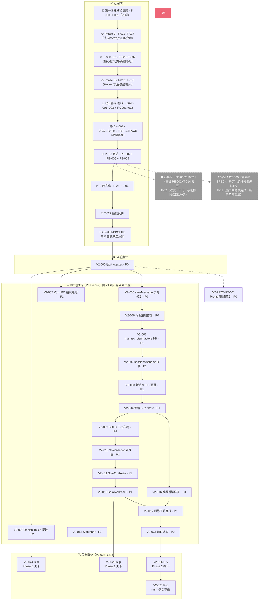

# 任务链状态（统一正本）

> **最后更新**: 2026-06-08  V14.1
> **系统版本**: V3.5
> **规范依据**: [TASK-SYSTEM-DESIGN.md](TASK-SYSTEM-DESIGN.md)
> **任务链版本**: V14.1

---

> ⚠️ **关键约束声明：界面改造边界**
>
> 1. **改造现有界面，不新建独立界面**。所有 UI 变更必须在现有组件（App.tsx / sidebar / 右侧栏 / 中心面板）内部完成。禁止创建独立的"训练面板"、"IDE 界面"或任何形式的新建布局入口。
> 2. **界面设计尚未完成，不提前实现**。主界面改造方案尚未经过 UI/UX 设计决策。**未设计，不实现**。任何涉及布局拆分、新面板创建、centerMode 逻辑变更的任务，在设计决策完成前一律禁止执行。
> 3. **已有组件优先**。新功能优先考虑塞入现有组件（Sidebar / RightPanel / ChatMessage / TrainingWorkshop 等），塞不下再评估修改现有组件，永远不把"建新界面"作为第一方案。
>
> 违者后果：代码被回退，任务标记为"违规执行"并重新审查范围。

---

## 〇、任务链三大基本原则

> **以下三条原则适用于任务链中所有任务的创建、执行和交接。违反任一原则的任务不得进入执行阶段。**

### 原则一：收尾确认

**每个任务必须是上一个任务的合理收尾，包含明确的完成标准和成果确认。**

- 任务启动前必须确认前序任务已达成 DoD（完成标准）
- 任务交付物必须与前序任务的输出形成逻辑闭环
- 不得在发现前序任务有遗留问题时"边做边补"，必须回退处理

### 原则二：基础提供

**每个任务必须为下一个任务提供必要的数据、资源或条件基础，确保工作连续性。**

- 任务完成后必须输出可被后续任务直接消费的产物（代码/配置/文档/数据）
- 任务的 DoD 必须包含"下一任务可用性验证"项
- 依赖断裂（下游任务无法获取上游输出）视为任务失败

### 原则三：自然衔接

**每个任务的开头必须与前序任务的结尾形成自然衔接，包含对前置成果的引用或确认。**

- 任务描述中必须明确引用前序任务的交付物（文件路径/函数名/配置键）
- 任务执行记录必须记录"从前序任务的哪一步/哪个输出开始"
- 跨任务的状态（如版本号、配置项、类型定义）必须保持一致

---

## 一、当前指针

| 位置 | 任务 |
|------|------|
| ✅ 已完成 | [T-000 ~ T-021](#-已完成任务-18项) + CS-001 + Phase 2（5项）+ Phase 2.5（5项）+ Phase 3（4项）+ GAP 系列（3项）+ P0/P1 修复（2项）+ CX-001（4项）+ PE-002 + PE-006 + PE-009 + F-04 + F-03 + T-027 + **CX-001-PROFILE** |
| ▶️ **当前指针** | **V2-000 拆分 App.tsx（P0）** — V2 SOLO 模式改造与缺陷修复，详见[Phase V2 章节](#phase-v2-ui-改造与缺陷修复-29-项) |
| ⚡ **并行可执行** | **V2-PROMPT-001 Prompt 传导链路修复（P0）** — 不依赖任何 V2 任务，可与 Phase 0 并行推进 |
| ⏩ **下一步** | V2-000 → V2-005 → V2-006 → V2-001 → V2-002 → ... → V2-027 审查通过（串行链，共 29 项）|

---

## 二、依赖图



---

### 依赖图说明

| 区块 | 含义 |
|------|------|
| ✅ 已完成（绿色组） | 堆叠显示的已完成阶段，内部顺序即执行顺序 |
| ▶️ 当前指针（橙色） | V2-000 拆分 App.tsx（P0），V2 SOLO 模式改造起点 |
| ⏩ 有效待执行 | V2 系列 Phase 0-2 共 24 项 + 4 项审查，箭头表示串行依赖关系 |
| 🔍 关卡审查（蓝色） | V2-024~027 嵌入 Phase 边界，审查通过后才可进入下一 Phase |
| ❌ 已移除（灰色虚线） | PE-008/010/011 已被 PE-002（CodexService）+ T-014（DynamicContextService）覆盖；F-02 过度工厂化与创作认知定位冲突 |
| ❓ 待定（灰色虚线） | PE-003 定义不成熟（最小版本仅为一处 TODO），F-07 报告标注为"条件接受"未经验证；F-01 面向中高级用户，新手阶段暂缓；F-05/F-06/SF-005~008 因 V2 改造优先级更高而暂缓 |

---

## 三、待执行任务序列

### 第一阶段（已完成，T-000 ~ T-021）

核心教学链路已全部完成，详见 §四 状态一览。

### 第二阶段（Phase 2，T-022 ~ T-027）

```
核心教学链路已完成。Phase 2 聚焦：技法库工程化 + 体验优化 + 诊断精度。

✅ T-022 技法库蒸馏完成 [P0]  ← 89 条技法，7 类别全覆盖，11 本书
      三管蒸馏体系已启动：小说技法蒸馏完成、AI 工具蒸馏完成、教育学蒸馏完成
  │
  ├──→ T-024 训练效果评分 [P0]  ← 依赖 T-022（评分需要技法库作为参考）— ✅ 已完成
  │
  └──→ T-027 症候变种标注 [P2]  ← 依赖 T-022（变种标注后需要技法库匹配）

✅ T-023 AI回复长度控制 [P0]  ← ✅ 已完成

✅ T-025 前端证据展示 [P1]  ← ✅ 已完成

✅ T-026 Prompt蒸馏调研 [P1]  ← ✅ 已完成（WinkNovel 补完 + InkoS 完整蒸馏 + 教育学蒸馏）

T-027 症候变种标注 [P2]  ← 待执行
```

### 序列化依据

| 步骤 | 关系类型 | 依据 |
|------|---------|------|
| T-021 → T-022 | 延伸 | T-021 训练工坊接线后，训练方案需要技法库支撑，而非 Prompt 硬编码 |
| T-021 → T-023 | 独立 | T-023 无硬依赖，可并行推进，是当前最快见效的用户体验优化 |
| T-022 → T-024 | 基础 | T-024 Evaluator 评分需要从技法库获取 reference technique |
| T-022 → T-027 | 基础 | T-027 变种标注后需要技法库按 variant 匹配更精准的练习 |
| T-025 | 独立 | 证据链路（SQLite → Service → IPC）已完整，仅需前端消费 |
| T-026 | 独立 | 纯研究任务，不依赖代码变更 |

### 推荐执行顺序

```
并行启动：
  T-023（1d，最快见效）
  T-026（2d，研究任务，不冲突）
  
依次执行：
  T-022（2d，为 T-024/T-027 打基础）
  T-025（1.5d，可穿插在 T-022 之后）
  T-024（2d，依赖 T-022）
  T-027（1.5d，依赖 T-022，优先级 P2 可排后）
```

### Phase 2.5：蒸馏成果落地（T-028 ~ T-032）

```
Phase 2 完成了"三管蒸馏"的收集工作（89条技法 / 24条教学零件 / 15条决策规则）。
但收集≠落地。Phase 2.5 把这些材料处理成系统可消费的形式。

T-028 技法核心化分类 [P0]     ← 89条技法重组为 core+variant 结构
  │
  └──→ T-029 症候类型分类 [P0]  ← 新增 syndrome-type-map.config.json
         │
         └──→ T-031 教育学规则接入 [P0]  ← education-theory-fragments.json 生效化

T-030 AI工具设计提取 [P1]      ← InkoS/WinkNovel 中可转化为系统功能的设计评估+实现

T-032 剩余蒸馏入库 [P1]        ← WinkNovel/InkoS 教学零件入库 technique-library.json

依赖关系：
  T-028 独立（技法数据重组）
  T-029 独立（全新配置文件，不依赖现有代码）
  T-030 独立（新增功能模块）
  T-031 依赖 T-029（症候类型分类是规则的条件字段）
  T-032 独立（数据追加）
```

### 第二阶段未覆盖的 spec 文档

以下 spec 文档经评估后列入「待定」池，Phase 2 不覆盖：

| 文档 | 安排 | 理由 |
|------|:----:|------|
| `SPEC_novel-profile_V1.0.md`（小说画像） | 暂缓 | 项目记忆标记为"过度工程"，当前无实际需求驱动 |
| `dynamic-context-service_V1.0.md`（动态上下文服务） | 暂缓 | T-014 已实现基础版本，当前够用 |
| `teaching-knowledge-bridge_V1.0.md`（教学知识桥梁） | 暂缓 | 知识桥接逻辑过于复杂，当前教学链路不需要 |
| `mvp-cut-recovery_V1.0.md`（MVP 裁剪恢复） | 暂缓 | 裁剪的内容当前无恢复需求 |
| `SPEC_adaptive-teaching_V1.0.md`（自适应教学） | **Phase 3** | **规划中。** 依赖 T-024 评分数据积累 + T-026 + 教育学理论蒸馏。预计升级为 TeachingStrategyRouter：一个独立的多条件教学策略决策层，不改变现有教学框架，而是为其提供"当前场景什么策略最合适"的决策依据。详见 [teaching-strategy-router_V1.0.md](../design/teaching-strategy-router_V1.0.md) |

### Phase V2：UI 改造与缺陷修复 + Prompt 链路修复（新增，25 项开发 + 4 项审查 = 29 项）

> V2 系列任务聚焦 SOLO 模式 UI 重构 + 项目缺陷修复 + **Prompt 传导链路修复**（审查发现 P-01~P-03）。基于 `prototype-v2-workspace.html`（3144 行高保真原型）+ 47 项缺陷扫描结果 + 规则资产明细表综合报告。
> 
> **设计文档**: [V2 SOLO 改造总报告](../reports/V2_SOLO_REDESIGN_REPORT_V1.0.md) | [项目缺陷报告](../reports/V2_PROJECT_DEFECTS_REPORT_V1.0.md) | [规则资产明细表综合报告](../../../output/项目开发规则资产明细表_综合报告.md)
> 
> **当前指针**: ▶️ **V2-000 拆分 App.tsx（P0）** — 必须先做，否则后续布局迁移无从下手
> 
> **并行可执行**: ⚡ **V2-PROMPT-001 Prompt 传导链路修复（P0）** — 不依赖任何 V2 任务，建议与 Phase 0 并行推进

#### 依赖图

```
F-05（已完成）→ V2-000（当前指针）
                │
                ├──→ V2-005（P0，saveMessage 事务修复）
                ├──→ V2-006（P0，诊断主键修复）
                ├──→ V2-007（P1，IPC 错误处理统一）
                ├──→ V2-008（P2，Design Token 提取）
                │
                └──→ V2-001（P1，DB 迁移：manuscripts/chapters）
                      └──→ V2-002（P1，扩展 sessions schema）
                            └──→ V2-003（P1，新增 9 个 IPC 通道）
                                  └──→ V2-004（P1，新增 3 个 Store）
                                        │
                                        ├──→ V2-009（P0，SOLO 三栏布局）
                                        │     ├──→ V2-010（P1，SoloSidebar）
                                        │     ├──→ V2-011（P1，SoloChatArea）
                                        │     └──→ V2-012（P1，SoloToolPanel）
                                        │           ├──→ V2-013（P2，StatusBar）
                                        │           ├──→ V2-014（P2，ModeSwitch）
                                        │           └──→ V2-015（P2，折叠恢复按钮）
                                        │
                                        └──→ V2-016（P0，推荐引擎修复）
                                              └──→ V2-017（P1，训练工坊面板）
                                                    └──→ V2-024（Phase 3，内容查看器）
```

#### 执行序列

| 排序 | ID | 任务名 | 严重度 | Phase | 前置依赖 | 预估 |
|:----:|:---:|--------|:------:|:-----:|----------|:----:|
| 1 | **V2-000** | 拆分 App.tsx（455→≤150 行） | **P0** | P0 | 当前指针 | 2d |
| 2 | **V2-005** | 修复 D-003：saveMessage() 事务保护 | **P0** | P0 | 无（可与 #1 并行）| 0.5d |
| 3 | **V2-006** | 修复 D-004：诊断主键生成策略 | **P0** | P0 | 无（可与 #1 并行）| 0.5d |
| 4 | V2-001 | 新建 manuscripts + chapters DB 迁移 | P1 | P0 | #1 (App.tsx) — 建议顺序 | 1d |
| 5 | V2-002 | 扩展 sessions schema（title/preview 等）| P1 | P0 | #4 (新表就绪) | 0.5d |
| 6 | V2-003 | 新增 9 个 IPC 通道 + handler | P1 | P0 | #4~5 (DB schema) | 2d |
| 7 | V2-004 | 新增 manuscriptStore + chapterStore + uiLayoutStore | P1 | P0 | #6 (IPC 通道) | 1.5d |
| 8 | V2-007 | 统一 IPC 错误处理为 createHandler 模式 | P1 | P0 | 无（与 #6 可并行）| 1d |
| 9 | V2-008 | 提取原型 CSS Design Token 为共享模块 | P2 | P0 | 无 | 0.5d |
| **9b** | **V2-PROMPT-001** | **修复 Prompt 传导链路（P-01/P-02/P-03）** | **P0** | **P0** | **无（与 Phase 0 并行）** | **2d** |
| 10 | **V2-009** | 重写 AppShell → SOLO 三栏布局（去 Header）| **P0** | P1 | #1, #7, #8 | 2d |
| 11 | V2-010 | 实现 SoloSidebar（项目/对话双视图）| P1 | P1 | #7, #10 (Store + 布局) | 2d |
| 12 | V2-011 | 实现 SoloChatArea（对话区 flex 权重加大）| P1 | P1 | #10 (布局) | 1d |
| 13 | V2-012 | 实现 SoloToolPanel（双态右侧面板）| P1 | P1 | #7, #10 (Store + 布局) | 1.5d |
| 14 | V2-013 | 实现 StatusBar 组件 | P2 | P1 | #10 (布局) | 0.5d |
| 15 | V2-014 | 实现 ModeSwitch（SOLO/IDE 切换）| P2 | P1 | #7, #10 | 0.5d |
| 16 | V2-015 | 侧栏折叠恢复按钮（fixed 浮动）| P2 | P1 | #11 (侧栏) | 0.5d |
| 17 | **V2-016** | 修复 D-001：推荐引擎 recommendTasks() | **P0** | P2 | 无（可与 P1 并行）| 2d |
| 18 | V2-017 | 训练工坊面板（占位符→真实数据）| P1 | P2 | #13, #17 | 2d |
| 19 | V2-018 | 诊断面板（对接 diagnosis_results）| P1 | P2 | #13 | 1.5d |
| 20 | V2-019 | 对话视图完整版（加载/搜索/分组）| P1 | P2 | #5, #11 | 2d |
| 21 | V2-020 | 任务面板（对接 teaching_state）| P1 | P2 | #11 | 1d |
| 22 | V2-021 | 成长记录面板 MVP | P2 | P2 | #13 | 1.5d |
| 23 | V2-022 | 设置面板基础版 | P2 | P2 | #19 | 1d |
| 24 | V2-023 | 清理 console 残留 + @ts-ignore 移除 | P2 | P2 | 无（贯穿全程）| 1.5d |
| 25 | **V2-024** | **Phase 0 关卡审查（R-α）** | P1 | R | #24 (Phase 0 完成) | 0.5d |
| 26 | **V2-025** | **Phase 1 关卡审查（R-β）** | P1 | R | #24, #10~16 (Phase 1 完成) | 0.5d |
| 27 | **V2-026** | **Phase 2 终审（R-γ）** | P1 | R | #24, P2 全部完成 | 1d |
| 28 | **V2-027** | **F/SF 恢复审查（R-δ）** | P1 | R | #27 (终审通过) | 0.5d |

**Phase V2 合计**: 25 项开发 + 4 项审查 = **29 项，预估 ~35 人天**

#### 各任务详细描述

##### V2-000：拆分 App.tsx（P0 — 先决条件）

| 属性 | 值 |
|------|-----|
| **目标** | 将 455 行 App.tsx 拆为 AppProviders/AppShell/AppConfigGate/AppErrorBoundary 4 个独立文件 |
| **前后端分工** | 纯前端改动：组件拆分，不影响 IPC/Store 逻辑 |
| **涉及文件** | `App.tsx`(修)→`AppProviders.tsx`(新)→`AppShell.tsx`(重)→`AppConfigGate.tsx`(新)→`AppErrorBoundary.tsx`(新) |
| **DoD** | [ ] App.tsx ≤150 行；[ ] 9 个 Store 订阅不丢失；[ ] IPC 事件正确迁移；[ ] tsc 0 错误 |

##### V2-005：修复 D-003 saveMessage() 事务保护（P0）

| 属性 | 值 |
|------|-----|
| **目标** | session.service.ts 的 saveMessage() 两步 DB 操作包裹在 better-sqlite3 事务中 |
| **缺陷来源** | 缺陷报告 D-003 |
| **涉及文件** | `src/main/services/session.service.ts:46-52`(修) |
| **DoD** | [ ] 两步在同一事务；[ ] 第二步失败自动回滚；[ ] 单元测试覆盖回滚 |

##### V2-006：修复 D-004 诊断主键生成策略（P0）

| 属性 | 值 |
|------|-----|
| **目标** | 诊断记录主键改用 UUID，添加 messageId null check |
| **缺陷来源** | 缺陷报告 D-004 |
| **涉及文件** | `src/main/services/diagnosis.service.ts:31`(修) |
| **DoD** | [ ] 主键 UUIDv4；[ ] messageId 为 null 有 fallback；[ ] 现有数据不受影响 |

##### V2-001 ~ V2-004：数据层新增（P1 — 链式依赖）

| ID | 任务 | 产出 | 依赖 |
|----|------|------|------|
| V2-001 | 新建 `010_manuscripts.sqlite` 迁移（manuscripts + chapters 表）| 迁移文件 | V2-000 |
| V2-002 | 新建 `011_sessions_extend.sql`（ALTER ADD COLUMN）| 迁移文件 | V2-001 |
| V2-003 | 新建 `manuscript.handler.ts` + 扩展 session.handler.ts | 4+5 个 IPC handler | V2-001~2 |
| V2-004 | 新建 manuscriptStore + chapterStore + uiLayoutStore | 3 个 Zustand Store | V2-003 |

##### V2-007：统一 IPC 错误处理（P1）

| 属性 | 值 |
|------|-----|
| **目标** | 创建 createHandler(fn) 包装函数，统一所有 IPC handler 的错误处理 |
| **缺陷来源** | 缺陷报告 §3.3 |
| **涉及文件** | 新建 `src/main/ipc/utils.ts` + 修改 5 个现有 handler |
| **DoD** | [ ] 所有 handler 用统一包装；[ ] 响应格式：`{ success:false, error:string }`；[ ] 生产不暴露 stack |

##### V2-008：提取 Design Token（P2）

| 属性 | 值 |
|------|-----|
| **目标** | 从原型提取 ~50 个 CSS 变量到共享 tokens.css |
| **涉及文件** | 新建 `src/renderer/styles/tokens.css` |
| **DoD** | [ ] 色板/字体/间距/圆角/阴影/动效/z-index 全覆盖；[ ] 3+ 组件可引用 |

##### V2-PROMPT-001：修复 Prompt 传导链路（P0）⚡ 可并行

| 属性 | 值 |
|------|-----|
| **优先级** | **P0** — 审查发现 P-01（PromptBuilder 未接入）、P-02（三套 Prompt 互不对齐）、P-03（能力越强 AI 越弱悖论）三个根本缺陷的唯一切入点 |
| **目标** | 合并 V3 Prompt（3000 字强规则）与 V1 Prompt（600 字弱规则）为基础层+增强层，修复 chat.handler.ts 的 System Prompt 构建逻辑，确保核心教学规则在全场景（含诊断后）生效 |
| **前后端分工** | 纯后端改动：System Prompt 组装逻辑。前端不受影响 |
| **涉及文件** | `src/main/handlers/chat.handler.ts`（修）— System Prompt 构建链路；`prompts/yuesheng-prompt-v3.md`（弃）— 合并到增强层后被 base-prompt.md 替代；`prompts/teaching-agent-prompt-v1.md`（弃）— 同上；`src/main/services/prompt-builder.ts`（修）— 确保教学状态机输出接入 System Prompt 消费链路；`prompts/base-prompt.md`（新）— 合并后的基础层；`prompts/diagnosis-augment.md`（新）— 诊断后增强层（在 base-prompt 基础上叠加诊断特定规则） |
| **技术方案** | **基础层（base-prompt.md）**：从 V3 提取所有行为规则（倾听优先铁三角/禁止陪伴化/辩驳场景规则/冰山理论教学等），保留全量，不再分 V3/V1 两套。**增强层（diagnosis-augment.md）**：仅包含诊断相关的增量规则（当前问题、建议下一步、症候类型匹配等），由 PromptBuilder 输出动态拼接。**System Prompt = base-prompt + (if 有诊断 → diagnosis-augment)** |
| **DoD** | [ ] V3 Prompt 15 条行为规则已提取到 base-prompt.md；[ ] 诊断后 System Prompt = base-prompt + diagnosis-augment（不再切换到 V1）；[ ] PromptBuilder 输出正确接入 chat.handler.ts；[ ] 短文本（无诊断）→ 全量规则生效；[ ] 长文本（有诊断）→ 全量规则 + 诊断增强 同时生效；[ ] P-01/P-02/P-03 全部验证通过；[ ] tsc 0 错误 |

##### V2-009 ~ V2-015：Phase 1 核心布局（~8d）

| ID | 任务 | 说明 | DoD |
|----|------|------|-----|
| V2-009 | **SOLO 三栏布局（P0）** | 删除 AppHeader，实现纯横向三栏 | [ ] 无 `<header>`；[ ] 中间区 flex:1；[ ] min-width:1200px |
| V2-010 | **SoloSidebar（P1）** | 项目/对话双 Tab 切换 | [ ] Tab 切换；[ ] 折叠/展开；[ ] 对话按时间分组 |
| V2-011 | **SoloChatArea（P1）** | 对话区 ≥60%，chat-header 内嵌教练身份 | [ ] 宽度≥60%；[ ] Enter/Shift+Enter；[ ] escapeHtml XSS |
| V2-012 | **SoloToolPanel（P1）** | 双态：48px 图标条 ↔ 380px 面板 | [ ] 动画流畅；[ ] 图标直接切面板；[ ] 记忆上次视图 |
| V2-013 | StatusBar（P2） | 底部 26px 状态栏 | [ ] 状态点动效；[ ] 上下文随章节更新 |
| V2-014 | ModeSwitch（P2） | SOLO/IDE 胶囊切换器 | [ ] 默认 SOLO；[ ] IDE 侧仅"开发中"占位提示；[ ] ⚠️ 不做任何 IDE 界面实现 |
| V2-015 | 折叠恢复按钮（P2） | 固定浮动按钮 | [ ] 收起态显示/展开态隐藏 |

##### V2-016 ~ V2-023：Phase 2 业务面板（~12.5d）

| ID | 任务 | 关联缺陷 | DoD |
|----|------|---------|-----|
| V2-016 | **推荐引擎修复（P0）** | D-001 | [ ] P003→show-don-tell；[ ] P007→dialogue-tension；[ ] 5+ 测试 |
| V2-017 | 训练工坊面板（占位→真实）| D-016 | [ ] 展示推荐列表；[ ] 可执行训练；[ ] 记录状态 |
| V2-018 | 诊断面板 | — | [ ] 展示诊断结果；[ ] 可展开详情；[ ] 空状态 |
| V2-019 | 对话视图完整版 | D-008 | [ ] 时间分组；[ ] 搜索过滤；[ ] 加载历史 |
| V2-020 | 任务面板 | — | [ ] 进行中/已完成；[ ] 切换状态 |
| V2-021 | 成长记录 MVP | — | [ ] 1 维趋势线 |
| V2-022 | 设置面板 | — | [ ] API Key；[ ] 主题切换；[ ] 持久化 |
| V2-023 | 清理 console + @ts-ignore | D-007, D-010 | [ ] 0 console.log；[ ] 0 @ts-ignore；[ ] build 零错误 |
| V2-024 | **Phase 0 关卡审查（R-α）** | — | [ ] 数据层审查通过；[ ] 技法消费层 coreId 计划评审；[ ] DoD 签字 |
| V2-025 | **Phase 1 关卡审查（R-β）** | — | [ ] UI 哲学审查通过；[ ] 无"AI 代写"导向元素；[ ] DoD 签字 |
| V2-026 | **Phase 2 终审（R-γ）** | — | [ ] 全部缺陷修复验证；[ ] 反例样本≥5 条；[ ] PE-008/T-014 分层方案确认；[ ] DoD 签字 |
| V2-027 | **F/SF 恢复审查（R-δ）** | — | [ ] F/SF 逐条过审报告；[ ] 明确做/不做/怎么做决策；[ ] 决策签字 |

---

##### V2-024：Phase 0 关卡审查 · R-α（P1）

| 属性 | 值 |
|------|-----|
| **触发条件** | V2-008（Design Token 提取）完成后，进入 Phase 1 前 |
| **审查范围** | V2-000（App.tsx 拆分）~ V2-008（Design Token）的全部交付物 |
| **审查维度** | ① **技法消费层检查**：injectTechniquePool() 是否已按 coreId + 活跃症候预过滤（而非全量 100 条注入）；matchTechniques() 是否已使用 coreId 做"核心模式→难度变种"分组推荐 |
| | ② **架构审查**：App.tsx 拆分后组件职责是否单一，9 个 Store 订阅是否完整迁移 |
| | ③ **数据模型审查**：manuscripts/chapters schema 是否与教学模型对齐 |
| | ④ **工程审查**：IPC 错误处理是否统一，DB 事务是否完整 |
| **审查方式** | 自检 checklist → 交叉抽样 3 个交付物 → 决策会议 |
| **DoD** | [ ] 4 个审查维度全部完成；[ ] 技法按需装载方案已确认（立即修复 / 排入 Phase 2 / 暂缓）；[ ] 审查报告归档 |

##### V2-025：Phase 1 关卡审查 · R-β（P1）

| 属性 | 值 |
|------|-----|
| **触发条件** | V2-015（折叠恢复按钮）完成后，进入 Phase 2 前 |
| **审查范围** | V2-009（SOLO 三栏）~ V2-015（折叠恢复按钮）的全部 UI 交付物 |
| **审查维度** | ① **哲学审查**：对话区是否 ≥60%（物理上确保"对话优先"）；是否存在鼓励"AI 代写"的 UI 元素（一票否决） |
| | ② **交互审查**：右侧面板双态切换是否保护用户专注（折叠态不分散注意力，展开态不喧宾夺主）|
| | ③ **视觉审查**：SOLO/IDE 切换是否有明确视觉指示；折叠恢复按钮在所有页面可用 |
| | ④ **一致性审查**：Design Token 是否被 3+ 组件引用，色板/字体/间距全覆盖 |
| **审查方式** | 自检 checklist → 逐页 UI walkthrough → 决策会议 |
| **DoD** | [ ] 4 个审查维度全部完成；[ ] 无"AI 代写"导向元素（一票否决项通过）；[ ] 审查报告归档 |

##### V2-026：Phase 2 终审 · R-γ（P1）

| 属性 | 值 |
|------|-----|
| **触发条件** | V2-023（清理完成）后，所有 V2 交付物就绪 |
| **审查范围** | 全部 23 个 V2 任务交付物 + 47 项缺陷修复状态 |
| **审查维度** | ① **缺陷修复验证**：D-001~D-047 逐条确认修复状态（已修复 / 排期 / 确认不修并注明理由）|
| | ② **反例样本收集**：是否已收集 ≥5 条典型"AI 翻车"反例对话，可作为 few-shot negative examples 注入 |
| | ③ **机制分层确认**：PE-008（知识文件引用）与 T-014（动态上下文装载）的合并或分层方案已明确 |
| | ④ **F-04 拆分方案**：评分部分与反馈颗粒度部分是否可解耦，拆分方案已确认 |
| **审查方式** | 自检 → 全量缺陷复核 → 反例样本评审 → 分层方案决策 → 终审报告 |
| **DoD** | [ ] 5 个审查维度全部完成；[ ] 反例样本库 ≥5 条已入库；[ ] PE-008/T-014 分层方案归档；[ ] 审查报告归档 |

##### V2-027：F/SF 恢复审查 · R-δ（P1）

| 属性 | 值 |
|------|-----|
| **触发条件** | V2-026 终审通过后，准备恢复 F/SF 系列前 |
| **审查范围** | F-05/F-06 及 SF-005~SF-008 共 6 项待执行 + 待定池（PE-003/F-07/F-01）|
| **审查维度** | 逐条过审，每项明确：是否与"保护创作主体性"核心哲学一致；前置依赖是否就绪；预估是否合理；是否值得做 |
| **审查方式** | 逐条评审表 → 每项三个决策选项之一：**做**（排入序列）/ **做但修改**（调整范围或方式）/ **不做**（移至已移除并注明理由）|
| **DoD** | [ ] 6 项 F/SF + 3 项待定全部完成逐条过审；[ ] 每项有明确决策并签字；[ ] 审查报告归档 |

---

## 九、审查发现汇总（2026-06-08 综合审查）

> 本报告合并了两份独立审查的结果：(1) 训练工坊+右侧栏V4+编辑器V3深度审查（code-review + impeccable + design-taste 三重评审）；(2) Marvis 全项目深度扫描分析。所有发现按问题域分类，可直接映射到后续任务。

### 九.1 训练工坊核心链路问题

| 编号 | 问题 | 严重度 | 来源 | 状态 |
|------|------|:------:|------|------|
| **A1** | challenge-templates.json 每个症候只有一句挑战描述；training-tasks.md（20个完整结构化任务，含场景/字数/禁止词/评估标准）未被系统使用 | **P0** | 代码审查 | ⏩ 待修复 |
| **A2** | SyndromeId 缺少 P008 定义，无训练覆盖 | P0 | 代码审查 | ⏩ 待修复 |
| **A3** | 阅读任务（CH-P007）强制三步框架（阅读原文→约束改写→提交评估）不匹配阅读任务本质 | P1 | 代码审查 | ⏩ 待修复 |
| **B1** | 预训练问题形同虚设 — 用户选了"节奏控制"但推荐列表不变，产生误导 | P0 | 代码审查 | ⏩ 待修复 |
| **B2** | 二次关注点选择增加摩擦 — 预训练问题→选推荐→选关注点=三层选择，含义重叠 | P1 | 代码审查 | ⏩ 待修复 |
| **B3** | 训练完成自动切回对话太突兀，用户没机会看评估结果 | P1 | 代码审查 | ⏩ 待修复 |
| **B4** | 训练记录显示原始 ID（CH-P001）而非可读名称 | P2 | 代码审查 | ⏩ 待修复 |
| **C1** | SyndromeId 缺少 P008 定义 | P1 | 代码审查 | ⏩ 待修复 |
| **C2** | BehaviorDerivationTool 与训练主循环完全独立，独自调用 IPC | P1 | 代码审查 | ⏩ 待修复 |

### 九.2 Prompt 系统断裂（Marvis 独有发现）

| 编号 | 问题 | 严重度 | 详情 | 状态 |
|------|------|:------:|------|------|
| **P-01** | **PromptBuilder 未接入 AI 消费链路** | **P0** | PromptBuilder 产出的教学进度（"已完成动作：A001缩小范围 | 当前问题：P001世界观膨胀 | 建议下一步：A002回归主角"）写了但从未被 chat.handler.ts 的 System Prompt 构建链路调用。教学状态机的核心价值完全没有传导到 AI 决策层 | → V2-PROMPT-001 |
| **P-02** | **三套 Prompt 互不对齐** | **P0** | yuesheng-prompt-v3.md（3000字，无诊断时用）、teaching-agent-prompt-v1.md（600字，有诊断时用）、PromptBuilder（写了没接入）。V3 有"倾听优先"铁三角/"禁止陪伴化"策略/"辩驳场景规则"——V1 全都没有 | → V2-PROMPT-001 |
| **P-03** | **能力越强 AI 反而越弱悖论** | **P0** | 用户发长文本（触发诊断）→ AI 用 V1 Prompt（600字弱规则）；发短文本 → AI 用 V3 Prompt（3000字强规则）。写作能力越强的用户，AI 得到的教学规则反而越少 | → V2-PROMPT-001 |
| **P-04** | **"从零构建"模式消失** | P1 | V1.0 Agent Prompt 设计了三模式系统（教练对话/训练/从零构建），代码实现中"从零构建模式"完全消失，系统假设用户已有文本 | ⏩ 待规划 |
| **P-05** | **Layer 2 认知反馈被删除** | P1 | V1.0 四层架构中的 Layer 2（让用户知道"为什么练这个"）在 V3.0 中被删除 | ⏩ 待规划 |
| **P-06** | **状态锁定变成教学阶段机** | P1 | 状态锁定不再追踪诊断结果的跨轮次一致性 | ⏩ 待规划 |

### 九.3 右侧栏 V4 + 编辑器 V3 代码质量问题

| 编号 | 问题 | 严重度 | 详情 | 涉及文件 | 状态 |
|------|------|:------:|------|---------|------|
| E1 | RightDrawer.tsx 503行，超过 R-019 规定 300行上限（超出67%） | P1 | 应拆分为 IconStrip / SessionTabs / ResizeHandle / ToolGrid | RightDrawer.tsx | ⏩ 待修复 |
| E2 | TOOL_TO_SESSION_TYPE 缺少 'tools' 和 '__settings__' 键，Settings 点击创建 edit 会话 | P0 | 类型映射不完整 | RightDrawer.tsx | ⏩ 待修复 |
| E3 | 非空断言 activePanel! / panelContent![activePanel!]，运行时可能为 null | P1 | 应改为可选链守卫 | RightDrawer.tsx | ⏩ 待修复 |
| UI-P0a | **图标系统分裂**：L1 标签用 emoji 📋◎📈，图标条用 Lucide SVG | **P0** | 三份审查报告共识 | RightDrawer.tsx | ⏩ 待修复 |
| UI-P0b | TOOL_TO_SESSION_TYPE 映射不完整（同 E2） | P0 | 三份审查共识 | RightDrawer.tsx | ⏩ 待修复 |
| UI-P0c | renderSubNav() 是空桩死代码 | P1 | impeccable P0 | RightDrawer.tsx | ⏩ 待修复 |
| UI-P1a | 扁平字体层级：9档挤在0.66-0.85rem | P1 | 所有辅助UI元素看起来"一样大" | ManuscriptPanel.tsx, RightDrawer.tsx |  待修复 |
| UI-P1b | Ghost-card反模式：设置弹出层同时用border+box-shadow | P1 | impeccable明确禁止 | ManuscriptPanel.tsx | ⏩ 待修复 |
| UI-P1c | 内联样式泛滥：1260行零CSS类名 | P1 | 无法利用:hover/:focus/:disabled | ManuscriptPanel.tsx, RightDrawer.tsx | ⏩ 待修复 |
| UI-P2a | 状态栏opacity 0.42，对比度~3.2:1 < WCAG AA 4.5:1 | P2 | 无障碍不达标 | ManuscriptPanel.tsx | ⏩ 待修复 |
| UI-P2b | 缺键盘快捷键（Ctrl+S/Ctrl+=/Ctrl+-）| P2 | 效率工具缺失 | ManuscriptPanel.tsx | ⏩ 待修复 |
| UI-P2c | 自动排版无确认对话框，5000字误操作不可恢复 | P2 | 用户控制不足 | ManuscriptPanel.tsx |  待修复 |

### 九.4 文档/代码定义不一致（Marvis 独有发现）

| 编号 | 问题 | 严重度 | 详情 | 状态 |
|------|------|:------:|------|------|
| D-01 | **P009 定义分裂** | P1 | constants.ts/mappings.ts 中是"设定堆砌"(BuildingBlockPile)，syndrome-manual.md 中是"角色动机缺失" | ⏩ 待修复 |
| D-02 | **P010 定义分裂** | P1 | 代码侧是"视角全知"(OmniscientView)，文档侧是"OC平面化" | ⏩ 待修复 |
| D-03 | **A004 动作四处不同描述** | P1 | V1 Prompt="现实锚点" / V3 Prompt="A004 现实锚点" / DiagnosisPanel.tsx="从核心构建" / mappings.ts="核心生长" | ⏩ 待修复 |

### 九.5 跨模块关联问题

| 编号 | 问题 | 严重度 | 详情 | 状态 |
|------|------|:------:|------|------|
| X-01 | **Store 协作无统一协议** | P1 | drawer.store + panel-session.store + chapter.store 共同管理右侧栏状态，靠手动协调，无统一同步协议 | ⏩ 待规划 |
| X-02 | **训练编辑器联动缺失** | P1 | 训练推荐的改写结果无法写入编辑器；编辑器文本无法发送到训练。这是核心教学链路的断裂点 | ⏩ 待规划 |
| X-03 | **左侧栏右侧栏联动** | — | 点击项目/章节的联动逻辑 | ✅ 已修复（V2 改造期间）|

### 九.6 做得好的部分（三份报告一致认可）

1. 配色体系不是 AI 默认的蓝紫 SaaS — 金棕暖灰(#C4883A)服务于中文写作场景
2. 布局模仿 Scrivener/Ulysses 经典文字处理器范式 — 不是 dashboard 卡片堆叠
3. 三层导航架构成熟 — L1(工具会话) + L2(章节) + 内容，类似 IDE 多标签
4. 深色分隔线 2px #D4CCC2 — 比 1px 灰线更有分量感
5. 编辑器默认值专业 — Georgia+Noto Serif SC 衬线栈、行高 1.9、全角缩进 2 格
6. 四套主题考究 — 暗色模式用深褐暖黑#1A1816而非纯黑
7. 方法论有真正"肉身"来源 — 不是拍脑袋，是真实教学现场提取的 7 种病症+12 个教学动作
8. 项目有罕见的自反性 — 自己审自己、自己批自己，比大部分外部审计更狠
9. 产品定位有真正的差异化壁垒 — 教练定位+结构化诊断书+训练任务追踪，竞品都没有

### 九.7 审查评分

| 维度 | 分数 | 说明 |
|------|------|------|
| **方法论层面** | 8.5+/10 | 方法论积累真实、差异化清晰、自反性强 |
| **Prompt→产品转化** | 4/10 | 核心机制大量丢失（P-01~P-06）|
| **代码工程质量** | 5/10 | RightDrawer超限/内联样式泛滥/映射不完整 |
| **设计品味** | 7/10 | 配色/布局/编辑器默认值在线 |
| **综合评分** | **7.0/10** | 与 Marvis 报告一致 |

---

## SKILLS：技术引用与能力矩阵

> **最后更新**: 2026-06-08
>
> **目的**: 统一管理项目可用 AI Agent Skills，按类别索引、标注关联任务、记录安装状态。后续所有开发任务应优先引用本章节中的 Skill，确保方法论一致性和代码质量。

### 总览

| 类别 | 已安装 | 推荐补充 | 合计 |
|------|:------:|:--------:|:----:|
| **前端 UI / 设计** | 9 | 3 | 12 |
| **工程实践** | 8 | 4 | 12 |
| **写作 / 教学（核心）** | 5 | 2 | 7 |
| **数据库 / 架构** | 2 | 3 | 5 |
| **Electron / 桌面** | 0 | 2 | 2 |
| **测试 / QA** | 1 | 4 | 5 |
| **工作流 / 元技能** | 6 | 2 | 8 |
| **总计** | **31** | **20** | **51** |

---

### A. 前端 UI / 设计类（已安装 9 个）

#### A1. 内置设计 Skills（Trae CN 原生）

| Skill 名称 | 来源 | 安装状态 | 关联任务 | 用途说明 |
|------------|:----:|:--------:|----------|----------|
| **design-spell** | Trae 内置 | ✅ 已有 | V2 全系列 | 前端组件/页面快速生成，React + Tailwind CSS |
| **frontend-design** | Trae 内置 | ✅ 已有 | V2-001~V2-006 | 高质量前端界面，避免 AI 美学模板化 |
| **figma** | Trae 内置 | ✅ 已有 | UI 设计稿→代码实现 | Figma 节点转生产代码 |
| **imagegen-frontend-web** | Trae 内置 | ✅ 已有 | V2 视觉设计参考 | 按区域生成网站设计参考图 |
| **image-to-code** | Trae 内置 | ✅ 已有 | 高保真还原设计稿 | 图片→HTML/CSS/React |
| **impeccable** | Trae 内置 | ✅ 已有 | UI 审查/打磨 | 全面 UI 审查：UX/可访问性/响应式/动画 |
| **high-end-visual-design** | Trae 内置 | ✅ 已有 | 高端视觉风格指导 | 字体/间距/阴影/卡片结构规范 |
| **gpt-taste** | Trae 内置 | ✅ 已有 | GSAP 动画+排版 | 驱动随机化布局、AIDA 页面结构、GSAP ScrollTrigger |
| **web-dev** | Trae 内置 | ✅ 已有 | 新页面从零构建 | 完整 Web 界面（仅在空项目时使用） |

#### A2. 推荐补充

| Skill 名称 | 来源 | 安装命令 | 推荐理由 |
|------------|:----:|----------|----------|
| **react-component-generator** | smallnest/langgraphgo | `npx playbooks add skill smallnest/langgraphgo --skill react-component-generator` | React + TS + Tailwind + Zustand 组件模板库，直接对齐我们技术栈 |
| **design-taste-frontend** | obra/superpowers | `npx skills add obra/superpowers --skill design-taste-frontend` | 反模板化审美，审查现有界面并升级为高级感 |
| **taste-skill (v1)** | obra/superpowers | `npx skills add obra/superpowers --skill design-taste-frontend-v1` | v1 风格保留，用于特定向后兼容场景 |

---

### B. 工程实践类（已安装 8 个）

#### B1. mattpocock 工程核心

| Skill 名称 | 来源 | 安装状态 | 关联任务 | 用途说明 |
|------------|:----:|:--------:|----------|----------|
| **diagnose** | mattpocock/skills | ✅ 已安装 | DB-P0, V2-Bug 修复 | 纪律化诊断循环：硬 bug → 性能 → 架构债务 |
| **improve-codebase-architecture** | mattpocock/skills | ✅ 已安装 | DB-REFACTOR 全系列 | DDD 原则驱动的架构深化，依赖领域语言 |
| **tdd** | mattpocock/skills | ✅ 已安装 | R-013 测试覆盖率 | 红-绿-重构循环，垂直切片驱动 |
| **triage** | mattpocock/skills | ✅ 已安装 | Issue 分流 | Bug/Enhancement × 5 种状态机分流 |
| **review** | mattpocock/skills | ✅ 已安装 | V2-024~027 审查关卡 | 代码审查流程规范 |
| **qa** | mattpocock/skills | ✅ 已安装 | CI/CD 质量保障 | 质量保障全流程 |
| **zoom-out** | mattpocock/skills | ✅ 已安装 | 架构评审 | 从细节跳出来看全局架构视角 |
| **to-prd** | mattpocock/skills | ✅ 已安装 | 需求→PRD | 当前对话综合为 PRD 文档 |

#### B2. 推荐补充

| Skill 名称 | 来源 | 安装命令 | 推荐理由 |
|------------|:----:|----------|----------|
| **systematic-debugging** | obra/superpowers | `npx skills add obra/superpowers --skill systematic-debugging` | 假设驱动调试循环：观察→假设→测试→验证 |
| **writing-plans** | obra/superpowers | ✅ Trae 内置已有 | 复杂任务的结构化实施计划 |
| **requesting-code-review** | obra/superpowers | `npx skills add obra/superpowers --skill requesting-code-review` | 提交前自审+测试覆盖+PR 描述准备 |
| **verification-before-completion** | obra/superpowers | `npx skills add obra/superpowers --skill verification-before-completion` | 强制完成前验证通过，防止半成品提交 |

---

### C. 写作 / 教学类（核心业务关联，已安装 5 个）

> ⭐ **这是月笙写作教练项目的核心差异化能力来源。**

| Skill 名称 | 来源 | 安装状态 | 关联任务/模块 | 用途说明 |
|------------|:----:|:--------:|---------------|----------|
| **writing-beats** | mattpocock/skills | ✅ 已安装 | P003/P007 症候诊断、训练内容生成 | 叙事节拍分析：将散乱笔记逐 beat 组装为有节奏的叙事文章 |
| **writing-shape** | mattpocock/skills | ✅ 已安装 | 训练系统（Training Agent） | 文章形态塑造：结构、流向、节奏的整体把控 |
| **writing-fragments** | mattpocock/skills | ✅ 已安装 | 诊断引擎（EvidenceRecord 解析） | 文本片段结构分析：识别文本中的独立语义单元 |
| **teach** | mattpocock/skills | ✅ 已安装 | 教学策略路由、State Machine | 教学方法论：如何有效地传授一项认知技能 |
| **ubiquitous-language** | mattpocock/skills | ✅ 已安装 | 类型定义（types.ts）、领域术语统一 | DDD 风格的统一领域语言提取，确保代码与文档术语一致 |

#### C1. 写作 Skills 与教学链路的映射关系

```
用户作品输入
    ↓
[writing-fragments] → 诊断引擎提取文本片段结构（EvidenceRecord）
    ↓
[writing-beats]     → 症候分析识别叙事节拍问题（P003 节奏失衡 / P007 展示而非告知）
    ↓
[teach]             → 教学策略路由选择教学方法
    ↓
[writing-shape]     → 训练任务生成（塑造文章形态）
    ↓
[ubiquitous-language] → 能力画像术语统一（SyndromeId / TrainingType）
```

#### C2. 推荐补充

| Skill 名称 | 来源 | 安装命令 | 推荐理由 |
|------------|:----:|----------|----------|
| **edit-article** | mattpocock/skills | `npx skills add mattpocock/skills --skill edit-article` | 文章编辑优化：重构段落、提升清晰度、收紧 prose |
| **scaffold-exercises** | mattpocock/skills | `npx skills add mattpocock/skills --skill scaffold-exercises` | 练习脚手架：自动生成练习目录（题目/解答/讲解器），直接用于训练任务 |

---

### D. 数据库 / 架构类（已安装 2 个）

| Skill 名称 | 来源 | 安装状态 | 关联任务 | 用途说明 |
|------------|:----:|:--------:|----------|----------|
| **database-schema-design** | aj-geddes/useful-ai-prompts | ❌ 未安装 | DB-REFACTOR 全系列 | 多方言 Schema 设计：PostgreSQL/MySQL/SQLite 适配，规范化+索引策略 |
| **axiom-database-migration** | CharlesWiltgen/Axiom | ❌ 未安装 | DB-P0 迁移安全 | SQLite 安全迁移模式：防数据丢失、FK 约束处理、回滚脚本 |

#### D1. 推荐安装命令

```bash
# 数据库 Schema 设计（支持 SQLite）
npx playbooks add skill aj-geddes/useful-ai-prompts --skill database-schema-design

# SQLite 安全迁移
npx skills add CharlesWiltgen/Axiom/.claude-plugin/plugins/axiom/skills/axiom-database-migration
```

#### D2. 推荐补充

| Skill 名称 | 来源 | 安装命令 | 推荐理由 |
|------------|:----:|----------|----------|
| **db-designer** | timequity/vibe-coder | `npx add-skill https://github.com/timequity/vibe-coder/tree/main/skills/db-designer` | 从功能描述推断 Schema，用户无需写 SQL |
| **drizzle-migrations** | erichowens/some_claude_skills | 见 lobehub | Drizzle ORM + SQLite 迁移最佳实践（如未来迁移到 Drizzle） |

---

### E. Electron / 桌面类（待安装）

> 我们的项目是 Electron + React + TypeScript 桌面应用，此类 Skills 是基础设施保障。

| Skill 名称 | 来源 | 安装状态 | 关联任务 | 用途说明 |
|------------|:----:|:--------:|----------|----------|
| **electron** | terminal-skills | ❌ 未安装 | IPC 重构、安全加固 | Electron 最佳实践：main/renderer 进程通信、contextIsolation、auto-updates |
| **electron-ipc-security-audit** | a5c-ai/babysitter | ❌ 未安装 | 安全审计 | IPC 安全漏洞系统性审计：输入验证、preload 泄露检测 |

#### E1. 推荐安装命令

```bash
# Electron 开发最佳实践
npx skills-installer add terminal-skills/electron --client shared

# IPC 安全审计
npx playbooks add skill a5c-ai/babysitter --skill electron-ipc-security-audit
```

---

### F. 测试 / QA 类（已安装 1 个）

| Skill 名称 | 来源 | 安装状态 | 关联任务 | 用途说明 |
|------------|:----:|:--------:|----------|----------|
| **TRAE-code-review** | Trae 内置 | ✅ 已有 | PR/MR 审查 | TRAE 专属代码审查：质量/正确性/最佳实践 |
| **TRAE-security-review** | Trae 内置 | ✅ 已有 | 安全扫描 | 代码安全漏洞扫描 |
| **test-automation-expert** | Subagent 内置 | ✅ 可用 | R-013 | 测试自动化策略：E2E/单元/集成/CI-CD |

#### F1. 推荐补充（来自 QASkills 生态）

| Skill 名称 | 来源 | 安装命令 | 覆盖范围 |
|------------|:----:|----------|----------|
| **playwright-e2e** | qaskills | `npx @qaskills/cli add playwright-e2e` | 端到端浏览器测试（Page Object Model） |
| **vitest-patterns** | qaskills | `npx @qaskills/cli add vitest-patterns` | 单元/集成测试（Vitest，我们的测试框架） |
| **accessibility-testing** | qaskills | `npx @qaskills/cli add accessibility-testing` | WCAG 无障碍测试（axe-core） |
| **performance-testing** | qaskills | `npx @qaskills/cli add performance-testing` | 性能测试（k6/Artillery） |

---

### G. 工作流 / 元技能类（已安装 6 个）

| Skill 名称 | 来源 | 安装状态 | 用途说明 |
|------------|:----:|:--------:|----------|
| **brainstorming** | Trae 内置 | ✅ 已有 | 创意工作前的需求探索和设计前置 |
| **skill-creator** | anthropics/skills | ✅ 可用 | 创建新 Skill 的标准流程 |
| **writing-plans** | obra/superpowers | ✅ 已有 | 复杂任务的结构化计划编写 |
| **grill-with-docs** | mattpocock/skills | ✅ 已安装 | 基于文档深度质询决策合理性 |
| **git-guardrails-claude-code** | mattpocock/skills | ✅ 已安装 | Git 危险操作拦截（push --force 等）|
| **handoff** | mattpocock/skills | ✅ 已安装 | 工作交接文档标准化 |
| **caveman** | mattpocock/skills | ✅ 已安装 | 最简实现优先原则 |

#### G1. 推荐补充

| Skill 名称 | 来源 | 安装命令 | 推荐理由 |
|------------|:----:|----------|----------|
| **find-skills** | vercel-labs/skills | `npx skills add vercel-labs/skills --skill find-skills` | 在对话中动态发现和安装新 Skill |
| **subagent-driven-development** | obra/superpowers | `npx skills add obra/superpowers --skill subagent-driven-development` | 编排专业子代理处理不同任务部分 |

---

### H. 使用指南：何时调用哪个 Skill

#### 场景映射表

| 你想做... | 调用 Skill | 备注 |
|-----------|-----------|------|
| 新建/重构一个前端组件 | `design-spell` → `react-component-generator` | 先设计视觉再写代码 |
| 审查/打磨已有 UI | `impeccable` → `design-taste-frontend` | 两轮审查：规范→审美 |
| 修复一个 Bug | `diagnose` → `systematic-debugging` | 先诊断根因再动手修 |
| 改造数据库 Schema | `database-schema-design` → `axiom-database-migration` | 先设计再安全迁移 |
| 生成训练内容 | `writing-beats` → `teach` → `writing-shape` | 三步流水线 |
| 分析用户文本问题 | `writing-fragments` → diagnose | 片段提取→症候匹配 |
| 写 PRD / 任务文档 | `to-prd` → `writing-plans` | 需求→计划的标准链路 |
| 代码审查 / PR | `review` → `TRAE-code-review` → `requesting-code-review` | 三层审查 |
| 审计 IPC 安全 | `electron-ipc-security-audit` | 安全专项 |
| 补充测试覆盖 | `vitest-patterns` → `tdd` | 测试策略→TDD 执行 |
| 项目交接 | `handoff` → `ubiquitous-language` | 交接文档+术语表 |

#### 优先级规则

```
P0 — 必须调用（核心链路）
├── 写作/教学类：writing-beats / teach / writing-shape / writing-fragments
├── 工程核心：diagnose / improve-codebase-architecture / tdd
└── 前端基础：design-spell / frontend-design

P1 — 强烈推荐（质量保障）
├── 审查：review / impeccable / TRAE-code-review
├── 数据库：database-schema-design / axiom-database-migration
├── 测试：vitest-patterns / test-automation-expert
└── Electron：electron / electron-ipc-security-audit

P2 — 按需调用（效率提升）
├── 规划：writing-plans / zoom-out / to-prd
├── 协作：handoff / grill-with-docs / ubiquitous-language
└── 元技能：brainstorming / find-skills / subagent-driven-development
```

---

## 四、状态一览

### ✅ 已完成（17 项）

| ID | 名称 | 优先级 | 完成日期 | DoD 摘要 |
|----|------|:------:|:--------:|---------|
| [T-000](T-000-基线建设.md) | 基线建设 | P0 | 2026-06-01 | 聊天链路打通、68 测试、规则优化 |
| [T-001](T-001-system-prompt-injection.md) | System Prompt 注入 + 态度档位 | P0 | 2026-06-01 | 三态档位、Prompt 参数化加载、UI 胶囊按钮 |
| [T-002](T-002-data-persistence-session.md) | 数据持久化与会话管理 | P0 | 2026-06-01 | SQLite 消息持久化、会话侧栏、自动标题 |
| [T-003](T-003-worldbuilding-character-expansion.md) | 世界观构建与角色扩展 | P0 | 2026-06-01 | P1_WORLD 5 子阶段、+3 症候、+6 训练任务、P008 删除、修改原文入口、AI 评估、成长记录、面板简化 |
| [T-004](T-004-diagnosis-persistence.md) | 诊断结果持久化 | P0 | 2026-06-01 | 诊断数据持久化到 SQLite |
| [T-005](T-005-ability-profile.md) | 长期能力表单与能力画像 | P1 | 2026-06-02 | 能力评分、弱点标签、趋势分析、IPC 通道 |
| [T-006](T-006-focus-area-transition.md) | 聚焦方向与过渡邀请 | P1 | 2026-06-02 | 三模式聚焦、子阶段过滤、过渡邀请、外置话术 |
| [T-007](T-007-config-extraction.md) | Config 配置层提取 | P0 | 2026-06-04 | 4 个 JSON 配置文件，含 $source 字段 |
| [T-008](T-008-student-model-bridge.md) | 学生模型桥接 | P1 | 2026-06-04 | 跨会话诊断聚合、{student_context} 修复 |
| [T-009](T-009-strategy-service.md) | Strategy Service | P0 | 2026-06-04 | TeachingStrategyService + ProblemPrioritizer |
| [T-010](T-010-prompt-builder-upgrade.md) | PromptBuilder 改造 | P1 | 2026-06-04 | 策略决策注入、249 测试通过 |
| [T-011](T-011-ability-profile-textualization.md) | 能力画像文字化 | P2 | 2026-06-04 | 文字化描述方法、toPromptText/toRendererView |
| [T-012](T-012-right-panel-sync.md) | 右侧栏数据同步 | P1 | 2026-06-05 | IPC 数据推送、Zustand store、282 测试 |
| [T-013](T-013-growth-visualization.md) | 能力成长可视化 | P1 | 2026-06-05 | GrowthTrendService 症候趋势计算 + 右侧栏可视化 |
| [T-014](T-014-dynamic-context-loading.md) | 动态上下文装载 | P0 | 2026-06-05 | DynamicContextService 按需装载、PromptLoader 三段式组装、知识文件片段标记 |
| [T-020](T-020-state-locking.md) | 状态锁定机制 | P2 | 2026-06-05 | TeachingState lockedSyndromes 字段 + 迁移 011 + 锁定/解锁逻辑 |
| [CS-001](#cs-code-scan-代码扫描修复) | 代码扫描修复（ER5/严格模式） | P2 | 2026-06-06 | ApiResponse 统一格式、tsconfig strict mode、(window as any) 消除 |
| [T-016](T-016-dispute-tracking.md) | 辩驳追踪 + 强度升级 | P1 | 2026-06-06 | DisputeTrackerService 辩驳检测+计数+升级、只升不降+用户否决权、30 单元测试 |
| [T-017](T-017-attitude-unification.md) | 态度系统统一 | P1 | 2026-06-06 | 三态系统统一、decideTone() attitude 联动、语气修饰完整、0 tsc 错误 |
| [T-018](T-018-reflection-gate.md) | 反思门控 | P1 | 2026-06-06 | ReflectionGateService、S2_REFLECTION 子阶段、Prompt 注入、11 测试 |
| [T-015](T-015-diagnosis-translation.md) | 翻译层 | P1 | 2026-06-06 | diagnosis-translations 翻译映射、右侧栏正面表述、8 测试 |
| [T-019](T-019-onboarding-flow.md) | 从零构建引导 | P2 | 2026-06-06 | OnboardingFlow 3步引导、App.tsx 新用户检测、onboarding:analyze handler |
| [T-021](T-021-training-entry.md) | 训练入口与工坊 | P1 | ✅ 已完成 | 双路径训练架构 + 70 测试全部通过 |
| [PE-009](PE-009-memory-capsule.md) | 记忆胶囊机制 | P0 | 2026-06-06 | MemoryCapsuleService + 16 测试 + chat.handler 集成 + tsc 0 错误 + 455 测试通过 |
| [F-04](F-04-layered-feedback.md) | 分层反馈策略 | P0 | 2026-06-06 | RightPanel 两区分层 + 默认折叠"仅供参考" + 严重度标签 + tsc 0 错误 + 455 测试通过 |

> **审计说明**（2026-06-04）：  
> - T-005 任务文件原标注"进行中"，但代码已完整实现并验证通过。本次统一校正为 done。  
> - T-003 实际涵盖了 TASK-SEQUENCE_V1.0 中的 M-1~M-5（症候修正 / 修改原文 / AI 评估 / 成长记录 / 面板简化），这些已完成的工作已合并计入 T-003。
> 
> **更新说明**（2026-06-06）：
> - T-014/T-020/T-013/T-021/T-016 已完成
> - 新增 CS-001 记录代码扫描修复工作
> - 新增 T-016 辩驳追踪服务，30 测试覆盖所有规则
> - T-015/T-017/T-018/T-019 已完成

### Phase 2 已完成（5 项）+ 待执行（1 项）

#### ✅ 已完成

| ID | 名称 | 优先级 | 完成日期 | DoD 摘要 |
|----|------|:------:|:--------:|---------|
| [T-022](T-022-technique-library-jsonization.md) | 技法库蒸馏与系统接入 | P0 | 2026-06-06 | 89 条技法，7 类别全覆盖，11 本书；technique-library.json + 注入替换硬编码；TrainWorkshop 参考技法展示；3 条 DoD 全部达成 |
| [T-023](T-023-response-length-control.md) | AI回复长度与焦点控制 | P0 | 2026-06-06 | yuesheng-prompt-v3.md 回复约束、formatDiagnosisHistory 注入优化、反思门控激活、0 tsc 错误 |
| [T-024](T-024-training-effectiveness-scoring.md) | 训练效果评分 | P0 | 2026-06-06 | Evaluator Agent 服务、评分持久化、前端展示评分圆环、评分≥7降级、0 tsc 错误、439 测试通过 |
| [T-025](T-025-evidence-frontend-display.md) | 前端证据原文引用展示 | P1 | 2026-06-06 | evidence.service getBySyndrome、IPC 通道、OriginalEvidenceSection 组件、0 tsc 错误 |
| [T-026](T-026-prompt-distillation-research.md) | 三管蒸馏体系 | P1 | 2026-06-06 | 小说技法 89 条（会话1）、AI 工具 24 条教学零件 + InkoS 完整蒸馏（会话2）、教育学 15 条决策规则 + JSON（会话3）|

#### ⏩ 待执行

| ID | 名称 | 优先级 | 状态 | 预估 | 依赖 |
|----|------|:------:|:----:|:----:|:----:|
| [T-027](T-027-syndrome-variant-annotation.md) | 症候变种标注能力 | P2 | ready | 1.5d | T-022 |

### Phase 2.5：蒸馏落地（5 项）✅ 全部完成

| ID | 名称 | 优先级 | 状态 | 产出物摘要 |
|----|------|:------:|:----:|-----------|
| T-028 | 技法核心化分类 | P0 | ✅ 完成 | 89条技法→10核心模式+coreId/difficultyOrder/genreScope |
| T-029 | 症候类型分类 | P0 | ✅ 完成 | syndrome-type-map.json（3类9症候）|
| T-030 | AI工具设计提取 | P1 | ✅ 完成 | 8功能评估(4接受1条件)+12 PE模式+8 SF设计+P1实现6项 |
| T-031 | 教育学规则接入 | P0 | ✅ 完成 | 15条规则全部代码生效，TSC 0 |
| T-032 | 剩余蒸馏入库 | P1 | ✅ 完成 | 21条 AIP 技法入库(107→128) |

### Phase 3：自适应教学层（4 项）✅ 全部完成

| ID | 名称 | 优先级 | 状态 | 产出物摘要 |
|----|------|:------:|:----:|-----------|
| T-033 | Router核心引擎 | P0 | ✅ 完成 | teaching-strategy-router.ts 3层决策引擎 |
| T-034 | Router集成 | P0 | ✅ 完成 | 接入chat.handler/prompt-builder/state-machine |
| T-035 | 学生模型升级 | P1 | ✅ 完成 | 5个新方法（训练成熟度/频次排行/停滞检测等）|
| T-036 | 话术生效化 | P2 | ✅ 完成 | user-type-map→toneProfile 完整链路 |

### 报告缺口补完（GAP 系列）✅ 全部完成 + P0/P1 修复

| ID | 名称 | 优先级 | 来源 | 状态 | 改动位置 |
|----|------|:------:|:----:|:----:|---------|
| GAP-001 | PE-007 三层Prompt架构 | P0 | pro-writing-tools-report | ✅ 完成 | yuesheng-prompt-v3.md L1/L2/L3 分层标记 |
| GAP-002 | PE-001 Persona结构化 | P1 | 同上 | ✅ 完成 | types.ts PersonaConfig + PERSONA_PRESETS；Router resolveToneFromMode() |
| GAP-003 | SF-002 三级目标追踪 | P1 | 同上 | ✅ 完成 | ActiveTrainingView 短/中/长期三栏进度 |
| FX-001 | P0-教练话术模板注入 | P0 | 自发现 | ✅ 完成 | prompt-builder.ts 第9段消费 matchedTemplateId |
| FX-002 | P1-7个测试失败修复 | P1 | 自发现 | ✅ 完成 | TrainingWorkshop.test.tsx 更新按钮文字 |

### CX-001 创作领域课程路径 ✅ 全部完成

| ID | 名称 | 优先级 | 来源 | 状态 | 说明 |
|----|------|:------:|:----:|:----:|------|
| [CX-001-DAG](CX-001-DAG-technique-prerequisites.md) | 知识依赖图 DAG 标注 | P1 | 跨学科调研 | ✅ 完成 | 128条技法逐条标注 prerequisites 字段 |
| CX-001-PATH | 三条独立路径原型 | P1 | 同上 | ✅ 完成 | curriculum-path.json：角色12条/世界观11条/大纲9条 |
| CX-001-TIER | 渐进分层评审节点 | P2 | 同上 | ✅ 完成 | tier-review.json：9 阶段完成标准+跳级+复习 |
| CX-001-SPACE | 间隔重复复习机制 | P2 | 同上 | ✅ 完成 | spaced-repetition.json：遗忘曲线7级间隔复习 |

### 待执行（V2 系列 + F 系列 + SF 系列）

> ⚠️ **变更说明**: CX-001-PROFILE 用户画像深度分辨已完成。V2 改造优先，F/SF 系列暂缓至 Phase V2 完成后。
>
> ▸ **▶️ 当前指针**: V2-000 拆分 App.tsx（P0）— V2 SOLO 模式改造起点

#### V2 系列（当前指针，29 项，含 4 项审查）

| ID | 名称 | 优先级 | Phase | 状态 | 预估 | 说明 |
|----|------|:------:|:-----:|:----:|:----:|------|
| **V2-000** | 拆分 App.tsx（455→≤150 行） | **P0** | P0 | **▶️ 当前指针** | **2d** | 后续布局迁移的先决条件 |
| V2-005 | 修复 D-003 saveMessage 事务保护 | **P0** | P0 | 待开始 | 0.5d | 数据一致性风险 |
| V2-006 | 修复 D-004 诊断主键策略 | **P0** | P0 | 待开始 | 0.5d | 数据完整性风险 |
| V2-001 | manuscripts/chapters DB 迁移 | P1 | P0 | 待开始 | 1d | 依赖 V2-000 |
| V2-002 | sessions schema 扩展 | P1 | P0 | 待开始 | 0.5d | 依赖 V2-001 |
| V2-003 | 新增 9 个 IPC 通道 | P1 | P0 | 待开始 | 2d | 依赖 V2-001~2 |
| V2-004 | 新增 3 个 Store | P1 | P0 | 待开始 | 1.5d | 依赖 V2-003 |
| V2-007 | 统一 IPC 错误处理 | P1 | P0 | 待开始 | 1d | 可并行 |
| V2-008 | Design Token 提取 | P2 | P0 | 待开始 | 0.5d | 可并行 |
| **V2-PROMPT-001** | **修复 Prompt 传导链路** | **P0** | P0 | **待开始（可并行）** | **2d** | 审查发现 P-01~P-03，不依赖 V2 |
| **V2-009** | SOLO 三栏布局（去 Header）| **P0** | P1 | 待开始 | 2d | 依赖 V2-004 |
| V2-010 | SoloSidebar 双视图 | P1 | P1 | 待开始 | 2d | 依赖 V2-004, V2-009 |
| V2-011 | SoloChatArea 增强 | P1 | P1 | 待开始 | 1d | 依赖 V2-009 |
| V2-012 | SoloToolPanel 双态 | P1 | P1 | 待开始 | 1.5d | 依赖 V2-004, V2-009 |
| V2-013 | StatusBar 组件 | P2 | P1 | 待开始 | 0.5d | 依赖 V2-009 |
| V2-014 | ModeSwitch 组件 | P2 | P1 | 待开始 | 0.5d | 依赖 V2-004 |
| V2-015 | 折叠恢复按钮 | P2 | P1 | 待开始 | 0.5d | 依赖 V2-010 |
| **V2-016** | 修复 D-001 推荐引擎 | **P0** | P2 | 待开始 | 2d | 可并行 |
| V2-017 | 训练工坊面板完整 | P1 | P2 | 待开始 | 2d | 依赖 V2-012, V2-016 |
| V2-018 | 诊断面板完整 | P1 | P2 | 待开始 | 1.5d | 依赖 V2-012 |
| V2-019 | 对话视图完整版 | P1 | P2 | 待开始 | 2d | 依赖 V2-002, V2-010 |
| V2-020 | 任务面板 | P1 | P2 | 待开始 | 1d | 依赖 V2-010 |
| V2-021 | 成长记录 MVP | P2 | P2 | 待开始 | 1.5d | 依赖 V2-012 |
| V2-022 | 设置面板 | P2 | P2 | 待开始 | 1d | 依赖 V2-019 |
| V2-023 | 清理 console + @ts-ignore | P2 | P2 | 待开始 | 1.5d | 贯穿全程 |
| **V2-024** | **Phase 0 关卡审查（R-α）** | P1 | R | 待开始 | 0.5d | V2-008 完成后触发 |
| **V2-025** | **Phase 1 关卡审查（R-β）** | P1 | R | 待开始 | 0.5d | V2-015 完成后触发 |
| **V2-026** | **Phase 2 终审（R-γ）** | P1 | R | 待开始 | 1d | V2-023 完成后触发 |
| **V2-027** | **F/SF 恢复审查（R-δ）** | P1 | R | 待开始 | 0.5d | V2-026 通过后触发 |

#### F/SF 系列（暂缓至 Phase V2 完成后）

| ID | 名称 | 优先级 | 来源 | 预估 | 状态 | 说明 |
|----|------|:------:|------|:----:|:----:|------|
| F-05 | 看点密度可视化（含 PE-012） | P1 | ai-tool-features-report | 2d | ⏸️ 暂缓 | 因 V2 改造优先级更高而暂缓 |
| F-06 | 伏笔生命周期追踪 | P2 | ai-tool-features-report | 3d | ⏸️ 暂缓 | 同上 |
| SF-005 | 角色一致性追踪 | P2 | pro-writing-tools-report | 2d | ⏸️ 暂缓 | 同上 |
| SF-006 | 叙事线管理器 | P2 | pro-writing-tools-report | 1.5d | ⏸️ 暂缓 | 同上 |
| SF-007 | 情绪弧线报告 | P2 | pro-writing-tools-report | 2d | ⏸️ 暂缓 | 同上 |
| SF-008 | POV分布报告 | P2 | pro-writing-tools-report | 0.5d | ⏸️ 暂缓 | 同上 |

### 已移除（冗余/被覆盖）

以下任务经评估确认与已有实现重复，从待执行池中移除：

| ID | 名称 | 原优先级 | 移除原因 |
|----|------|:--------:|---------|
| PE-008 | Knowledge 文件引用策略 | P2 | 已被 PE-002 CodexService 覆盖（按诊断结果自动注入知识条目）|
| PE-010 | Lorebook 触发式注入 | P2 | technique-library.json 已有 `applicableSyndromes` 字段，CodexService 已有 trigger 过滤机制 |
| PE-011 | 四层上下文堆叠 | P2 | 已被 T-014 DynamicContextService 覆盖（三段式 Prompt 组装：核心层+按需层+上下文层）|

### 待定（不成熟/条件性）

以下功能经评估认为尚不满足纳入任务链的条件：

| ID | 名称 | 来源 | 原因 | 建议 |
|----|------|------|------|------|
| PE-003 | 三分变量系统 | pro-writing-tools-report | 最小版本定义模糊（原描述为"将 {student_info} 展开为 {/* TODO */}"） | 先出 SPEC，明确拆分后的 namespace 结构、token 分配、与 T-014 的关系 |
| F-07 | 迷你维度反馈 | ai-tool-features-report | 报告标注为"条件接受"——需用户反馈验证后再决定 | 等待用户验证，之后再评估是否纳入 |
| F-01 | 写作前七问引导 | ai-tool-features-report | 面向中高级用户，3 个 MVP 问题对新手过于抽象 | 用户成长至中段作者阶段后重新评估 |

### 影子功能（已实现无任务记录）

以下功能已在代码中实现但**无对应任务记录**（违反 R-018 变更溯源规范），需补充任务文档：

| 功能 | 代码位置 | 建议处理 |
|------|---------|---------|
| PE-004 五步引导链 | TrainingWorkshop.tsx 入口选择题 | 补任务记录（0.1d） |
| PE-005 约束三明治技术 | yuesheng-prompt-v3.md V3.5 | 补任务记录（0.1d） |
| SF-001 场景元数据面板 | ActiveTrainingView.tsx 3个下拉选择 | 补任务记录（0.1d） |
| SF-003/SF-004 节拍诊断 | BeatCheckChart.tsx + diagnosis-parser.ts | 补任务记录（0.1d） |

---

## 五、前后端工作分布

### 第一阶段（已完成）

| 任务 | 后端工作 | 前端工作 | 前端文件 |
|------|---------|---------|---------|
| T-014 | DynamicContextService 按需装载 | 无 | — |
| T-020 | teaching-state-machine P3 阶段 + 锁定语义 | 无 | — |
| T-013 | GrowthTrendService 症候趋势计算 | 右侧栏能力成长可视化 | RightPanel.tsx |
| T-021 | TrainingRecommendationService + training IPC | 训练工坊（中心面板）+ 错误卡片 + 桥接卡片 + 训练历史 + ActiveTrainingView | TrainingWorkshop.tsx + TrainingBridgeCard.tsx + ActiveTrainingView.tsx + training.store.ts + training.handler.ts + 70 测试 |
| T-016 | DisputeTracker 辩驳检测 + 升级 | 无 | — |
| T-017 | decideTone() 接收 attitude 参数 | 态度按钮映射调整 | Sidebar.tsx |
| T-018 | ReflectionGateService + 状态机 S2_REFLECTION | 反思问题卡片渲染 | ChatMessage.tsx |
| T-015 | diagnosisToUserFacing 翻译函数 | 右侧栏使用翻译层 | RightPanel.tsx |
| T-019 | 新用户检测 + 引导会话创建 | 向导式引导流程 UI | OnboardingFlow.tsx |

### Phase 2（已完成）

| 任务 | 变更摘要 |
|------|---------|
| T-022 | technique-library.json 34→89 条；diagnosis-agent-prompt-v1.md `{{technique_pool}}` 注入；RecommendationsSection 参考技法展示；index_V1.md V5.0 |
| T-023 | yuesheng-prompt-v3.md §二「回复控制」+ 格式修正 V3.3→V3.4；formatDiagnosisHistory last-2 + most-severe 策略；shouldEnterReflection + enterReflectionIfTriggered |
| T-024 | training-evaluator.service.ts Evaluator Agent；TRAINING_EVALUATE IPC 评分+降级；012_add_training_score.sql 迁移；TrainingWorkshop 评分圆环展示；0 tsc 439 测试通过 |
| T-025 | evidence.service getBySyndrome() + IPC；OriginalEvidenceSection 组件；diag.store evidenceMap 缓存；0 tsc 通过 |
| T-026 | 小说技法 89 条（11 本书 7 类别全覆）；AI 工具 24 条教学零件（WinkNovel+InkoS）；教育学 15 条决策规则 + JSON 格式 |
| T-027 | ✅ _已完成_ |

---

## 六、优先级时序图

### 第一阶段（已完成）

```
立即启动（P0）                    核心交付（P1）                      体验增强（P2）
────────────                     ────────────                      ────────────
T-014 动态上下文装载 ──→ T-020 状态锁定 ──→ T-013 能力成长可视化        T-019 从零构建引导
  │                                  │
  │                                  └──→ T-021 训练入口 ──→ T-016 辩驳追踪
  │                                                              │
  │                                                              └──→ T-017 态度统一
  │                                                                       │
  │                                                                       └──→ T-018 反思门控
  │                                                                                │
  │                                                                                └──→ T-015 翻译层
  └────────────────────────────────────────────────────────────────────────────→ T-019 总结
```

### Phase 2（已完成）

```
P0（核心链路）                          P1（体验提升）                     P2（架构优化）
─────────────────                      ────────────                     ────────────
✅ T-022 技法库蒸馏（34→89 条）──┬──→ ✅ T-024 训练效果评分（评分闭环完成）
                               │
                               └──→ ⏩ T-027 症候变种标注

✅ T-023 回复长度控制（Prompt 约束 + 反思门控生效化）
✅ T-025 前端证据展示（OriginalEvidenceSection 组件）
✅ T-026 三管蒸馏体系（小说/AI工具/教育学，全完成）
```

---

## 七、设计依据索引

每个任务的设计来源及序列关系：

### 第一阶段（已完成）

| # | 任务 | 设计文档 | 关联发现 | 来源任务 | 关系 |
|---|------|---------|---------|---------|:----:|
| 1 | T-014 动态上下文装载 | dynamic-context-service_V1.0.md | 发现10 参考抽屉走偏 | — | 链首 |
| 2 | T-020 状态锁定机制 | — | 发现2 四层架构坍缩 | T-014 | 延续 |
| 3 | T-013 能力成长可视化 | training-effectiveness-scoring_V2.0.md | 发现5 评分幽灵 | T-020 | 基础 |
| 4 | T-021 训练入口与卡片 | challenge-unlock-reflection_V1.0.md | 发现2 四层架构坍缩（Layer 4） | T-013 | 延续 |
| 5 | T-016 辩驳追踪 | dispute-tracking-escalation_V1.0.md | 发现8 验证报告未消化 | T-021 | 延续 |
| 6 | T-017 态度统一 | attitude-system-unification_V1.0.md | 发现7 态度系统混乱 | T-016 | 总结 |
| 7 | T-018 反思门控 | challenge-unlock-reflection_V1.0.md | 发现9 AI 温和偏差 | T-017 | 延续 |
| 8 | T-015 翻译层 | diagnosis-translation-layer_V1.0.md | 发现4 诊断面板违反理念 | T-018 | 延续 |
| 9 | T-019 从零构建 | — | 发现1 从零构建模式被遗忘 | T-015 | 总结 |

### Phase 2（已完成）

| # | 任务 | 设计文档 | 关联发现 | 状态 |
|---|------|---------|---------|:----:|
| 10 | T-022 技法库蒸馏 | SPEC_Technique_Invocation_V1.md | report §5.2（技法未接入） | ✅ 完成 |
| 11 | T-023 回复长度控制 | design-philosophy_V1.0.md §五 | report §7.1（AI回复偏长） | ✅ 完成 |
| 12 | T-024 训练效果评分 | training-effectiveness-scoring_V2.0.md | report §5.3（评分未实现） | ✅ 完成 |
| 13 | T-025 前端证据展示 | SPEC_Evidence_V1.md | report §6.2（前端未消费） | ✅ 完成 |
| 14 | T-026 三管蒸馏体系 | design-philosophy_V1.0.md §四 | report §12.2（蒸馏未开始） | ✅ 完成 |
| **15** | **T-027 症候变种标注** | **design-philosophy_V1.0.md §五** | **report §11.1（症候扁平）** | **✅ 已完成** |

### Phase V2（新增，当前指针）

| # | 任务 | 设计文档 | 缺陷来源（如适用） | 状态 |
|---|------|---------|-------------------|:----:|
| **16** | **V2-000 拆分 App.tsx** | 改造报告 §3.1 God Component 问题 | — | **▶️ 当前指针** |
| 17 | V2-005 saveMessage 事务 | 缺陷报告 D-003 | 实体扫描发现 | 待开始 |
| 18 | V2-006 诊断主键修复 | 缺陷报告 D-004 | 实体扫描发现 | 待开始 |
| 19 | V2-001 manuscripts/chapters DB | 改造报告 §6.1 数据模型 | 架构审计发现 | 待开始 |
| 20 | V2-002 sessions schema 扩展 | 改造报告 §6.1 | DB schema 审计 | 待开始 |
| 21 | V2-003 新增 IPC 通道 | 改造报告 §6.2 | 功能需求 | 待开始 |
| 22 | V2-004 新增 Store | 改造报告 §6.3 | 功能需求 | 待开始 |
| 23 | V2-007 统一 IPC 错误处理 | 缺陷报告 §3.3 | 架构审计发现 | 待开始 |
| 24 | V2-008 Design Token 提取 | 改造报告 §4 设计系统 | — | 待开始 |
| 25 | V2-009 SOLO 三栏布局 | 改造报告 §3 设计理念 | — | 待开始 |
| 26 | V2-010 SoloSidebar | 改造报告 §3.3 IA决策 | — | 待开始 |
| 27 | V2-011 SoloChatArea | 改造报告 §3.4 设计细节 | — | 待开始 |
| 28 | V2-012 SoloToolPanel | 改造报告 §3.3.2 | — | 待开始 |
| 29 | V2-016 推荐引擎修复 | 缺陷报告 D-001 | 实体扫描发现 | 待开始 |

---

## 八、切换指南（从旧体系迁移）

如果你之前使用的是旧任务体系，以下是映射关系。注意状态定义差异：

- 旧体系状态：进行中 / 已完成 / 待启动
- **新体系状态**：draft → ready → in_progress → review → done → rework（严格流转）

| 旧体系文档 | 旧任务 | 新体系位置 | 说明 |
|-----------|--------|-----------|------|
| TASK-SEQUENCE_V1.0.md | M-1~M-5 | T-003 | 已合并 |
| TASK-SEQUENCE_V1.0.md | V1.1-7 能力画像文字版 | T-011 | 已 done |
| TASK-SEQUENCE_V1.0.md | V1.1-8 聚焦方向后置 | T-012 | 已 done |
| TASK-SEQUENCE_V1.0.md | V1.1-9 意图-执行一致性 | — | Phase 3，暂缓 |
| TASK-SEQUENCE_V1.0.md | V1.1-10 教学记录分层 | — | Phase 3，暂缓 |
| mvp-phase1-tasks_V1.0.md | T-001~T-014 | 已全部 done | 不再维护 |
| TASK-SEQUENCE_V2.0.md | T-1.1~T-2.4 | T-007~T-016 | 已重新编号 |
| V2.1 任务链 | T-013~T-020 | 序列已调整 | 依赖关系重新审查 |

---

## 十一、变更记录

| 版本 | 日期 | 变更内容 |
|------|------|---------|
| **V14.1** | **2026-06-08** | **新增 V2-PROMPT-001 Prompt 传导链路修复（P0）** |
| | | • 基于规则资产明细表审查发现 P-01/P-02/P-03：V3 Prompt 15 条行为规则仅在未触发诊断时生效，诊断后切换到 V1 Prompt（600字弱规则），核心教学规则在多数场景失活 |
| | | • 新增 V2-PROMPT-001：合并 Prompt 基础层+增强层，修复 chat.handler.ts 的 System Prompt 构建逻辑 |
| | | • 不依赖任何 V2 任务，可与 Phase 0 并行推进，预估 2 人天 |
| | | • Phase V2 扩展：24 开发→25 开发，总数 28→29 项，预估 33→35 人天 |
| **V14.0** | **2026-06-08** | **任务链章节编号系统性修正 + 三大基本原则** |
| | | • 新增 §〇 任务链三大基本原则（收尾确认/基础提供/自然衔接）|
| | | • 审查发现汇总 §九→§四，子节九.1~九.7→四.1~四.7 |
| | | • SKILLS 章节补全编号 §五 |
| | | • 状态一览 §四→§六、前后端工作分布 §五→§七、优先级时序图 §六→§八 |
| | | • 设计依据索引 §七→§九、切换指南 §八→§十、变更记录 §九→§十一 |
| | | • 版本号 V13.1 → V14.0 |
| V1.0 | 2026-06-01 | 初始任务链（T-000 ~ T-004）|
| V2.0 | 2026-06-04 | 统一正本：审计校正状态，新增 T-007 ~ T-016 |
| V2.1 | 2026-06-05 | 重构任务链：T-007~T-012 改为 done，新增 T-013~T-020 |
| **V3.0** | **2026-06-05** | **任务管理系统优化：统一格式、规范状态流转、序列化重排。**  |
| | | **具体变更：** |
| | | • 更新 TASK-SYSTEM-DESIGN 为 V3.0，明确状态流转规则、序列化判定流程、优先级调整规则|
| | | • 重写 TASK-TEMPLATE.md 为完整统一格式|
| | | • 重写 T-014~T-020 为统一格式（基本信息行、目标、设计依据、前后端分工、文件清单、DoD、回退方案、执行记录）|
| | | • 新建 T-013（原缺失文件）为统一格式|
| | | • 重排序列：T-014→T-020→T-013→T-016→T-017→T-018→T-015→T-019|
| | | • 每步标注关系类型：延续/总结/基础|
| | | • P0 任务唯一：T-014 为当前唯一 P0，其他 P1/P2 串行|
| **V3.1** | **2026-06-05** | **矛盾修复 + 训练入口补缺** |
| | | • 新增 T-021 训练入口与卡片，序列插入 T-013→T-021→T-016 |
| | | • 修复 T-016 vs T-017 矛盾：补充自动升级 vs 手动选择优先级规则（§3.2.1） |
| | | • 修复 T-016 vs T-018 交互遗漏：反思阶段辩驳排除规则 |
| | | • T-017 态度系统设计文档补充与 T-016 联动说明 + 否决权 IPC |
| **V4.1** | **2026-06-06** | **T-021 收尾完成：测试补齐 + 文档更新** |
| | | • T-021 全部 11 个 DoD 达成 |
| | | • 新增 70 个测试 → T-021 总计 79 个测试全部通过 |
| | | • 测试覆盖：store（22）/ IPC handler（14）/ Workshop 组件（13）/ ActiveTrainingView（21）/ service（9）|
| | | • T-021 标记为 ✅ 已完成 |
| | | • 更新 TeachingStrategyRouter 概念文档 + 第二阶段未覆盖 spec 调整 |
| | | • 核心链路全部完成（T-000~T-021 + CS-001）|
| | | • 新增 T-022 技法库JSON化与系统接入（P0）|
| | | • 新增 T-023 AI回复长度与焦点控制（P0）|
| | | • 新增 T-024 训练效果评分（P0）|
| | | • 新增 T-025 前端证据原文引用展示（P1）|
| | | • 新增 T-026 AI写作工具Prompt蒸馏调研（P1，研究任务）|
| | | • 新增 T-027 症候变种标注能力（P2）|
| | | • 更新 TASK-CHAIN.md：依赖图、序列化依据、推荐执行顺序|
| | | • 评估并暂缓 5 个 spec 文档（自适应教学/小说画像等）|
| **V5.0** | **2026-06-06** | **Phase 2 全部完成（除 T-027），三管蒸馏体系落地** |
| | | • T-022 技法库蒸馏完成：89 条技法，7 类别，11 本书，index_V1.md V5.0 |
| | | • T-023 回复长度控制完成：Prompt 约束 + 反思门控生效化 |
| | | • T-024 训练效果评分完成：Evaluator Agent + 评分持久化 + 前端展示 + 降级逻辑 |
| | | • T-025 前端证据展示完成：OriginalEvidenceSection + evidence.getBySyndrome IPC |
| | | • T-026 三管蒸馏体系完成：小说技法 89 条 + AI 工具 24 条教学零件 + 教育学 15 条决策规则 |
| | | • TASK-CHAIN.md 更新 V5.0：所有 Phase 2 任务标记完成，依赖图更新，状态表更新 |
| | | • T-027 症候变种标注（P2）保留为唯一待执行 |
| **V9.0** | **2026-06-06** | **CX-001-DAG + CX-001-PATH 完成，当前指针移至 TIER** |
| | | • CX-001-DAG 128 条技法 prerequisites 标注完成 |
| | | • CX-001-PATH curriculum-path.json 生成：角色12条/世界观11条/大纲9条 |
| | | • 当前指针更新为 CX-001-TIER「渐进分层评审节点」|
| **V9.1** | **2026-06-06** | **CX-001-TIER 完成，当前指针移至 SPACE** |
| | | • CX-001-TIER tier-review.json 生成：3 路径 9 阶段完成标准+跳级+复习 |
| | | • 当前指针更新为 CX-001-SPACE「间隔重复复习机制」|
| **V9.2** | **2026-06-06** | **CX-001-SPACE 完成，CX-001 系列全部交付** |
| | | • CX-001-SPACE spaced-repetition.json 生成：32 条技法遗忘曲线间隔复习 |
| | | • generate_spaced_repetition.py 脚本自动验证 DoD 全部通过 |
| | | • CX-001 四个子任务（DAG/PATH/TIER/SPACE）全部完成 |
| | | • 当前指针移至 PE/SF 系列，推荐优先执行 PE-002 |
| **V9.3** | **2026-06-06** | **PE-002 Codex 结构化知识注入完成** |
| | | • 新增 codex.service.ts：Codex 知识条目聚合、过滤、排序、格式化 |
| | | • 新增 codex-config.json：4 种条目类型配置（优先级/触发条件/格式） |
| | | • 改造 prompt-loader.ts：集成 CodexService，注入 Codex 结构块 |
| | | • 改造 chat.handler.ts：buildCodexEntries 构建知识条目传参 |
| | | • tsc 0 错误，439 测试全部通过 |
| | | • 当前指针移至 PE-006 渐进式提需求策略 |
| **V9.4** | **2026-06-06** | **PE-006 渐进式提需求策略完成** |
| | | • TrainingWorkshop.tsx：新增 pendingFocus 状态 + focusOptions/selectedFocus 状态 |
| | | • PE-006 关注点选择 UI：chip 按钮选择 + 确认开始 + 跳过直接开始 |
| | | • 从推荐技法提取关注点选项，无技法时使用通用选项 |
| | | • tsc 0 错误，439 测试全部通过 |
| | | • 当前指针移至 PE-008 Knowledge 文件引用策略 |
| **V10.0** | **2026-06-06** | **依赖图重构 + 待执行池扩展** |
| | | • 依赖图全面重构：flowchart LR → flowchart TD（上下结构）|
| | | • 已完成阶段堆叠为 7 个组节点，移除 36+ 个独立节点 |
| | | • 新增「已发现待规划」虚线框，列出 9 项未分配功能 |
| | | • 新增「影子功能」记录：4 项已实现但无任务记录的功能 |
| | | • 待执行池新增 PE-003/PE-009 + F-01~F-07 说明 |
| **V11.1** | **2026-06-06** | **PE-009 记忆胶囊机制完成** |
| | | • MemoryCapsuleService + CapsuleOptions 接口 + buildCapsule() 核心方法 |
| | | • 16 个单元测试覆盖空诊断/摘要/聚焦/频率/进度/完整胶囊/便捷函数 |
| | | • 集成到 chat.handler.ts，替代 formatDiagnosisHistory，2→3 条诊断 |
| | | • 移除未使用的 severityToNumber 导入 |
| | | • tsc 0 错误，全量 455 测试通过 |
| | | • 当前指针移至 F-04 分层反馈策略 |
| | | • **移除 3 条冗余任务**：PE-008/010/011 已被 PE-002 CodexService + T-014 DynamicContextService 覆盖 |
| | | • **新增当前指针 PE-009** 记忆胶囊机制（P0, 0.5d），报告评分第 1 的高价值任务 |
| | | • **新增 F-04** 分层反馈策略（P0, 0.5d），投入产出比最高的诊断面板升级 |
| | | • **合并 PE-012 → F-05**：场景密度算法并入看点密度可视化 |
| | | • **待定 PE-003**（定义不成熟）和 **F-07**（条件接受未验证），暂不纳入 |
| | | • 依赖图更新：移除冗余节点，有效待执行改为并行结构，虚线框标注已移除/待定项 |
| **V11.2** | **2026-06-06** | **新增 CX-001-PROFILE 用户画像深度分辨** |
| | | • 新增 CX-001-PROFILE 任务（P2, 1d）：优化 inferCognitiveStyle，引入入场短文诊断初始化 + 关键词统计升级 |
| | | • 当前指针不变（仍为 F-04）|
| **V11.3** | **2026-06-06** | **F-04 分层反馈策略完成** |
| | | • RightPanel.tsx 诊断面板改造为两区（需要处理/仅供参考）|
| | | • "仅供参考"区默认折叠，显示"还有 N 个轻微问题，点击展开查看"|
| | | • 每个症候 chip 增加严重度标签（严重/注意/轻微）|
| | | • 新增 CSS 样式：diagnosis-zone / severity-tag 系列|
| | | • tsc 0 错误，全量 455 测试通过|
| | | • 当前指针移至 F-01 写作前七问引导（后续依次调整为 F-03 → F-05）|
| **V11.4** | **2026-06-06** | **移除 F-02 AI味四维自查** |
| | | • 经评估，F-02 "过度工厂化"，与月笙"创作认知系统"定位存在张力 |
| | | • 纯工具检测器缺乏教学环节，不如现有诊断系统对用户成长帮助大 |
| | | • 当前指针移至 F-01 写作前七问引导 |
| **V11.5** | **2026-06-06** | **F-01 暂缓至中高级阶段，指针移至 F-03** |
| | | • F-01 的 3 个 MVP 问题对新手过于抽象（与 §7 "新手优先"策略冲突） |
| | | • 移入待定区，标注"用户成长至中段作者阶段后重新评估" |
| | | • 当前指针移至 F-03 角色行为推导模板（P1）|
| **V11.6** | **2026-06-06** | **F-03 已完成，指针移至 F-05 看点密度可视化** |
| | | • F-03 角色行为推导模板已完成：BehaviorDerivationService + 三问表单 + Prompt + IPC |
| | | • 新增训练工坊中的"角色行为推导"工具入口（折叠式），用户三问+AI 行为推演 |
| | | • tsc 0 错误，455 测试全通过 |
| | | • 当前指针移至 F-05 看点密度可视化（P1，含 PE-012）|
| **V11.7** | **2026-06-06** | **T-027 症候变种标注已完成** |
| | | • SyndromeResult 新增 variant 字段，parser 解析 `::` 分隔符 |
| | | • diagnosis-agent-prompt 新增 P001/P002/P004 共 7 个变种定义 |
| | | • DiagnosisCard 折叠/展开视图均展示变种标签 |
| | | • tsc 0 错误，455 测试全通过 |
| | | • 当前指针恢复至 F-05 看点密度可视化 |
| **V11.8** | **2026-06-06** | **CX-001-PROFILE 用户画像深度分辨已完成** |
| | | • 分层关键词体系：3 层权重 × 2 风格 = 6 组 ≥60 个关键词 |
| | | • 时效加权：最近 3 条 ×1.5，旧消息 ×0.5 |
| | | • 入场诊断：≥2 条消息即可判定认知风格（置信度按数据量缩放） |
| | | • 跨会话一致性加分：跨 session 风格一致 → +0.1 置信度 |
| | | • 置信度精算：baseConfidence × dataMultiplier + consistencyBonus |
| | | • 纯函数 computeCognitiveStyleFromMessages 可测：20 测试覆盖全部场景 |
| | | • tsc 0 错误，466 测试全通过 |
| | | • 当前指针仍为 F-05 看点密度可视化 |
| **V12.0** | **2026-06-07** | **V2 任务链合并入统一正本 + 依赖图重构** |
| | | • V2-TASK-CHAIN.md 全部 24 项任务移入 TASK-CHAIN.md §三 Phase V2 |
| | | • 版本 V11.8 → V12.0，当前指针更新为 V2-000 |
| | | • 依赖图替换 F/SF 系列为 V2 Phase 0-2 子图（17 个节点）|
| | | • 新增 Phase V2 执行序列表、依赖树、24 项详细描述 |
| | | • 状态一览表新增 V2 系列（24 项），F/SF 系列标记暂缓 |
| | | • 设计依据索引新增 Phase V2 章节（16 项）|
| | | • 删除冗余的 V2-TASK-CHAIN.md |
| **V12.1** | **2026-06-07** | **新增核心审查活动 V2-024~027（R-α/β/γ/δ）** |
| | | • 新增 4 项关卡审查任务：Phase 0 关卡（R-α）、Phase 1 关卡（R-β）、Phase 2 终审（R-γ）、F/SF 恢复审查（R-δ）|
| | | • 执行序列扩展 24→28 项，合计预估 33 人天 |
| | | • 依赖图新增「关卡审查」子图，嵌入 Phase 边界 |
| | | • 状态一览表 + 设计依据索引同步更新 |
| | | • 每个审查任务含：触发条件、审查范围、审查维度（技术+哲学）、审查方式、DoD |
| **V13.1** | **2026-06-08** | **新增 SKILLS 技术引用与能力矩阵章节（51 个 Skill 索引）** |
| | | • 8 大类别：前端UI(12) / 工程实践(12) / 写作教学(7) / 数据库(5) / Electron(2) / 测试QA(5) / 工作流(8) |
| | | • 已安装 31 个（Trae 内置 9 + mattpocock 22），推荐补充 20 个 |
| | | • 写作 Skills 与教学链路映射关系图（writing-fragments→beats→teach→shape→ubiquitous-language）|
| | | • 场景映射表：12 种常见操作 → 推荐 Skill 调用链 |
| | | • 优先级规则：P0 必须调用 / P1 强烈推荐 / P2 按需调用 |
| **V13.0** | **2026-06-08** | **DB-REFACTOR 数据库架构改造并入任务链（10 项）** |
| | | • 全量 DB 架构审计：12 表 / 11 迁移五维评分（设计B+/命名A-/字段B/索引A/迁移B-/参照完整性C+）|
| | | • 新增 DB-REFACTOR 章节：8 项任务（P0×1 + P1×3 + P2×4），含执行序列、依赖关系、详细描述和 DoD |
| | | • 依赖图新增 DB 子图（8 节点，与 V2 并行可执行）|
| | | • 状态一览表新增 DB-REFACTOR 系列（待执行）|
| | | • 当前指针区新增「并行可执行」行指向 DB 章节 |
| **V12.2** | **2026-06-07** | **补充界面改造边界声明（防偏离）** |
| | | • 因另一线执行结果跑偏到新建独立界面，补充关键约束声明到任务链头部 |
| | | • 三条铁律：改造现有界面 / 未设计不实现 / 已有组件优先 |
| | | • 违者后果：代码回退 + 标记违规重新审查 |
| **V8.0** | **2026-06-06** | **CX-001 启动 + GAP 系列全部完成 + P0/P1 修复** |
| | | • GAP-001 PE-007 三层Prompt架构完成：V3.4 Prompt 加 L1/L2/L3 分层标记 |
| | | • GAP-002 PE-001 Persona结构化完成：PersonaConfig 接口 + PERSONA_PRESETS |
| | | • GAP-003 SF-002 三级目标追踪完成：ActiveTrainingView 短/中/长期进度 |
| | | • FX-001 P0修复：prompt-builder.ts 第9段消费 matchedTemplateId（教练话术注入）|
| | | • FX-002 P1修复：TrainingWorkshop.test.tsx 更新按钮文字，439 测试全部通过 |
| | | • CX-001 创作领域课程路径启动：跨学科教学编排方法论调研完成 |
| | | • CX-001-DAG 知识依赖图设计完成：10 核心模式 4 层 DAG（L0→L1→L2→L3）|
| | | • CX-001 子任务分解：DAG标注 / 三路径原型 / 评审节点 / 间隔复习 |
| | | • 待执行池扩增：PE-002/006/008/010/011/012 + SF-005/006/007/008 |
| | | • 跨学科调研报告入库：docs/research/跨学科教学编排方法论调研_V1.0.md |
| | | • T-028 技法核心化分类：89 条技法重组为 core+variant 树形结构 |
| | | • T-029 症候类型分类：新增 syndrome-type-map.json（expressive_deficit/structural_disorder/motivation_deficit）|
| | | • T-030 AI工具设计提取：InkoS/WinkNovel 设计转化为系统功能 |
| | | • T-031 教育学规则接入：education-theory-fragments.json 15 条规则生效化 |
| | | • T-032 剩余蒸馏入库：WinkNovel/InkoS 教学零件入 technique-library.json |
| | | • TASK-CHAIN.md 更新 V6.0：依赖图 + Phase 2.5 规划 + 任务文档 |
