# 工作日报 — 任务管理系统统一与规划

> **日期**: 2026-06-04  
> **项目**: 月笙写作教练  
> **作者**: AI Assistant  
> **会话核心目标**: 统一 V1.0 中的多个任务体系，建立单一正本；完成 MVP 审计；进行前端 Bug 修复与 UI 重构

---

## 一、任务管理系统统一规范

### 1.1 核心原则

1. **单一正本** — `TASK-CHAIN.md` 是唯一任务注册中心，所有任务必须在其中登记
2. **顺序依赖** — 每个任务必须是前一个任务的延续/总结，或者是后一个任务的基础/前置条件
3. **状态可追踪** — 每个任务必须有明确状态，变更时更新
4. **审计驱动** — 任务状态基于代码实际完成度，而非文档声明
5. **前后端显式标注** — 每个任务必须明确列出前端组件/后端服务的分工

### 1.2 文件结构

```
docs/tasks/
├── TASK-CHAIN.md              ← 唯一正本：所有任务状态总览 + 依赖图
├── TASK-SYSTEM-DESIGN.md      ← 系统设计规范
├── TASK-TEMPLATE.md           ← 任务模板（创建新任务时复制）
├── T-NNN-task-name.md         ← 具体任务文件
├── WORK-REPORT-2026-06-04.md  ← 本文件：工作日报
└── archive/                   ← 旧任务文档归档
```

### 1.3 旧体系归档

以下旧文档已移至 `archive/`：

| 旧文档 | 说明 |
|--------|------|
| mvp-phase1-tasks_V1.0.md | MVP 阶段任务，已完成 |
| TASK-SEQUENCE_V1.0.md | 旧任务序列 V1 |
| TASK-SEQUENCE_V2.0.md | 旧任务序列 V2 |
| SESSION-2026-06-02-summary.md | Session 日志 |
| REPORT-2026-06-02.md | 旧工作日报 |
| PLAN_Frontend_V1.md | 前端计划 |
| PLAN_Dual_Agent_V1.md | 双 Agent 计划 |

---

## 二、任务编号与状态体系

### 2.1 编号规则

- **格式**: `T-NNN`
- **范围**: T-000 ~ T-999
- **分配**: 顺序递增，不重复使用，已完成任务保留编号

### 2.2 状态流转

```
draft ──→ ready ──→ in_progress ──→ review ──→ done
            ↑                           │
            └── rework ←────────────────┘
```

| 状态 | 含义 | 判定标准 |
|------|------|---------|
| **draft** | 任务已创建但未就绪 | 前置条件未满足 |
| **ready** | 可开始执行 | 前置条件已满足 |
| **in_progress** | 正在执行中 | 代码正在编写 |
| **review** | 等待审查 | 代码完成，等待验证 |
| **done** | 已完成 | DoD 全部满足且已验证 |
| **rework** | 需返工 | 审查未通过 |

### 2.3 优先级定义

| 级别 | 含义 | 标准 |
|------|------|------|
| **P0** | 阻塞链 | 不做此任务，后续所有任务无法进行 |
| **P1** | 核心交付 | 直接影响用户体验或架构完整性 |
| **P2** | 体验增强 | 有价值的改进，但不阻塞链 |
| **P3** | 条件触发 | 需要外部条件才能做 |

---

## 三、任务链依赖图

```mermaid
flowchart LR
    subgraph done["✅ 已完成"]
        T0[T-000 基线建设]
        T1[T-001 System Prompt 注入]
        T2[T-002 数据持久化]
        T3[T-003 世界观扩展]
        T4[T-004 诊断持久化]
        T5[T-005 能力画像]
        T6[T-006 聚焦方向]
    end
    
    subgraph next["📋 待执行"]
        T7[T-007 Config 提取]
        T8[T-008 学生模型桥接]
        T9[T-009 Strategy Service]
        T10[T-010 PromptBuilder 改造]
        T11[T-011 能力画像文字化]
        T12[T-012 聚焦方向后置]
        T13[T-013 Challenge-Unlock]
        T14[T-014 训练推荐引擎]
        T15[T-015 训练内容创作]
        T16[T-016 ZPD 校准]
    end
    
    T0 --> T1 --> T2 --> T3 --> T4 --> T5 --> T6
    T6 --> T7 --> T8 --> T9 --> T10
    T10 --> T11 --> T12 --> T13
    T13 --> T14 --> T15 --> T16
```



### 序列化依赖

| 步骤 | 依赖理由 |
|------|---------|
| T-007 → T-008 | T-007 产出的 student model schema 指导 T-008 的桥接设计 |
| T-008 → T-009 | Strategy Service 需要学生模型作为决策输入 |
| T-009 → T-010 | PromptBuilder 需要 Strategy Service 的决策输出 |
| T-010 → T-011 | Prompt 已注入能力信息，UI 数字评分应当同步改为文字 |
| T-011 → T-012 | UI 简化后，聚焦方向选择时机更易调整 |
| T-012 → T-013 | 状态机改动后（后置聚焦），在其基础上加反思子阶段 |
| T-013 → T-014 | 反思过关后推荐训练，形成流畅的用户体验流 |
| T-014 → T-015 | 推荐引擎需要内容来推荐 |
| T-015 → T-016 | 训练内容就绪后，用 ZPD 校准引导新用户体验 |

---

## 四、已完成任务审计

### 审计校正

在本次统一规范过程中，通过代码审计发现以下文档状态与实际不符：

- **T-005 长期能力表单与能力画像**：任务文件原标注"进行中"，但代码已完整实现并验证通过 → **校正为 done**
- **T-006 聚焦方向与过渡邀请机制**：同上 → **校正为 done**
- **T-003 世界观构建与角色扩展**：实际涵盖了旧体系中的 M-1~M-5（症候修正 / 修改原文 / AI 评估 / 成长记录 / 面板简化），这些已完成的工作已合并计入 T-003

### 已完成任务清单（7 项）

| ID | 名称 | 优先级 | 完成日期 | 核心成果 |
|----|------|:------:|:--------:|---------|
| T-000 | 基线建设 | P0 | 2026-06-01 | 聊天链路打通、68 测试通过、规则优化 |
| T-001 | System Prompt 注入 + 态度档位 | P0 | 2026-06-01 | 三态档位、Prompt 参数化加载、UI 胶囊按钮 |
| T-002 | 数据持久化与会话管理 | P0 | 2026-06-01 | SQLite 消息持久化、会话侧栏、自动标题 |
| T-003 | 世界观构建与角色扩展 | P0 | 2026-06-01 | P1_WORLD 5 子阶段、+3 症候、+6 训练任务、P008 删除、修改原文入口、AI 评估、成长记录、面板简化 |
| T-004 | 诊断结果持久化 | P0 | 2026-06-01 | 诊断数据持久化到 SQLite |
| T-005 | 长期能力表单与能力画像 | P1 | 2026-06-02 | 能力评分、弱点标签、趋势分析、IPC 通道 |
| T-006 | 聚焦方向与过渡邀请 | P1 | 2026-06-02 | 三模式聚焦、子阶段过滤、过渡邀请、外置话术 |

---

## 五、待执行任务序列

| ID | 名称 | 优先级 | 状态 | 预估工时 | 依赖 | 前端组件 |
|----|------|:------:|:----:|:--------:|:----:|:--------:|
| T-007 | Config 配置层提取 | P0 | ready | 1-2d | 无 | — |
| T-008 | 学生模型桥接 | P1 | draft | 2d | T-007 | — |
| T-009 | Strategy Service | P0 | draft | 3d | T-008 | — |
| T-010 | PromptBuilder 改造 | P1 | draft | 2d | T-009 | — |
| T-011 | 能力画像文字化 | P2 | draft | 1d | T-010 | ComparisonView.tsx |
| T-012 | 聚焦方向后置 | P2 | draft | 1d | T-011 | 新增 FocusAreaSelector |
| T-013 | Challenge-Unlock 反思关卡 | P2 | draft | 3d | T-012 | 新增 ReflectionGate |
| T-014 | 训练推荐引擎 | P1 | draft | 2d | T-013 | 新增 TrainingCard |
| T-015 | 训练内容创作 | P2 | draft | 4-8h | T-014 | — |
| T-016 | ZPD 校准 | P2 | draft | 2d | T-015 | — |

---

## 六、前后端分工

| 任务 | 后端工作 | 前端工作 |
|------|---------|---------|
| T-007 | 提取 4 个 JSON 配置文件 | 无 |
| T-008 | ability-profile.service 加跨会话聚合 | 无 |
| T-009 | 新建 TeachingStrategyService + ProblemPrioritizer | 无 |
| T-010 | 改 PromptBuilder 入参 | 无 |
| T-011 | ability-profile.service 加 text label 接口 | ComparisonView.tsx, App.tsx |
| T-012 | state machine 调整阶段流转 | 诊断后新增 FocusAreaSelector |
| T-013 | state machine 新增 S2_REFLECTION 子阶段 | 新建 ReflectionGate.tsx |
| T-014 | recommendation-engine 实现推荐算法 | 新建 TrainingCard.tsx |
| T-015 | 写训练题（纯内容） | 无 |
| T-016 | state machine 增强 P0_INIT | 无独立组件 |

> T-007 ~ T-010 是纯后端基础建设，不碰 UI。
> T-011 ~ T-014 前后端各一半，每个任务包含明确的 UI 组件改动或新增。
> T-015 ~ T-016 以内容/逻辑为主，UI 改动最小。

---

## 七、设计依据索引

| 任务 | 来源文档 | 章节 |
|------|---------|------|
| T-007 | teaching-knowledge-bridge_V1.0.md | §三 数据配置层、§七 Phase A |
| T-008 | student-model-redesign_V1.0.md / resource-detail-report_part1.md | §一 §三 / §2 IntelliCode |
| T-009 | teaching-knowledge-bridge_V1.0.md | §四 策略服务层、§七 Phase C |
| T-010 | teaching-knowledge-bridge_V1.0.md | §五 PromptBuilder 改造、§七 Phase D |
| T-011 | TASK-SEQUENCE_V1.0.md | §四 V1.1-7 |
| T-012 | TASK-SEQUENCE_V1.0.md | §四 V1.1-8 |
| T-013 | resource-detail-report_part1.md / integrated-resource-report_V1.0.md | §1 Prober.ai / §4.1 |
| T-014 | resource-detail-report_part1.md / resource-detail-report_part2.md | §4 OATutor / §10.2 |
| T-015 | TASK-SEQUENCE_V1.0.md / resource-detail-report_part2.md | §四 V1.1-6 / §10.2 |
| T-016 | resource-detail-report_part1.md / integrated-resource-report_V1.0.md | §5 Claw-STU / §4.1 |

---

## 八、今日新增工作：前端审计、Bug 修复与 UI 重构（2026-06-04 下午/晚间）

> **工作依据**:  
> - 外部前端设计评估报告指出的 5 个核心问题  
> - UI-design-analysis.md 设计参考文件  
> - 用户实际使用中报告的 5 个前端 Bug  

### 8.1 前端设计评估与修复概览

| # | 问题 | 处理结果 | 说明 |
|---|------|---------|------|
| 1 | 硬编码映射表散落各处 | ✅ 已修复 | 创建统一映射源 display-names.ts |
| 2 | DiagnosisPanel「尝试修改」功能违反教练哲学 | ✅ 保留并核实 | 后端完整实现，符合练习-反馈闭环 |
| 3 | 视觉设计模板化 | ✅ 部分重构 | RightPanel 重新设计 |
| 4 | RightPanel 与 Chat 内嵌诊断卡片重复 | ✅ 已解决 | 改为当前对话焦点单面板 |
| 5 | 教学进度可视化简陋 | ⬜ 待 V2 | |

### 8.2 Bug 修复清单

| # | Bug | 级别 | 根因 | 修复文件 |
|---|-----|------|------|---------|
| 1 | 对话切换后内容消失 | 🔴 P0 | handleNewSession 未清空消息 | App.tsx#L356 |
| 2 | 配置页显示旧值 | 🔴 P0 | 后端旧配置 | config.service.ts#L80-L91 |
| 3 | 直接态度按钮无法选中 | 🔴 P0 | 映射误判 | App.tsx#L347-L350 |
| 4 | 空置栏（诊断残留） | 🟡 P1 | 切换未清诊断 | App.tsx#L357/#L385 |
| 5 | Config IPC 绕过升级 | 🔴 P0 | getConfigKey | config.handler.ts#L27 |
| 6 | RightPanel DOM 残留 | 🟡 P1 | CSS 隐藏 | RightPanel.tsx |
| 7 | MessageList 底部空白 | 🟢 P2 | py-6 | MessageList.tsx |

### 8.3 硬编码映射表修复

新建 `shared/display-names.ts`，统一从 `shared/mappings.ts` 导入，修正 A003/A004/A005/A006 的中文名。消除前后端名称不一致问题。

### 8.4 RightPanel 重构

取消标签页切换模式，改为当前对话焦点单面板，按条件展示以下区域：

- **当前对话焦点** — 显示阶段名称和子阶段
- **教学进度** — 步骤列表含状态（completed/active/pending）
- **诊断发现** — 按严重度展示诊断结果
- **能力成长** — 进度条 + 趋势展示
- **空状态** — 无数据时显示"准备就绪"

### 8.5 后端→前端接入验证

根据 MVP 审计报告（第 4 节）的 34 通道验证结果：

| 类别 | 通道数 | 占比 |
|------|:------:|:----:|
| ✅ 已接入前端 | 16 | 47% |
| 🟡 Store 有调用但无展示 | 2 | 6% |
| 🔴 完全未接入 | 16 | 47% |

**核心教学链路（用户输入 → 诊断 → 教学 → 训练 → 成长）已完整实现并接入前端。**

### 8.6 今日变更文件清单

| 文件 | 变更类型 | 说明 | 附录 |
|------|---------|------|:----:|
| `src/renderer/shared/display-names.ts` | 新增 | 统一映射源，消除硬编码 | G |
| `src/renderer/components/panels/RightPanel.tsx` | 重构 | 单面板取代标签页切换 | H |
| `src/renderer/App.tsx` | 修改 | Bug 修复 × 4（对话切换、态度按钮、诊断清除、session 选择） | K |
| `src/main/services/config.service.ts` | 修改 | 旧配置值自动升级迁移 | I |
| `src/main/ipc/config.handler.ts` | 修改 | CONFIG_GET 改用 getConfig() 确保升级逻辑生效 | J |
| `src/renderer/components/teaching/TeachingProgress.tsx` | 修改 | 改用 display-names 统一映射 | M |
| `src/renderer/components/diagnosis/DiagnosisCard.tsx` | 修改 | 改用 display-names + 保留自检清单 | F |
| `src/renderer/components/chat/MessageList.tsx` | 修改 | py-6 → pt-6 修复底部空白 | L |
| `src/renderer/styles/globals.css` | 修改 | 新增 RightPanel V2 样式（~160行） | N |
| `docs/tasks/WORK-REPORT-2026-06-04.md` | 首版 | 本文件 | — |
| `docs/tasks/TASK-SYSTEM-DESIGN.md` | 新增 | 任务管理系统设计规范 V2.0 | A |
| `docs/tasks/TASK-CHAIN.md` | 新增 | 任务链唯一正本 V2.0 | B |
| `docs/tasks/T-007-config-extraction.md` | 新增 | Config 提取任务文档 | D |
| `docs/tasks/archive/MVP-audit-report_V1.0.md` | 新增 | MVP 审计报告 V1.2（34通道验证） | — |

---

## 附录 A: TASK-SYSTEM-DESIGN.md 全文

> 来源：`docs/tasks/TASK-SYSTEM-DESIGN.md`

```markdown
# 月笙写作教练 — 任务管理系统设计

> **版本**: V2.0  
> **日期**: 2026-06-04  
> **状态**: 已确认  
> **说明**: 统一 V1.0 中的多个任务体系，建立单一正本

---

## 一、核心原则

1. **单一正本** — `TASK-CHAIN.md` 是唯一任务注册中心，所有任务必须在其中登记
2. **顺序依赖** — 每个任务必须是前一个任务的延续/总结，或者是后一个任务的基础/前置条件
3. **状态可追踪** — 每个任务必须有明确状态，变更时更新
4. **审计驱动** — 任务状态基于代码实际完成度，而非文档声明
5. **前后端显式标注** — 每个任务必须明确列出前端组件/后端服务的分工，不得隐含 UI 工作

---

## 二、文件结构

```
docs/tasks/
├── TASK-CHAIN.md              ← 唯一正本：所有任务状态总览 + 依赖图
├── TASK-SYSTEM-DESIGN.md      ← 本文件：系统设计规范
├── TASK-TEMPLATE.md           ← 任务模板（创建新任务时复制）
├── T-NNN-task-name.md         ← 具体任务文件
└── archive/                   ← 旧任务文档归档
    ├── mvp-phase1-tasks_V1.0.md
    ├── TASK-SEQUENCE_V1.0.md
    ├── TASK-SEQUENCE_V2.0.md
    ├── SESSION-2026-06-02-summary.md
    ├── REPORT-2026-06-02.md
    ├── PLAN_Frontend_V1.md
    └── PLAN_Dual_Agent_V1.md
```

---

## 三、任务编号规则

### 编号格式

- **格式**: `T-NNN`
- **范围**: T-000 ~ T-999
- **分配**: 顺序递增，一旦分配不重复使用
- **已完成任务保留编号**，不删除

### 已完成任务编号（保留不动）

| 编号 | 名称 | 状态 | 
|------|------|------|
| T-000 | 基线建设 | ✅ done |
| T-001 | System Prompt 注入 + 态度档位控制 | ✅ done |
| T-002 | 数据持久化与会话管理 | ✅ done |
| T-003 | 世界观构建与角色塑造教学扩展 | ✅ done |
| T-004 | 诊断结果持久化 | ✅ done |
| T-005 | 长期能力表单与用户能力画像 | ✅ done |
| T-006 | 聚焦方向与过渡邀请机制 | ✅ done |

> **说明**：T-005、T-006 代码已完整实现并通过测试，但之前的文档状态标注为"进行中"（未更新）。本次统一校正为 done。

### 审计确认的额外已完成工作（合并到已有任务中）

| 工作内容 | 原文档位置 | 归属任务 |
|---------|-----------|---------|
| 症候体系修正（P008 删除） | TASK-SEQUENCE_V1.0 M-1 | T-003 |
| 修改原文入口（EditPanel + IPC）| TASK-SEQUENCE_V1.0 M-2 | T-003（治疗路径）|
| AI 修改评估（evaluateRewrite）| TASK-SEQUENCE_V1.0 M-3 | T-003 |
| 一句话成长记录（GrowthCard）| TASK-SEQUENCE_V1.0 M-4 | T-003 |
| 诊断面板简化（单视图）| TASK-SEQUENCE_V1.0 M-5 | T-003 |

---

## 四、任务状态定义

### 状态流转图

```
draft ──→ ready ──→ in_progress ──→ review ──→ done
            ↑                           │
            └── rework ←────────────────┘
```

### 状态含义

| 状态 | 含义 | 判定标准 |
|------|------|---------|
| **draft** | 任务已创建但未就绪 | 前置条件未满足 |
| **ready** | 可开始执行 | 前置条件已满足 |
| **in_progress** | 正在执行中 | 代码正在编写 |
| **review** | 等待审查 | 代码完成，等待验证 |
| **done** | 已完成 | DoD 全部满足且已验证 |
| **rework** | 需返工 | 审查未通过 |

---

## 五、优先级定义

| 级别 | 含义 | 标准 | 示例 |
|------|------|------|------|
| **P0** | 阻塞链 | 不做此任务，后续所有任务无法进行 | Config 提取（无此基础，Strategy Service 无法实现）|
| **P1** | 核心交付 | 直接影响用户体验或架构完整性 | {student_context} 为空修复 |
| **P2** | 体验增强 | 有价值的改进，但不阻塞链 | Challenge-Unlock 反思关卡 |
| **P3** | 条件触发 | 需要外部条件（数据/反馈）才能做 | BKT 知识追踪 |

---

## 六、任务文件模板

```markdown
# T-NNN: 任务名称

## 基本信息
- **优先级**: P0/P1/P2/P3
- **状态**: draft | ready | in_progress | review | done | rework
- **预估工时**: Xh
- **依赖**: T-MMM（必须前置完成的任务）

## 目标
（一句话描述这个任务要解决什么问题）

## 设计依据
- **设计哲学**: docs/design/xxx.md §X（引用具体章节）
- **技术规格**: docs/specs/xxx.md §X
- **来源任务**: T-MMM（这个是哪个前置任务的延续）

## 涉及文件
| 文件路径 | 改动类型 |
|---------|---------|
| path/to/file | 新增 / 修改 / 删除 |

## DoD（完成标准）
- [ ] 标准 1（可验证、可测量）
- [ ] 标准 2
- [ ] 标准 3

## 回退方案
（如果此任务需要回退，怎么回到上一个状态）

## 执行记录
### 改动文件
（完成后填写）

### 验证结果
（完成后填写）
- [ ] 类型检查通过
- [ ] 测试通过（X/X）

## 输出产物
（完成后填写关键成果）

## 下个任务建议
（AI 完成任务后，推荐的后续方向）
```

---

## 七、任务链规则

### 链的序列化约束

链中的每个任务必须满足以下条件之一：
1. **是前一个任务的延续** — 在前一个任务的输出基础上深化
2. **是前一个任务的总结** — 将前一个任务的成果整合到系统中
3. **是后一个任务的基础** — 产出物被后一个任务消费

### 违反示例

```
❌ T-007（Config 提取）→ T-008（Challenge-Unlock）
   Challenge-Unlock 需要 Strategy Service，而 Strategy Service 需要 Config
   正确：T-007（Config）→ T-008（Strategy）→ T-009（Challenge-Unlock）

❌ T-007（训练内容创作）→ T-008（PromptBuilder 改造）
   训练内容和 Prompt 没有直接依赖关系
   正确：T-007（Config）→ T-008（学生模型桥接）→ T-009（Strategy）...
```

### 链的更新机制

1. 任务完成 → 更新状态为 done
2. AI 在完成时推荐下一个任务
3. 下一个任务创建时更新 TASK-CHAIN.md
4. 链可以分叉（一个前置触发多个后续），但不能有循环依赖

---

## 八、变更记录

| 版本 | 日期 | 变更内容 |
|------|------|---------|
| V1.0 | 2026-06-01 | 初始任务链系统设计 |
| V2.0 | 2026-06-04 | 统一规范：单一正本、状态定义、优先级分级、序列化约束 |
```

---

## 附录 B: TASK-CHAIN.md 全文

> 来源：`docs/tasks/TASK-CHAIN.md`

```markdown
# 任务链状态（统一正本）

> **最后更新**: 2026-06-04  
> **系统版本**: V2.0  
> **规范依据**: TASK-SYSTEM-DESIGN.md

---

## 一、当前指针

| 位置 | 任务 |
|------|------|
| ⏪ 已完成 | T-000 ~ T-006（7 项） |
| ▶️ **进行中** | 无（等待开始 T-007） |
| ⏩ 下一个 | T-007: Config 配置层提取 |

---

## 二、依赖图


---

## 三、待执行任务序列

T-007 → T-008 → T-009 → T-010 → T-011 → T-012 → T-013 → T-014 → T-015 → T-016

---

## 四、状态一览

### ✅ 已完成（7 项）

| ID | 名称 | 优先级 | 完成日期 | DoD 摘要 |
|----|------|:------:|:--------:|---------|
| T-000 | 基线建设 | P0 | 2026-06-01 | 聊天链路打通、68 测试、规则优化 |
| T-001 | System Prompt 注入 + 态度档位 | P0 | 2026-06-01 | 三态档位、Prompt 参数化加载、UI 胶囊按钮 |
| T-002 | 数据持久化与会话管理 | P0 | 2026-06-01 | SQLite 消息持久化、会话侧栏、自动标题 |
| T-003 | 世界观构建与角色扩展 | P0 | 2026-06-01 | P1_WORLD 5 子阶段、+3 症候、+6 训练任务、P008 删除、修改原文入口、AI 评估、成长记录、面板简化 |
| T-004 | 诊断结果持久化 | P0 | 2026-06-01 | 诊断数据持久化到 SQLite |
| T-005 | 长期能力表单与能力画像 | P1 | 2026-06-02 | 能力评分、弱点标签、趋势分析、IPC 通道 |
| T-006 | 聚焦方向与过渡邀请 | P1 | 2026-06-02 | 三模式聚焦、子阶段过滤、过渡邀请、外置话术 |

### 📋 待执行（10 项）

| ID | 名称 | 优先级 | 状态 | 预估工时 | 依赖 |
|----|------|:------:|:----:|:--------:|:----:|
| T-007 | Config 配置层提取 | P0 | ready | 1-2d | 无 |
| T-008 | 学生模型桥接 | P1 | draft | 2d | T-007 |
| T-009 | Strategy Service | P0 | draft | 3d | T-008 |
| T-010 | PromptBuilder 改造 | P1 | draft | 2d | T-009 |
| T-011 | 能力画像文字化 | P2 | draft | 1d | T-010 |
| T-012 | 聚焦方向后置 | P2 | draft | 1d | T-011 |
| T-013 | Challenge-Unlock 反思关卡 | P2 | draft | 3d | T-012 |
| T-014 | 训练推荐引擎 | P1 | draft | 2d | T-013 |
| T-015 | 训练内容创作 | P2 | draft | 4-8h | T-014 |
| T-016 | ZPD 校准 | P2 | draft | 2d | T-015 |

---

## 五、前后端工作分布

| 任务 | 后端工作 | 前端工作 | 前端文件 |
|------|---------|---------|---------|
| T-007 | 提取 4 个 JSON | 无 | — |
| T-008 | ability-profile.service 加跨会话聚合 | 无 | — |
| T-009 | 新建 TeachingStrategyService + ProblemPrioritizer | 无 | — |
| T-010 | 改 PromptBuilder 入参 | 无 | — |
| T-011 | ability-profile.service 加 text label 接口 | 前端替换数字为文字标签 | ComparisonView.tsx, App.tsx |
| T-012 | state machine 调整阶段流转 | 聚焦选择 UI 从开头移到诊断后 | DiagnosisCard.tsx 中新增 FocusAreaSelector |
| T-013 | state machine 新增 S2_REFLECTION 子阶段 | 反思问题展示 + 回答输入 | 新建 ReflectionGate.tsx |
| T-014 | recommendation-engine 实现推荐算法 | 训练推荐卡片 + 入口 | 新建 TrainingCard.tsx |
| T-015 | 写训练题（纯内容） | 无 | — |
| T-016 | state machine 增强 P0_INIT | 校准问题嵌入对话流 | 无独立组件 |

---

## 六、设计依据索引

| 任务 | 来源文档 | 章节 |
|------|---------|------|
| T-007 | teaching-knowledge-bridge_V1.0.md | §三 数据配置层、§七 Phase A |
| T-008 | student-model-redesign_V1.0.md / resource-detail-report_part1.md | §一 §三 / §2 IntelliCode |
| T-009 | teaching-knowledge-bridge_V1.0.md | §四 策略服务层、§七 Phase C |
| T-010 | teaching-knowledge-bridge_V1.0.md | §五 PromptBuilder 改造、§七 Phase D |
| T-011 | TASK-SEQUENCE_V1.0.md | §四 V1.1-7 |
| T-012 | TASK-SEQUENCE_V1.0.md | §四 V1.1-8 |
| T-013 | resource-detail-report_part1.md / integrated-resource-report_V1.0.md | §1 Prober.ai / §4.1 |
| T-014 | resource-detail-report_part1.md / resource-detail-report_part2.md | §4 OATutor / §10.2 |
| T-015 | TASK-SEQUENCE_V1.0.md / resource-detail-report_part2.md | §四 V1.1-6 / §10.2 |
| T-016 | resource-detail-report_part1.md / integrated-resource-report_V1.0.md | §5 Claw-STU / §4.1 |

---

## 七、切换指南（从旧体系迁移）

| 旧体系文档 | 旧任务 | 新体系位置 | 说明 |
|-----------|--------|-----------|------|
| TASK-SEQUENCE_V1.0.md | M-1 症候修正 | T-003 | 已合并 |
| TASK-SEQUENCE_V1.0.md | M-2 修改原文入口 | T-003 | 已合并 |
| TASK-SEQUENCE_V1.0.md | M-3 AI 修改评估 | T-003 | 已合并 |
| TASK-SEQUENCE_V1.0.md | M-4 一句话成长记录 | T-003 | 已合并 |
| TASK-SEQUENCE_V1.0.md | M-5 诊断面板简化 | T-003 | 已合并 |
| TASK-SEQUENCE_V1.0.md | V1.1-6 训练任务补充 | T-014/T-015 | 拆分为引擎 + 内容 |
| TASK-SEQUENCE_V1.0.md | V1.1-7 能力画像文字版 | T-011 | 新编号 |
| TASK-SEQUENCE_V1.0.md | V1.1-8 聚焦方向后置 | T-012 | 新编号 |
| mvp-phase1-tasks_V1.0.md | T-001~T-014 | 已全部完成 | 不再维护 |
| TASK-SEQUENCE_V2.0.md | T-1.1~T-2.4 | T-007~T-016 | 重新编号 |

---

## 八、变更记录

| 版本 | 日期 | 变更内容 |
|------|------|---------|
| V1.0 | 2026-06-01 | 初始任务链（T-000 ~ T-004）|
| V2.0 | 2026-06-04 | 统一正本：审计校正状态（T-005/T-006 改为 done），新增 T-007 ~ T-016，清理旧文档 |
```

---

## 附录 C: TASK-TEMPLATE.md 全文

> 来源：`docs/tasks/TASK-TEMPLATE.md`

```markdown
# T-NNN: 任务名称

## 基本信息
- **优先级**: P0/P1/P2/P3
- **状态**: draft / ready / in_progress / review / done / rework
- **预估工时**: Xh / Xd
- **依赖**: T-MMM（必须前置完成的任务）

## 目标
（一句话描述这个任务要解决什么问题、为什么需要）

## 前后端分工
| 层 | 工作内容 | 涉及文件 |
|---|---------|---------|
| 后端 | （Service / IPC / DB 改动） | path/to/file |
| 前端 | （组件 / Store / UI 改动） | path/to/file |
| 数据 | （JSON / md / 配置改动） | path/to/file |

## 设计依据
- **设计哲学**: docs/design/xxx.md §X
- **技术规格**: docs/specs/xxx.md §X
- **来源任务**: T-MMM（这个任务是哪个前置任务的延续）

## 涉及文件
| 文件路径 | 改动类型 | 说明 |
|---------|---------|------|
| path/to/file | 新增 / 修改 / 删除 | 变更内容摘要 |

## DoD（完成标准）
- [ ] 标准 1（可验证、可测量）
- [ ] 标准 2
- [ ] 标准 3

## 回退方案
（如果此任务需要回退，怎么回到上一个状态）

## 执行记录
### 改动文件
（完成后填写）

### 验证结果
（完成后填写）
- [ ] 类型检查通过
- [ ] 测试通过（X/X）

## 输出产物
（完成后填写关键成果）

## 下个任务建议
（AI 完成任务后，推荐的下一个任务和理由）
```

---

## 附录 D: T-007-config-extraction.md 全文

> 来源：`docs/tasks/T-007-config-extraction.md`

```markdown
# T-007: Config 配置层提取

## 基本信息
- **优先级**: P0（阻塞链 — 无此基础，Strategy Service 无法实现）
- **状态**: ready
- **预估工时**: 1-2 天
- **依赖**: 无（首个任务）

## 目标
将散落在 md 文档中的教学知识提取为结构化 JSON 配置文件，为后续所有 Service 提供数据基础。

## 前后端分工
| 层 | 工作内容 | 涉及文件 |
|---|---------|---------|
| 数据 | 从 md 提取教学知识为结构化 JSON | resources/config/*.json |
| 前端 | 无 | — |

## 设计依据
- **技术规格**: teaching-knowledge-bridge_V1.0.md §三（数据配置层）、§七 Phase A
- **来源任务**: T-006（独立新链的起点）

## 涉及文件

| 文件路径 | 改动类型 | 来源文档 |
|---------|---------|---------|
| resources/config/teaching-strategies.json | 新增 | SPEC_adaptive-teaching_V1.0.md（三模式触发条件） |
| resources/config/user-type-matrix.json | 新增 | teaching-strategy-notes.md（用户类型→教学方式映射） |
| resources/config/problem-tiering.json | 新增 | syndrome-manual.md（问题分级：致命/结构/皮肤） |
| resources/config/challenge-templates.json | 新增 | action-library.md（Challenge-Unlock 模板，T-013 用） |

## DoD（完成标准）

- [ ] 4 个 JSON 文件创建在 resources/config/ 目录下
- [ ] 每个文件包含 $source 字段，标注原始文档引用
- [ ] JSON 格式正确，可通过 JSON.parse() 验证
- [ ] 文件路径与后续 T-009/T-013 的计划引用路径一致

## 回退方案
无需回退 — 纯文件新增，不影响现有代码。

## 下个任务建议
T-008 学生模型桥接：在 Config 配置就绪后，修复 {student_context} 为空的问题，并为 Strategy Service 提供学生模型输入。
```

---

## 附录 E: prompt-loader.ts 全文

> 来源：`src/main/services/prompt-loader.ts`

```typescript
/**
 * Prompt 加载服务
 * 负责：读取、组装、注入 System Prompt
 * 解耦：chat.handler 不应负责 Prompt 模板管理
 */

import * as path from 'path';
import * as fs from 'fs';
import { app } from 'electron';
import { AttitudeLevel, DiagnosisAnalysis } from '../../renderer/shared/types';
import { PromptBuilder } from './prompt-builder';
import { ACTION_NAMES, ACTION_GOALS, SYNDROME_NAMES, SYNDROME_META } from '../../shared/mappings';

/** 教学状态上下文接口 */
export interface StateContext {
  currentPhase: string;
  currentSubphase: string;
}

/** 状态上下文 getter 类型 */
export type StateContextGetter = (sessionId: string) => StateContext | null;

/** 语气修饰词配置结构 */
export interface ToneModifiersConfig {
  _meta: { description: string };
  doubao: string;
  direct: string;
}

/** 教学进度文本获取函数 */
export type TeachingProgressGetter = (sessionId: string) => string;

/** 硬编码降级默认值 */
const DEFAULT_TONE_MODIFIERS: Record<string, string> = {
  doubao: `...（完整内容见源文件）`,
  direct: `...（完整内容见源文件）`,
};

/**
 * Prompt 加载服务
 */
export class PromptLoader {
  private stateContextGetter: StateContextGetter | null = null;
  private cachedToneModifiers: ToneModifiersConfig | null = null;
  private promptBuilder: PromptBuilder | null = null;
  private getStore: (() => { getBySession: (sessionId: string) => unknown }) | null = null;

  setStateContextGetter(getter: StateContextGetter): void { this.stateContextGetter = getter; }
  setPromptBuilder(builder: PromptBuilder): void { this.promptBuilder = builder; }
  setStoreGetter(getStore: () => { getBySession: (sessionId: string) => unknown }): void { this.getStore = getStore; }

  private getPromptPath(filename: string): string {
    return app.isPackaged
      ? path.join(process.resourcesPath, \`prompts/\${filename}\`)
      : path.join(app.getAppPath(), \`resources/prompts/\${filename}\`);
  }

  private readPrompt(filename: string, fallback: string): string {
    const promptPath = this.getPromptPath(filename);
    if (fs.existsSync(promptPath)) return fs.readFileSync(promptPath, 'utf-8');
    try { return fs.readFileSync(path.join(process.cwd(), \`resources/prompts/\${filename}\`), 'utf-8'); }
    catch { return fallback; }
  }

  loadSystemPrompt(
    attitude: AttitudeLevel,
    diagnosisAnalysis?: DiagnosisAnalysis | null,
    diagnosisHistory?: string,
    studentContext?: string,
    sessionId?: string,
  ): string {
    const FALLBACK = '你是一个专业的写作教练月笙，帮助用户提升写作水平。';
    try {
      let basePrompt = this.readPrompt('yuesheng-prompt-v3.md', FALLBACK);
      if (studentContext) basePrompt = basePrompt.replace('{student_context}', studentContext);
      else basePrompt = basePrompt.replace('{student_context}', '暂无学生状态数据。');

      if (diagnosisAnalysis) {
        const enhancement = this.buildDiagnosisEnhancement(diagnosisAnalysis);
        if (enhancement) basePrompt += \`\n\n\${enhancement}\`;
      }
      if (diagnosisHistory) basePrompt += \`\n\n\${diagnosisHistory}\`;

      if (sessionId && this.promptBuilder && this.getStore) {
        const store = this.getStore();
        const state = store.getBySession(sessionId);
        if (state && typeof state === 'object' && 'currentPhase' in state) {
          const progressText = this.promptBuilder.buildSystemPrompt(
            state as any,
            (id: string) => ACTION_NAMES[id] ?? id,
            (id: string) => ACTION_GOALS[id] ?? '',
            (id: string) => SYNDROME_NAMES[id] ?? id,
          );
          if (progressText && !progressText.includes('暂无')) basePrompt += \`\n\n\${progressText}\`;
        }
      }

      const toneModifier = this.getToneModifier(attitude);
      return toneModifier ? basePrompt + toneModifier : basePrompt;
    } catch {
      console.warn('[PromptLoader] Failed to load system prompt');
    }
    const fallback = FALLBACK;
    const toneModifier = this.getToneModifier(attitude);
    return toneModifier ? fallback + '\n\n' + toneModifier : fallback;
  }

  private buildDiagnosisEnhancement(analysis: DiagnosisAnalysis): string {
    const lines: string[] = [];
    lines.push('---');
    lines.push('## 当前诊断结果（本轮触发）');
    lines.push('');
    if (analysis.rootCause) { lines.push(\`**根因分析**：\${analysis.rootCause}\`); lines.push(''); }
    if (analysis.intentPhase) { lines.push(\`**意图阶段**：\${analysis.intentPhase}\`); lines.push(''); }
    if (analysis.syndromeRef.length > 0) {
      lines.push('**识别到的症候**：');
      for (const ref of analysis.syndromeRef) {
        const name = SYNDROME_NAMES[ref] ?? ref;
        const meta = SYNDROME_META[ref];
        const severity = meta ? \`（\${meta.severity}）\` : '';
        lines.push(\`- \${name}\${severity}\`);
      }
      lines.push('');
    }
    // ... keyPassages, techniquePool omitted for brevity
    return lines.join('\n');
  }

  private getToneModifier(attitude: AttitudeLevel): string {
    const config = this.loadToneModifiers();
    if (attitude === 'doubao') return config.doubao ?? '';
    if (attitude === 'direct') return config.direct ?? '';
    return '';
  }

  clearToneModifiersCache(): void { this.cachedToneModifiers = null; }
}
```

---

## 附录 F: DiagnosisCard.tsx 全文

> 来源：`src/renderer/components/diagnosis/DiagnosisCard.tsx`

```typescript
import React, { useState } from 'react';
import { ChevronDown, ChevronUp, AlertCircle, FileText, Target, CheckSquare } from 'lucide-react';
import { Badge } from '../common/Badge';
import type { DiagnosisEntry, SeverityLevel } from '../../shared/types';
import { ActionNameMap } from '../../shared/display-names';

interface DiagnosisCardProps {
  diagnosis: DiagnosisEntry;
}

const severityLabel: Record<SeverityLevel, string> = {
  L1: '轻度', L2: '中度', L3: '严重',
};

const severityBadge: Record<SeverityLevel, 'warning' | 'danger' | 'accent'> = {
  L1: 'warning', L2: 'warning', L3: 'danger',
};

/** 自检问题映射（引导用户自我发现，不替用户判断） */
const SELF_CHECK_QUESTIONS: Record<string, string[]> = {
  P001: ['你的开篇是否聚焦在一个具体场景上？', '读者能在前300字内看到一个清晰画面吗？', '这些世界观设定是"展示"出来的，还是"解释"出来的？'],
  P002: ['这个角色除了推动剧情，有自己的欲望和动机吗？', '如果把角色换成另一个人，故事走向会不同吗？'],
  P003: ['你是直接告诉读者"他很伤心"，还是通过动作/对话展现？', '这段情绪有具体的身体反应或行为表现吗？'],
  P004: ['这些背景信息是否真的需要现在告诉读者？', '能否通过角色的眼睛慢慢展现，而不是一次性倒出？'],
  P005: ['整段文字是否始终从同一个角色的视角出发？', '有没有突然跳到另一个角色"知道"或"感受"到的信息？'],
  P006: ['这段内容是在推进剧情/深化角色，还是在重复已知信息？', '读者读到这里会有"然后呢"的好奇，还是想跳过？'],
  P007: ['你的句式结构是否过于单一？', '长短句、叙述和描写的比例是否需要调整？'],
  P009: ['角色做这个决定的内在动机是什么？读者能理解为什么吗？', '如果删掉旁白解释，仅靠行动读者还能看懂动机吗？'],
  P010: ['你的原创角色是否有超越"设定"的真实人性反应？', '把角色放在日常场景中，他的反应还会像文中一样吗？'],
};

/**
 * DiagnosisCard — 诊断卡片
 * 嵌入在 Chat 流中，默认折叠只显示摘要。
 * 展开后显示：证据片段、建议动作、自检清单。
 */
export const DiagnosisCard: React.FC<DiagnosisCardProps> = ({ diagnosis }) => {
  const [expanded, setExpanded] = useState(false);
  const topSyndrome = diagnosis.syndromes[0];
  if (!topSyndrome) return null;

  return (
    <div className="border border-border rounded-[var(--radius-md)] bg-surface shadow-sm overflow-hidden">
      {/* Summary row */}
      <button
        onClick={() => setExpanded(!expanded)}
        className="w-full flex items-center gap-3 px-4 py-3 text-left hover:bg-surface-secondary transition-colors duration-fast"
        aria-expanded={expanded}
        aria-label="Toggle diagnosis details"
      >
        <div className="w-1 h-8 bg-accent-primary rounded-full flex-shrink-0" />
        <div className="flex-1 min-w-0">
          <p className="text-sm font-medium text-text-primary truncate">{topSyndrome.name}</p>
          <p className="text-xs text-text-tertiary mt-0.5">{topSyndrome.evidence[0]?.slice(0, 50)}...</p>
        </div>
        <div className="flex items-center gap-2 flex-shrink-0">
          <Badge variant={severityBadge[topSyndrome.severity]}>{severityLabel[topSyndrome.severity]}</Badge>
          {expanded ? <ChevronUp className="w-4 h-4 text-text-tertiary" /> : <ChevronDown className="w-4 h-4 text-text-tertiary" />}
        </div>
      </button>

      {/* Expanded details */}
      {expanded && (
        <div className="border-t border-border animate-expand">
          <div className="px-4 py-3 space-y-4">
            {diagnosis.syndromes.map((syndrome) => {
              const questions = SELF_CHECK_QUESTIONS[syndrome.id] ?? [];
              return (
                <div key={syndrome.id} className="space-y-2">
                  <div className="flex items-center gap-2">
                    <AlertCircle className="w-4 h-4 text-accent-primary" />
                    <span className="text-sm font-medium text-text-primary">{syndrome.name}</span>
                    <Badge variant={severityBadge[syndrome.severity]}>{severityLabel[syndrome.severity]}</Badge>
                    {syndrome.score && <span className="text-xs text-text-tertiary ml-auto">信号分: {syndrome.score.toFixed(1)}</span>}
                  </div>
                  {/* Evidence */}
                  {syndrome.evidence.length > 0 && (
                    <div className="bg-highlight rounded-[var(--radius-sm)] p-3 border border-border-light">
                      <div className="flex items-start gap-2">
                        <FileText className="w-3.5 h-3.5 text-text-tertiary mt-0.5 flex-shrink-0" />
                        <div className="space-y-1">
                          {syndrome.evidence.map((ev, i) => <p key={i} className="text-sm text-text-secondary leading-relaxed">"{ev}"</p>)}
                        </div>
                      </div>
                    </div>
                  )}
                  {/* Suggested actions */}
                  {syndrome.suggestedActions && syndrome.suggestedActions.length > 0 && (
                    <div>
                      <p className="text-xs font-medium text-text-secondary mb-1.5 flex items-center gap-1">
                        <Target className="w-3 h-3" />建议动作
                      </p>
                      <div className="flex flex-wrap gap-1.5">
                        {syndrome.suggestedActions.map((actionId) => (
                          <Badge key={actionId} variant="accent">{ActionNameMap[actionId] ?? actionId}</Badge>
                        ))}
                      </div>
                    </div>
                  )}
                  {/* Self-check list */}
                  {questions.length > 0 && <SelfCheckList questions={questions} />}
                </div>
              );
            })}
          </div>
        </div>
      )}
    </div>
  );
};

/** 自检清单子组件 */
const SelfCheckList: React.FC<{ questions: string[] }> = ({ questions }) => {
  const [checkedItems, setCheckedItems] = useState<Set<number>>(new Set());
  const allChecked = questions.length > 0 && questions.every((_, i) => checkedItems.has(i));

  return (
    <div className="border border-border rounded-md overflow-hidden">
      <div className="px-3 py-2 bg-bg-tertiary/50 border-b border-border flex items-center gap-2">
        <CheckSquare className="w-3.5 h-3.5 text-accent-primary" />
        <span className="text-xs font-medium text-text-secondary">自检清单</span>
        {allChecked && <span className="text-xs text-accent-success ml-auto">已自查 ✓</span>}
      </div>
      <div className="px-3 py-2 space-y-1.5">
        {questions.map((q, i) => (
          <label key={i} className="flex items-start gap-2 py-1 cursor-pointer hover:text-text-primary transition-colors">
            <input type="checkbox" checked={checkedItems.has(i)} onChange={() => setCheckedItems(prev => { const n = new Set(prev); n.delete(i) || n.add(i); return n; })} className="mt-0.5 w-3.5 h-3.5 accent-accent-primary" />
            <span className={`text-xs ${checkedItems.has(i) ? 'text-text-muted line-through' : 'text-text-secondary'}`}>{q}</span>
          </label>
        ))}
      </div>
    </div>
  );
};
```

## 附录 G: shared/display-names.ts 全文

> 来源：`src/renderer/shared/display-names.ts`

```typescript
// 中文显示名称映射表
// 统一从 shared/mappings.ts 导入，禁止在本地重复定义
// 与后端保持单一来源，消除前后端名称不一致问题

export { ACTION_NAMES as ActionNameMap, SYNDROME_NAMES as SyndromeNameMap } from '../../shared/mappings';

// Phase/Subphase 名称映射（仅前端使用，无对应后端映射）
export const PhaseNameMap: Record<string, string> = {
  P0_INIT: '初次见面',
  P1_WORLD: '世界观搭建',
  P2_PRACTICE_LOOP: '诊断与训练',
  P4_REVIEW: '复盘总结',
};

export const SubphaseNameMap: Record<string, string> = {
  S1_NATURAL_LAW: '自然法则',
  S1_PROTAGONIST: '主角设定',
  S1_SOCIAL_STRUCT: '社会结构',
  S1_FIRST_SCENE: '第一个场景',
  S1_DAILY_DETAIL: '日常细节',
  S2_IDENTIFY: '识别问题',
  S2_TEACHING: '教学讲解',
  S2_ASSIGN_TASK: '分配任务',
  S2_REVIEW_TASK: '评审任务',
  S4_SUMMARY: '总结',
};
```

---

## 附录 H: RightPanel.tsx 全文

> 来源：`src/renderer/components/panels/RightPanel.tsx`

```typescript
import React from 'react';
import {
  ChevronRight,
  Check,
  AlertTriangle,
  Target,
  BookOpen,
  TrendingUp,
  Zap,
} from 'lucide-react';

/* ── 类型定义 ── */

export interface RightPanelProps {
  collapsed: boolean;
  onToggleCollapse: () => void;
  /** 教学进度数据 */
  currentPhase: string;
  /** 当前子阶段 */
  currentSubphase: string;
  steps: Array<{
    id: string;
    title: string;
    desc: string;
    status: 'completed' | 'active' | 'pending';
  }>;
  nextStep: string;
  /** 诊断数据 */
  diagnoses: Array<{
    id: string;
    name: string;
    severity: 'high' | 'mid' | 'low';
    status: string;
  }>;
  /** 成长数据 */
  growthItems: Array<{
    name: string;
    value: string;
    trend: 'improving' | 'stable';
    percent: number;
    desc: string;
  }>;
}

/* ── 主组件 — 当前对话焦点（取代标签页切换） ── */

export const RightPanel: React.FC<RightPanelProps> = ({
  collapsed,
  onToggleCollapse,
  currentPhase,
  currentSubphase,
  steps,
  nextStep,
  diagnoses,
  growthItems,
}) => {
  const hasActiveDiagnosis = diagnoses.length > 0;
  const hasTeachingSteps = steps.length > 0;
  const hasGrowth = growthItems.length > 0;

  return (
    <aside
      className={`right-panel${collapsed ? ' collapsed' : ''}`}
      style={{
        flex: collapsed ? '0 0 0' : '0 1 320px',
        width: collapsed ? '0' : undefined,
        minWidth: collapsed ? '0' : '240px',
        maxWidth: collapsed ? '400px' : undefined,
        padding: collapsed ? '0' : undefined,
        borderLeft: collapsed ? 'none' : undefined,
        overflow: collapsed ? 'hidden' : undefined,
      }}
      role="complementary"
      aria-label="Side panel"
    >
      {/* 切换按钮 */}
      <button
        className={`right-panel-toggle${collapsed ? ' collapsed-right' : ''}`}
        onClick={onToggleCollapse}
        style={{
          position: 'absolute',
          top: 80,
          left: -20,
          width: 39,
          height: 39,
          background: 'var(--bg-card)',
          border: '1px solid var(--border)',
          borderRadius: '50%',
          display: 'flex',
          alignItems: 'center',
          justifyContent: 'center',
          cursor: 'pointer',
          zIndex: 100,
          transition: 'all 0.4s cubic-bezier(0.34, 1.56, 0.64, 1)',
          color: 'var(--text-tertiary)',
          fontSize: '0.85rem',
          boxShadow: 'var(--shadow-md)',
          transform: collapsed ? 'rotate(180deg)' : 'rotate(0deg)',
        }}
        aria-label={collapsed ? '展开面板' : '折叠面板'}
      >
        <ChevronRight className="w-4 h-4" />
      </button>

      {/* 折叠时不渲染内容 */}
      {!collapsed && (
        <div className="panel-content active">
          {/* ===== 当前对话焦点 ===== */}
          <div className="focus-section">
            <div className="focus-header">
              <Target className="w-4 h-4" />
              <span>当前对话焦点</span>
            </div>
            <div className="focus-phase">{currentPhase || '等待开始'}</div>
            {currentSubphase && (
              <div className="focus-subphase">{currentSubphase}</div>
            )}
          </div>

          {/* ===== 教学进度 ===== */}
          {hasTeachingSteps && (
            <div className="section">
              <div className="section-header">
                <BookOpen className="w-3.5 h-3.5" />
                <span>教学进度</span>
              </div>
              <div className="steps-list">
                {steps.map((step) => (
                  <div
                    key={step.id}
                    className={`step-item ${step.status}`}
                  >
                    <div className="step-dot">
                      {step.status === 'completed' && (
                        <Check className="w-3 h-3" />
                      )}
                      {step.status === 'active' && (
                        <div className="step-dot-active" />
                      )}
                    </div>
                    <div className="step-info">
                      <div className="step-title">{step.title}</div>
                      {step.desc && (
                        <div className="step-desc">{step.desc}</div>
                      )}
                    </div>
                  </div>
                ))}
              </div>
              {nextStep && (
                <div className="next-step-box">
                  <div className="next-step-label">下一步</div>
                  <div className="next-step-text">{nextStep}</div>
                </div>
              )}
            </div>
          )}

          {/* ===== 诊断发现 ===== */}
          {hasActiveDiagnosis && (
            <div className="section">
              <div className="section-header">
                <AlertTriangle className="w-3.5 h-3.5" />
                <span>诊断发现</span>
              </div>
              {diagnoses.map((d) => (
                <div key={d.id} className="diagnosis-chip">
                  <div className={`diagnosis-chip-severity ${d.severity}`} />
                  <span className="diagnosis-chip-name">{d.name}</span>
                  <span className="diagnosis-chip-status">{d.status}</span>
                </div>
              ))}
            </div>
          )}

          {/* ===== 能力成长 ===== */}
          {hasGrowth && (
            <div className="section">
              <div className="section-header">
                <TrendingUp className="w-3.5 h-3.5" />
                <span>能力成长</span>
              </div>
              {growthItems.slice(0, 4).map((item, idx) => (
                <div key={idx} className="growth-row">
                  <div className="growth-row-header">
                    <span className="growth-row-title">{item.name}</span>
                    <span className={`growth-row-value ${item.trend}`}>
                      {item.value}
                    </span>
                  </div>
                  <div className="growth-row-bar">
                    <div
                      className={`growth-row-bar-fill ${item.trend}`}
                      style={{ width: `${item.percent}%` }}
                    />
                  </div>
                  {item.desc && (
                    <div className="growth-row-desc">{item.desc}</div>
                  )}
                </div>
              ))}
            </div>
          )}

          {/* ===== 空状态 ===== */}
          {!hasActiveDiagnosis && !hasTeachingSteps && !hasGrowth && (
            <div className="empty-state">
              <div className="empty-state-icon">
                <Zap className="w-6 h-6" />
              </div>
              <div className="empty-state-title">准备就绪</div>
              <div className="empty-state-desc">
                发送写作内容后，系统将自动分析并生成教学进度
              </div>
            </div>
          )}
        </div>
      )}
    </aside>
  );
};

RightPanel.displayName = 'RightPanel';
```

---

## 附录 I: config.service.ts 全文

> 来源：`src/main/services/config.service.ts`

```typescript
// 配置管理服务
// 负责：使用 electron-store 读写配置、验证 API Key、测试连接

import Store from 'electron-store';
import { ApiConfig, ApiConfigValidation, ConnectionTestResult } from '../../renderer/shared/types';

/** 配置存储键名常量 */
const CONFIG_KEYS = {
  API_KEY: 'apiKey',
  BASE_URL: 'baseUrl',
  MODEL_NAME: 'modelName',
  TEMPERATURE: 'temperature',
  ATTITUDE_LEVEL: 'attitudeLevel',
} as const;

/** 默认配置值 */
const DEFAULT_CONFIG: ApiConfig = {
  apiKey: '',
  baseUrl: 'https://api.deepseek.com',
  modelName: 'deepseek-v4-flash',
  temperature: 0.7,
  attitudeLevel: 'yuesheng',
};

/** 连接测试超时时间（毫秒） */
const TEST_CONNECTION_TIMEOUT_MS = 10_000;

/**
 * 配置管理服务（单例）
 */
export class ConfigService {
  private store: Store<ApiConfig>;
  private static instance: ConfigService | null = null;

  private constructor() {
    this.store = new Store<ApiConfig>({
      name: 'api-config',
      defaults: DEFAULT_CONFIG,
    });
  }

  static getInstance(): ConfigService {
    if (!ConfigService.instance) ConfigService.instance = new ConfigService();
    return ConfigService.instance;
  }

  /**
   * 获取完整的 API 配置（含旧值升级迁移）
   * Bug Fix: 旧配置值（baseUrl、modelName、attitudeLevel）自动升级
   */
  getConfig(): ApiConfig {
    const config = {
      apiKey: this.store.get(CONFIG_KEYS.API_KEY, DEFAULT_CONFIG.apiKey),
      baseUrl: this.store.get(CONFIG_KEYS.BASE_URL, DEFAULT_CONFIG.baseUrl),
      modelName: this.store.get(CONFIG_KEYS.MODEL_NAME, DEFAULT_CONFIG.modelName),
      temperature: this.store.get(CONFIG_KEYS.TEMPERATURE, DEFAULT_CONFIG.temperature),
      attitudeLevel: this.store.get(CONFIG_KEYS.ATTITUDE_LEVEL, DEFAULT_CONFIG.attitudeLevel),
    };

    // === 自动升级旧配置值 ===
    let needsUpgrade = false;

    if (config.baseUrl === 'https://api.deepseek.com/v1') {
      config.baseUrl = 'https://api.deepseek.com';
      needsUpgrade = true;
    }
    if (config.modelName === 'deepseek-v4-pro') {
      config.modelName = 'deepseek-v4-flash';
      needsUpgrade = true;
    }
    // 旧版 attitudeLevel 'sharp'/'gentle' → 新版三态
    const legacyLevel = config.attitudeLevel as string;
    if (legacyLevel === 'sharp' || legacyLevel === 'gentle') {
      config.attitudeLevel = 'yuesheng';
      needsUpgrade = true;
    }

    if (needsUpgrade) {
      this.store.set(CONFIG_KEYS.BASE_URL, config.baseUrl);
      this.store.set(CONFIG_KEYS.MODEL_NAME, config.modelName);
      this.store.set(CONFIG_KEYS.ATTITUDE_LEVEL, config.attitudeLevel);
      console.log('[Config] 已自动升级旧配置值');
    }

    return config;
  }

  getConfigKey<K extends keyof ApiConfig>(key: K): ApiConfig[K] {
    return this.store.get(key, DEFAULT_CONFIG[key]) as ApiConfig[K];
  }

  setConfigKey<K extends keyof ApiConfig>(key: K, value: ApiConfig[K]): void {
    this.store.set(key, value);
  }

  setConfig(config: Partial<ApiConfig>): void {
    if (config.apiKey !== undefined) this.store.set(CONFIG_KEYS.API_KEY, config.apiKey);
    if (config.baseUrl !== undefined) this.store.set(CONFIG_KEYS.BASE_URL, config.baseUrl);
    if (config.modelName !== undefined) this.store.set(CONFIG_KEYS.MODEL_NAME, config.modelName);
    if (config.temperature !== undefined) this.store.set(CONFIG_KEYS.TEMPERATURE, config.temperature);
  }

  validateConfig(config: ApiConfig): ApiConfigValidation {
    const errors: string[] = [];
    if (!config.apiKey || config.apiKey.trim().length === 0) errors.push('API Key 不能为空');
    if (!config.baseUrl || config.baseUrl.trim().length === 0) errors.push('Base URL 不能为空');
    else { try { new URL(config.baseUrl); } catch { errors.push('Base URL 格式无效'); } }
    if (!config.modelName || config.modelName.trim().length === 0) errors.push('Model Name 不能为空');
    if (config.temperature < 0 || config.temperature > 2) errors.push('Temperature 必须在 0-2 之间');
    return { isValid: errors.length === 0, errors };
  }

  async testConnection(apiKey: string, baseUrl: string): Promise<ConnectionTestResult> { /* ... 见源文件 */ }
  resetConfig(): void { this.store.set(DEFAULT_CONFIG); }
  isConfigured(): boolean { return this.getConfigKey(CONFIG_KEYS.API_KEY).trim().length > 0; }
}
```

---

## 附录 J: config.handler.ts 全文

> 来源：`src/main/ipc/config.handler.ts`

```typescript
// 配置相关 IPC 处理器
// 负责：处理渲染进程的配置请求，转发到 ConfigService

import { ipcMain } from 'electron';
import { ConfigService } from '../services/config.service';
import { IPC_CHANNELS } from '../../shared/constants';
import { ApiConfig, ConnectionTestResult } from '../../renderer/shared/types';

/**
 * 注册配置相关的 IPC 处理器
 */
export function registerConfigHandlers(): void {
  const configService = ConfigService.getInstance();

  // 获取配置值
  // Bug Fix: 调用 getConfig() 而非 getConfigKey()，确保旧值自动升级逻辑生效
  ipcMain.handle(
    IPC_CHANNELS.CONFIG_GET,
    (_event, args: { key: keyof ApiConfig }): ApiConfig[keyof ApiConfig] => {
      return configService.getConfig()[args.key];
    }
  );

  // 设置配置值
  ipcMain.handle(
    IPC_CHANNELS.CONFIG_SET,
    async (_event, args: { key: keyof ApiConfig; value: ApiConfig[keyof ApiConfig] }): Promise<void> => {
      configService.setConfigKey(args.key, args.value);
    }
  );

  // 测试连接
  ipcMain.handle(
    IPC_CHANNELS.CONFIG_TEST_CONNECTION,
    async (_event, args: { apiKey: string; baseUrl: string }): Promise<ConnectionTestResult> => {
      return await configService.testConnection(args.apiKey, args.baseUrl);
    }
  );
}
```

---

## 附录 K: App.tsx 关键片段

> 来源：`src/renderer/App.tsx` — 仅包含今日修改的关键区域

**1. display-names 导入（L23）**
```typescript
import { PhaseNameMap as PanelPhaseNameMap, SubphaseNameMap as PanelSubphaseNameMap, ActionNameMap as PanelActionNameMap } from './shared/display-names';
```

**2. headerAttitude 三态映射修复（L347-L350）— Bug #3 修复**
```typescript
const headerAttitude: 'gentle' | 'direct' | 'sharp' =
    attitudeLevel === 'doubao' ? 'gentle'
    : attitudeLevel === 'direct' ? 'direct'
    : 'sharp';
```

**3. handleNewSession 清空诊断（L352-L360）— Bug #1 修复**
```typescript
const handleNewSession = useCallback(async () => {
    const session = await createSession();
    if (session) {
      await switchSession(session.id);
      useChatStore.getState().clearMessages();
      useDiagStore.getState().setCurrentDiagnosis(null);
      setAbilityProfile(null);
    }
}, [createSession, switchSession]);
```

**4. handleSessionSelect 清除诊断残留（L369-L391）— Bug #4 修复**
```typescript
const handleSessionSelect = useCallback(
    async (sessionId: string) => {
      await switchSession(sessionId);
      // ... 加载消息 ...
      useDiagStore.getState().setCurrentDiagnosis(null);
      resetDiagnosisFlow();
      setAbilityProfile(null);
      fetchAbilityProfile();
    },
    [switchSession, resetDiagnosisFlow, fetchAbilityProfile]
);
```

**5. RightPanel 传入 Props（L495-L504）**
```typescript
<RightPanel
    collapsed={rightPanelCollapsed}
    onToggleCollapse={() => setRightPanelCollapsed(!rightPanelCollapsed)}
    currentPhase={PanelPhaseNameMap[teachingState?.currentPhase ?? ''] || teachingState?.currentPhase || ''}
    currentSubphase={PanelSubphaseNameMap[teachingState?.currentSubphase ?? ''] || teachingState?.currentSubphase || ''}
    steps={buildRightPanelSteps(teachingState)}
    nextStep={buildRightPanelNextStep(teachingState)}
    diagnoses={buildRightPanelDiagnoses(currentDiagnosis)}
    growthItems={buildGrowthItems(abilityProfile)}
/>
```

---

## 附录 L: MessageList.tsx 全文

> 来源：`src/renderer/components/chat/MessageList.tsx`

```typescript
import React, { useRef, useEffect } from 'react';
import { MessageBubble } from './MessageBubble';
import { TypingIndicator } from './TypingIndicator';
import { EmptyState } from '../common/EmptyState';
import { MessageSquare } from 'lucide-react';
import { ChatMessage } from '../../shared/types';

interface MessageListProps {
  messages: ChatMessage[];
  isStreaming: boolean;
  hasSession: boolean;
  emptyState?: React.ReactNode;
}

/**
 * MessageList — 消息列表容器
 * 自动滚动到最新消息，支持流式加载时的打字指示器。
 */
export const MessageList: React.FC<MessageListProps> = ({
  messages, isStreaming, hasSession, emptyState,
}) => {
  const listRef = useRef<HTMLDivElement>(null);
  const bottomRef = useRef<HTMLDivElement>(null);

  useEffect(() => {
    bottomRef.current?.scrollIntoView({ behavior: 'smooth' });
  }, [messages, isStreaming]);

  if (!hasSession) {
    return (
      <div className="flex-1 flex items-center justify-center">
        {emptyState || (
          <EmptyState icon={MessageSquare} title="写点什么，我们聊聊"
            description="开始一段新的对话，或从左侧选择一个已有会话" />
        )}
      </div>
    );
  }

  if (messages.length === 0) {
    return (
      <div className="flex-1 flex items-center justify-center">
        <EmptyState icon={MessageSquare} title="发送第一条消息"
          description="粘贴你的写作内容，让月笙帮你分析" />
      </div>
    );
  }

  return (
    <div ref={listRef}
      // Bug Fix: py-6 → pt-6，移除了底部 padding 防止空白区域
      className="flex-1 overflow-y-auto px-4 pt-6"
      role="log" aria-label="Chat messages" aria-live="polite"
    >
      <div className="max-w-3xl mx-auto space-y-4">
        {messages.map((msg) => (<MessageBubble key={msg.id} message={msg} />))}
        {isStreaming && <TypingIndicator />}
      </div>
      <div ref={bottomRef} />
    </div>
  );
};
```

---

## 附录 M: TeachingProgress.tsx 全文

> 来源：`src/renderer/components/teaching/TeachingProgress.tsx`

```typescript
import React from 'react';
import { Check, Clock, AlertCircle, ChevronRight, Target, BookOpen } from 'lucide-react';
import { Badge } from '../common/Badge';
import type { TeachingState, ActiveProblem } from '../../shared/types';
// 改用 shared/display-names 统一映射源
import { PhaseNameMap, SubphaseNameMap, ActionNameMap } from '../../shared/display-names';

export interface TeachingProgressProps {
  teachingState: TeachingState | null;
  className?: string;
  compact?: boolean;
}

const ALL_SUBPHASES = Object.keys(SubphaseNameMap);

const ProblemStatusMap: Record<ActiveProblem['status'], { label: string; variant: 'danger' | 'warning' | 'success' }> = {
  active: { label: '活跃', variant: 'danger' },
  improving: { label: '改善中', variant: 'warning' },
  resolved: { label: '已解决', variant: 'success' },
};

const ProgressStep: React.FC<{ label: string; isCompleted: boolean; isCurrent: boolean }> = ({ label, isCompleted, isCurrent }) => (
  <div className="flex items-center gap-2.5 py-1.5">
    <div className={`w-5 h-5 rounded-full flex items-center justify-center flex-shrink-0 transition-colors duration-fast ${
      isCompleted ? 'bg-info text-text-inverse' : isCurrent ? 'bg-accent-primary text-text-inverse' : 'bg-surface-secondary border border-border'
    }`}>
      {isCompleted ? <Check className="w-3 h-3" /> : isCurrent ? <Clock className="w-3 h-3" /> : <div className="w-2 h-2 rounded-full bg-text-tertiary" />}
    </div>
    <span className={`text-sm ${isCompleted ? 'text-text-secondary' : isCurrent ? 'text-text-primary font-medium' : 'text-text-tertiary'}`}>{label}</span>
  </div>
);

function getSubphasesForPhase(phase: string): string[] {
  switch (phase) {
    case 'P1_WORLD': return ['S1_NATURAL_LAW', 'S1_PROTAGONIST', 'S1_SOCIAL_STRUCT', 'S1_FIRST_SCENE', 'S1_DAILY_DETAIL'];
    case 'P2_PRACTICE_LOOP': return ['S2_IDENTIFY', 'S2_TEACHING', 'S2_ASSIGN_TASK', 'S2_REVIEW_TASK'];
    case 'P4_REVIEW': return ['S4_SUMMARY'];
    default: return [];
  }
}

export const TeachingProgress: React.FC<TeachingProgressProps> = ({ teachingState, className = '', compact = false }) => {
  // PhaseNameMap / SubphaseNameMap / ActionNameMap 均从 display-names 导入
  // ...完整组件见源文件
  // 关键改动：PhaseNameMap[...]替代本地硬编码映射
  if (!teachingState) { /* ...空状态渲染... */ }
  // compact 模式下用 PhaseNameMap[currentPhase] 替代本地映射
  // 展开模式下也用 PhaseNameMap/SubphaseNameMap/ActionNameMap
};
```

---

## 附录 N: globals.css — RightPanel V2 样式节选

> 来源：`src/renderer/styles/globals.css`

```css
/* ========================================
   右侧面板（RightPanel）
   ======================================== */

.right-panel {
  background: var(--bg-sidebar);
  border-left: 1px solid var(--border);
  display: flex;
  flex-direction: column;
  position: relative;
  transition: flex 0.4s cubic-bezier(0.34, 1.56, 0.64, 1), width 0.4s cubic-bezier(0.34, 1.56, 0.64, 1), min-width 0.4s cubic-bezier(0.34, 1.56, 0.64, 1);
}
.right-panel.collapsed .panel-tabs,
.right-panel.collapsed .panel-content { display: none; }

.right-panel-toggle {
  position: absolute; width: 39px; height: 39px;
  background: var(--bg-card); border: 1px solid var(--border); border-radius: 50%;
  display: flex; align-items: center; justify-content: center;
  cursor: pointer; z-index: 100;
  transition: all 0.4s cubic-bezier(0.34, 1.56, 0.64, 1);
  color: var(--text-tertiary); font-size: 0.85rem;
  box-shadow: var(--shadow-md);
}
.right-panel-toggle:hover {
  background: var(--accent-light); color: var(--accent);
  border-color: var(--accent); box-shadow: var(--shadow-lg); transform: scale(1.15);
}

.panel-tabs {
  display: flex; border-bottom: 1px solid var(--border); padding: 0 4px;
}
.panel-tab {
  flex: 1; padding: 10px 8px; text-align: center; font-size: 0.8rem;
  font-weight: 500; color: var(--text-tertiary); cursor: pointer;
  border-bottom: 2px solid transparent; transition: all 0.15s;
  font-family: var(--font-body); background: none;
  border-top: none; border-left: none; border-right: none;
}
.panel-tab:hover { color: var(--text-secondary); }
.panel-tab.active { color: var(--accent); border-bottom-color: var(--accent); }

.panel-content { display: none; flex: 1; overflow-y: auto; padding: 16px; }
.panel-content.active { display: flex; flex-direction: column; gap: 16px; }

/* ===== New RightPanel: Current Conversation Focus ===== */
.focus-section {
  background: var(--accent-subtle); border: 1px solid var(--accent-light);
  border-radius: var(--radius-lg); padding: 14px 16px;
}
.focus-header {
  display: flex; align-items: center; gap: 6px;
  font-size: 0.72rem; font-weight: 600; text-transform: uppercase;
  letter-spacing: 0.5px; color: var(--accent); margin-bottom: 8px;
}
.focus-phase {
  font-size: 1.05rem; font-weight: 600; color: var(--text-primary);
  font-family: var(--font-display);
}
.focus-subphase { font-size: 0.82rem; color: var(--text-secondary); margin-top: 4px; }

.section { border: 1px solid var(--border-light); border-radius: var(--radius-lg); padding: 14px 16px; }
.section-header {
  display: flex; align-items: center; gap: 6px;
  font-size: 0.72rem; font-weight: 600; text-transform: uppercase;
  letter-spacing: 0.5px; color: var(--text-tertiary); margin-bottom: 12px;
}

.steps-list { display: flex; flex-direction: column; gap: 4px; }
.step-item {
  display: flex; align-items: flex-start; gap: 10px;
  padding: 8px 10px; border-radius: var(--radius-md);
  transition: background 0.15s;
}
.step-item:hover { background: var(--bg-hover); }
.step-item.active { background: var(--accent-subtle); }
.step-item.completed { opacity: 0.7; }
.step-dot { width: 20px; height: 20px; border-radius: 50%; flex-shrink: 0;
  border: 2px solid var(--border); display: flex; align-items: center; justify-content: center; margin-top: 1px; }
.step-item.completed .step-dot { border-color: var(--success); background: var(--success); color: white; }
.step-item.active .step-dot { border-color: var(--accent); }
.step-info { flex: 1; }
.step-title { font-size: 0.82rem; font-weight: 500; color: var(--text-primary); }
.step-desc { font-size: 0.75rem; color: var(--text-tertiary); margin-top: 1px; }

.diagnosis-chip {
  display: flex; align-items: center; gap: 8px; padding: 8px 10px;
  border-radius: var(--radius-md); background: var(--bg-card);
  border: 1px solid var(--border-light); margin-bottom: 6px;
}
.diagnosis-chip-severity { width: 8px; height: 8px; border-radius: 50%; flex-shrink: 0; }
.diagnosis-chip-severity.high { background: var(--accent); }
.diagnosis-chip-severity.mid { background: var(--warning); }
.diagnosis-chip-severity.low { background: var(--info); }
.diagnosis-chip-name { flex: 1; font-size: 0.82rem; color: var(--text-primary); }
.diagnosis-chip-status { font-size: 0.72rem; color: var(--text-tertiary); }

.growth-row { margin-bottom: 12px; }
.growth-row-header { display: flex; align-items: center; justify-content: space-between; margin-bottom: 4px; }
.growth-row-title { font-size: 0.82rem; color: var(--text-primary); }
.growth-row-value { font-size: 0.75rem; font-weight: 600; }
.growth-row-value.improving { color: var(--success); }
.growth-row-value.stable { color: var(--text-secondary); }
.growth-row-bar { height: 6px; background: var(--bg-hover); border-radius: 3px; overflow: hidden; }
.growth-row-bar-fill { height: 100%; border-radius: 3px; transition: width 0.6s ease; }
.growth-row-bar-fill.improving { background: var(--success); }
.growth-row-bar-fill.stable { background: var(--accent); }
.growth-row-desc { font-size: 0.72rem; color: var(--text-tertiary); margin-top: 2px; }

.next-step-box {
  margin-top: 10px; padding: 8px 10px; background: var(--accent-subtle);
  border-radius: var(--radius-md); border: 1px solid var(--accent-light);
}
.next-step-label { font-size: 0.7rem; font-weight: 600; text-transform: uppercase; letter-spacing: 0.5px; color: var(--accent); margin-bottom: 2px; }
.next-step-text { font-size: 0.82rem; color: var(--text-primary); }

.empty-state { text-align: center; padding: 40px 20px; }
.empty-state-icon {
  width: 48px; height: 48px; margin: 0 auto 12px;
  background: var(--bg-hover); border-radius: 50%;
  display: flex; align-items: center; justify-content: center;
  color: var(--text-tertiary);
}
.empty-state-title { font-size: 0.95rem; font-weight: 600; color: var(--text-primary); margin-bottom: 4px; }
.empty-state-desc { font-size: 0.8rem; color: var(--text-tertiary); line-height: 1.5; }
```

---

> **变更记录**  
> 2026-06-04 | V1.0 | 初始创建 — 任务管理系统统一规范 + 前端审计与 UI 重构
